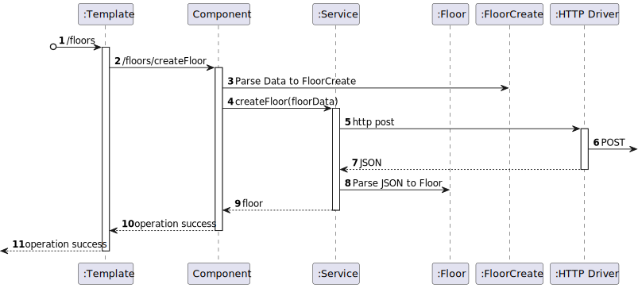
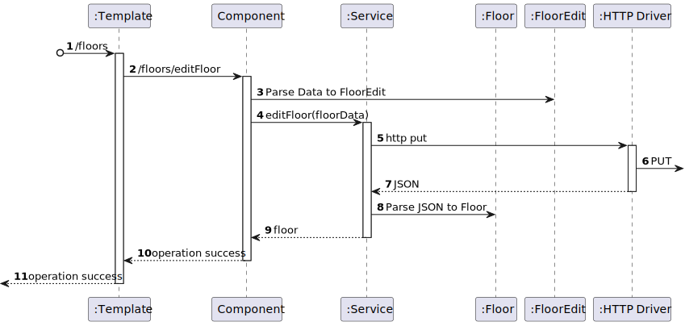
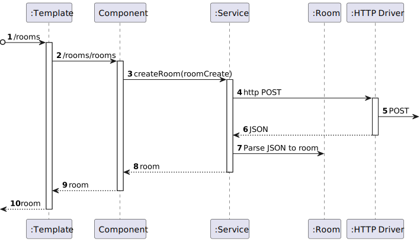
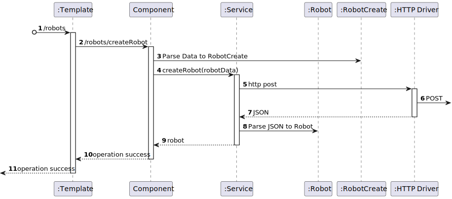

# Layer 3

## Logical View - Logistics

## Implementation View - Logistics

## Logical and Implementation View - Logistics

## Logical View - MasterDataBuilding

## Implementation View - MasterDataBuilding

## Logical and Implementation View - MasterDataBuilding

### US1050

### US1060

### US1070

### US1080

### US1090

### US1110

### US1100

### US1200

### US1120

### US1170

### US1180

### US1190

### US1130

### US1150

### US1140

### US1210

### US1000

### US1010

### US1020

### US1030

