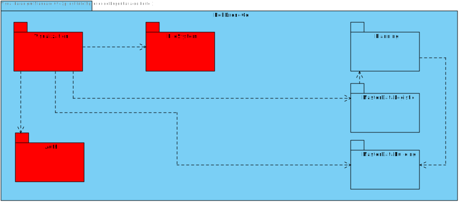

# US 100 - As a system user I intend to change my personal data.

## 1. Context

* This is the first time this task is being developed

## 2. Requirements

**US 100 -** As a system user I intend to change my personal data.

## 3. Analysis

### Questions to the client

> Q:Que dados pessoais é que o utente pode alterar?
> <br>A: todos à exceção do email que serve para identificar o cliente.

> Q: A password do utilizador é expectável poder ser alterada neste caso de uso?
Ou isso seria algo a fazer noutra funcionalidade do software?
> <br>A: a alteração de password faz parte de outro conjunto de casos de uso

**Regarding this requirement we understand that:**

As an actor of the system, I want to be able to change my personal data.
When I press the button to edit my account, the name, taxpayer number and phone number should be unlocked for the user to change.
After pressing the button to save the changes, the system should validate the data and if it is correct, the data should be changed and the user should be notified that the data has been changed successfully.


## 4. Design

### 4.1. Realization

### Level1
###### LogicalView:


###### SceneryView:


###### ProcessView:


#### Level2

###### LogicalView:


###### ImplementationView:


###### PhysicalView:


###### ProcessView:


#### Level3
###### LogicalView:


###### ImplementationView:


###### ProcessView:


### 4.2. Applied Patterns

* Repository
* Directive
* Service

### 4.3. Tests

**Test 1:** *Controller Test with valid user*
```
[TestMethod]
    public async Task Check_UpdateUser_ReturnsOkResult()
    {
        string name = "Jose Gouveia";
        string email = "1211089@isep.ipp.pt";
        string phoneNumber = "930597721";
        string taxPayerNumber = "290088763";
        string password = "1211089aA!";

        var userServiceMock = new Mock<IUserService>();
        var userDto = new UserDto(name, email, phoneNumber, taxPayerNumber, "Admin");
        userServiceMock.Setup(x => x.UpdateUser(userDto)).ReturnsAsync(userDto);
        var userController = new UserController(userServiceMock.Object);

        var result = await userController.UpdateUser(userDto);

        Assert.IsInstanceOfType(result.Result, typeof(OkObjectResult));
        var okResult = (OkObjectResult)result.Result;
        Assert.AreEqual(userDto, okResult.Value);
    }
````

**Test 2:** *Controller Test with invalid user*
```
[TestMethod]
    public async Task Check_UpdateUser_ReturnsBadRequestResult()
    {
        string name = "Jose Gouveia";
        string email = "1211089@isep.ipp.pt";
        string phoneNumber = "930597721";
        string taxPayerNumber = "290088763";
        string password = "1211089aA!";
        
        var userServiceMock = new Mock<IUserService>();
        var userDto = new UserDto(name, email, phoneNumber, taxPayerNumber, "Admin");
        userServiceMock.Setup(x => x.UpdateUser(userDto)).ThrowsAsync(new Exception("Some error occurred."));
        var userController = new UserController(userServiceMock.Object);

        var result = await userController.UpdateUser(userDto);

        Assert.IsInstanceOfType(result.Result, typeof(BadRequestObjectResult));
        var badRequestResult = (BadRequestObjectResult)result.Result;
        Assert.AreEqual("Some error occurred.", badRequestResult.Value);
    }
````

**Test 3:** *Service Test with valid user*
```
[TestMethod]
    public async Task Check_Update_Of_User()
    {
        var userId = "jocas@isep.ipp.pt";
        var user = User.Create("Jocas", userId, "912345678", "912345678", "123456789aA!", "Utente");
        _userRepository.Setup(repo => repo.GetByIdAsync(It.IsAny<Email>())).ReturnsAsync(user);

        string newName = "Jose AAAAAA";
        string newPhoneNumber = "987654321";
        string newTaxPayerNumber = "290088123";

        UserDto updateDto = new UserDto(newName,user.Id.Value, newPhoneNumber, newTaxPayerNumber, user.Role.Value);

        var updated = await _userService.UpdateUser(updateDto);

        Assert.AreEqual(updated.Name, newName);
        Assert.AreEqual(updated.PhoneNumber, newPhoneNumber);
        Assert.AreEqual(updated.TaxPayerNumber, newTaxPayerNumber);
    }
````

**Test 4:** *Service Test with invalid user*
```
[TestMethod]
    public async Task Check_Update_Of_User_With_Invalid_Id()
    {
        var userId = "jocas@isep.ipp.pt";
        
        var email = Email.Create(userId);
        _userRepository.Setup(x => x.GetByIdAsync(email)).ReturnsAsync((User)null);

        string newName = "Jose AAAAAA";
        string newPhoneNumber = "987654321";
        string newTaxPayerNumber = "290088123";

        UserDto updateDto = new UserDto(newName, userId, newPhoneNumber, newTaxPayerNumber, "Utente");

        await Assert.ThrowsExceptionAsync<BusinessRuleValidationException>(() => _userService.UpdateUser(updateDto));
    }
````

## 5. Implementation

UserService:

````
public async Task<UserDto> UpdateUser(UserDto dto){
            try
            {
                _logger.LogInformation("UserService: Getting current user\n\n");

                var email = Email.Create(dto.Email);
                var user = await this._userRepository.GetByIdAsync(email);
                if (user == null)
                {
                    throw new BusinessRuleValidationException("User not found");
                } 
                if(dto.Name != null){
                    user.UpdateName(Name.Create(dto.Name));
                }
                if(dto.PhoneNumber != null){
                    user.UpdatePhoneNumber(PhoneNumber.Create(dto.PhoneNumber));
                }
                if(dto.TaxPayerNumber != null){
                    user.UpdateTaxPayerNumber(TaxPayerNumber.Create(dto.TaxPayerNumber));
                }
                await this._unitOfWork.CommitAsync();
                return new UserDto(user.Name.NameString, user.Id.Value, user.PhoneNumber.Number, user.TaxPayerNumber.Number, user.Role.Value);
            }
            catch (BusinessRuleValidationException e)
            {
                _logger.LogWarning("UserService: Error has occurred while getting current user: " + e.Message + "\n\n");
                throw new BusinessRuleValidationException(e.Message);
            }
            catch (Exception e)
            {
                _logger.LogError("UserService: Error has occurred while getting current user: " + e.Message + "\n\n");
                throw new Exception(e.Message);
            }
        }
````

UserController:

````
[HttpPut("edit")]
        public async Task<ActionResult<UserDto>> UpdateUser(UserDto dto){
            try
            {
                var user = await this._userService.UpdateUser(dto);
                return Ok(user);
            }
            catch (Exception e)
            {
                return BadRequest(e.Message);
            }
        }
````

User-data.component.ts:

```` typescript
  editProfile(){
    if(this.confirmEdit){
      this.confirmEdit = false;
      this.userForm.disable();
    } else{
      this.confirmEdit = true;
      this.userForm.enable();
    }
  }

  confirmUpdate(){
    const user: UserDto = {
      name: this.userForm.controls['name'].value ? this.userForm.controls['name'].value : "",
      email: this.userForm.controls['email'].value ? this.userForm.controls['email'].value : "",
      phoneNumber: Number(this.userForm.controls['phoneNumber'].value),
      taxPayerNumber: Number(this.userForm.controls['taxPayerNumber'].value),
      role: this.userForm.controls['role'].value ? this.userForm.controls['role'].value : ""
    }
    this.authService.updateUser(user).subscribe((user: UserDto) => {
      window.alert("Profile updated");
      this.userForm.disable();
      this.confirmEdit = false;
    });
  }
````

## 6. Integration/Demonstration

To see this functionality working, a user needs to be registered in the system. After that, the user can edit his account by clicking on the edit account button, situated in the profile tab. After that, the user can change the data he wants and then press the submit button saving the changes.

## 7. Observations

No additional observations
