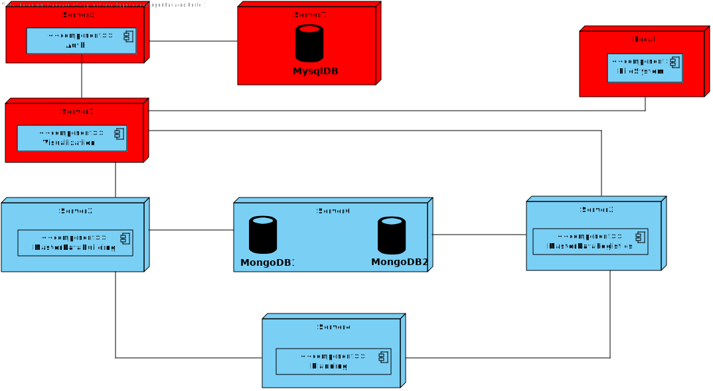

# US 100 - As a system user I intend to change my personal data.

## 1. Context

* This is the first time this task is being developed

## 2. Requirements

**US 100 -** As a system user I intend to change my personal data.

## 3. Analysis

### Questions to the client

> Q:Que dados pessoais é que o utente pode alterar?
>  A: todos à exceção do email que serve para identificar o cliente.

> Q: A password do utilizador é expectável poder ser alterada neste caso de uso?
Ou isso seria algo a fazer noutra funcionalidade do software?
>  A: a alteração de password faz parte de outro conjunto de casos de uso

**Regarding this requirement we understand that:**

As an actor of the system, I want to be able to change my personal data.
When I press the button to edit my account, the name, taxpayer number and phone number should be unlocked for the user to change.
After pressing the button to save the changes, the system should validate the data and if it is correct, the data should be changed and the user should be notified that the data has been changed successfully.

## 4. Design

### 4.1. Realization

### Level1
###### LogicalView:

###### SceneryView:

###### ProcessView:

#### Level2

###### LogicalView:

###### ImplementationView:

###### PhysicalView:

###### ProcessView:

#### Level3
###### LogicalView:

###### ImplementationView:

###### ProcessView:

### 4.2. Applied Patterns

### 4.3. Tests

## 5. Implementation

## 6. Integration/Demonstration

## 7. Observations
