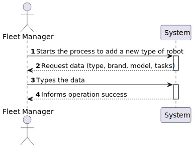
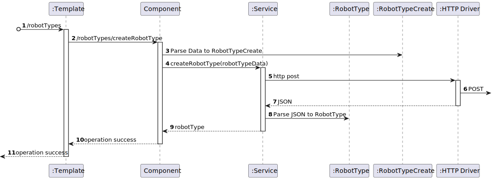

# US 1100 - As a fleet manager, I want to add a new type of robot indicating its designation and what types of tasks it can perform from the predefined list of tasks.

## 1. Context

* Backend developed in Sprint A.
* This task is relative to system user Fleet Manager .

## 2. Requirements

**US 1100 -** As a fleet manager, I want to add a new type of robot indicating its designation and what types of tasks it can perform from the predefined list of tasks.

> **Q**: Que tipo de tarefas um robot pode realizar? <br>
> **A**: De momento apenas existem dois tipos de tarefas conhecidas que o sistema deve suportar: vigilância e entrega de objectos <br>

> **Q**: Pretende alguma regra de negócio para o limite de caracteres para o tipo, marca e modelo? <br>
> **A**: tipo de robot: obrigatório, alfanum+ericos, maximo 25 caracteres
marca: obrigatório, maximo 50 caracteres
modelo: obrigatório, máximo 100 caracteres <br>

> **Q**: Poderia explicar as diferenças entre estas duas user stories, US350 e US360? <br>
> **A**: o requisito 350 permite definir que tipos de robots existem. por exemplo "Tipo A: Robot marca X modelo Y com capacidade de executar tarefas de vigilância" e "Tipo B: Robot marca W modelo Z com capacidade de executar tarefas de vigilância e pickeup&delivery" <br>


**Dependencies:**
**US350** - Sprint A

**Regarding this requirement we understand that:** <br>
As a Fleet Manager, an actor of the system, I will be able to access the system and start the process to create a new robot, first we will indicate the type and then the available task

## 3. Analysis

**Analyzing this User Story we understand that:**
* Fleet Manager is a user role that manages the data of the robots and drones and the types of tasks.
* Robisep is a type of mobile robot that can move through the corridors and elevators of the buildings, but not stairs. It can perform tasks such as surveillance, cleaning, or delivery of items.
* The available task type are surveillance and delivery of objects
* The robot type has a Code, a Brand and a Model.
* ex1."Tipo A: Robot marca X modelo Y com capacidade de executar tarefas de vigilância"
* ex2."Tipo B: Robot marca W modelo Z com capacidade de executar tarefas de vigilância e pickeup&delivery"


### 3.1. Domain Model Excerpt


## 4. Design

### 4.1. Realization

### Level1
###### LogicalView:


###### SceneryView:


###### ProcessView:


#### Level2

###### LogicalView:


###### ImplementationView:


###### PhysicalView:


###### ProcessView:


#### Level3
###### LogicalView:


###### ImplementationView:


###### ProcessView:


### 4.3. Applied Patterns


### 4.4. Tests


## 5. Implementation

### 
```

````

## 6. Integration/Demonstration


## 7. Observations
