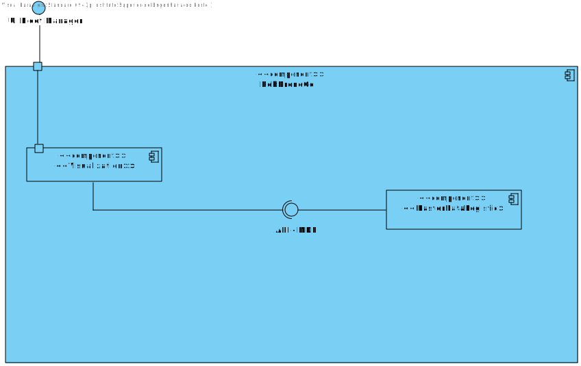

# US 1100 - As a fleet manager, I want to add a new type of robot indicating its designation and what types of tasks it can perform from the predefined list of tasks.

## 1. Context

* Backend developed in Sprint A.
* This task is relative to system user Fleet Manager .

## 2. Requirements

**US 1100 -** As a fleet manager, I want to add a new type of robot indicating its designation and what types of tasks it can perform from the predefined list of tasks.

> **Q**: Que tipo de tarefas um robot pode realizar? <br>
> **A**: De momento apenas existem dois tipos de tarefas conhecidas que o sistema deve suportar: vigilância e entrega de objectos <br>

> **Q**: Pretende alguma regra de negócio para o limite de caracteres para o tipo, marca e modelo? <br>
> **A**: tipo de robot: obrigatório, alfanum+ericos, maximo 25 caracteres
marca: obrigatório, maximo 50 caracteres
modelo: obrigatório, máximo 100 caracteres <br>

> **Q**: Poderia explicar as diferenças entre estas duas user stories, US350 e US360? <br>
> **A**: o requisito 350 permite definir que tipos de robots existem. por exemplo "Tipo A: Robot marca X modelo Y com capacidade de executar tarefas de vigilância" e "Tipo B: Robot marca W modelo Z com capacidade de executar tarefas de vigilância e pickeup&delivery" <br>


**Dependencies:**
**US350** - Sprint A

**Regarding this requirement we understand that:** <br>
As a Fleet Manager, an actor of the system, I will be able to access the system and start the process to create a new robot, first we will indicate the type and then the available task

## 3. Analysis

**Analyzing this User Story we understand that:**
* Fleet Manager is a user role that manages the data of the robots and drones and the types of tasks.
* Robisep is a type of mobile robot that can move through the corridors and elevators of the buildings, but not stairs. It can perform tasks such as surveillance, cleaning, or delivery of items.
* The available task type are surveillance and delivery of objects
* The robot type has a Code, a Brand and a Model.
* ex1."Tipo A: Robot marca X modelo Y com capacidade de executar tarefas de vigilância"
* ex2."Tipo B: Robot marca W modelo Z com capacidade de executar tarefas de vigilância e pickeup&delivery"
* We will use Angular, so we need an HTML, CSS and TS file.
* We will need three labels (ID, Brand and Model)
* We will need two checkboxes to define the available tasks
* We will need a button to perform the action
* We will a notification to inform the operation success.

### 3.1. Domain Model Excerpt


## 4. Design

### 4.1. Realization

### Level1
###### LogicalView:


###### SceneryView:


###### ProcessView:


#### Level2

###### LogicalView:



###### ImplementationView:


###### PhysicalView:


###### ProcessView:


#### Level3
###### LogicalView:


###### ImplementationView:


###### ProcessView:


### 4.2. Applied Patterns

* Pipe
* Directive
* Service

### 4.3. Tests
**Test 1:** *Intercepting a POST request to mock the creation of a new robot type.*
```
beforeEach(() => {

        cy.intercept('POST', 'http://localhost:4000/api/robotTypes/createRobotType', {
          statusCode: 201,
          body: {
            "robotTypeID": "RT001",
            "robotBrand": "Acme Robotics",
            "robotModel": "RX-7",
            "availableTasks": [
                "Floor surveillance",
                "Object transport"
            ]
        }
        }).as('createRobotType')

        cy.visit('/robot-types/createRobotType')

    });
````

**Test 2:** *Ensures that the page has the correct title, indicating it's the 'Create Robot Type' page.*
```
it('has correct title', function() {
        cy.get('h1').should('contain', 'Create Robot Type')
    })
````

**Test 3:** *Verifies the presence of a form for users to create a new robot type.*
```
it('should display a form for creating a new robot type', () => {
        cy.get('form').should('be.visible');
    });
````

**Test 5:** *Confirms the presence of a text input field for entering the robot type ID.*
```
 it('should display a text input field for entering the robot type ID', () => {
        cy.get('input[id=robotTypeID]').should('be.visible');
        cy.get('input[id=robotTypeID]').should('have.attr', 'type', 'text');
    });
````

**Test 5:** *Confirms the presence of a text input field for entering the robot brand.*
```
it('should display a text input field for entering the robot brand', () => {
        cy.get('input[id=robotBrand]').should('be.visible');
        cy.get('input[id=robotBrand]').should('have.attr', 'type', 'text');
    });
````

**Test 6:** *Confirms the presence of a text input field for entering the robot model.*
```
it('should display a text input field for entering the robot model', () => {
        cy.get('input[id=robotModel]').should('be.visible');
        cy.get('input[id=robotModel]').should('have.attr', 'type', 'text');
    });
````

**Test 7:** *Confirms the presence of two checkboxes for selecting the robot's tasks.*
```
it('should display two checkboxes for selecting the robot\'s tasks: Floor surveillance and Object transport', () => {
        cy.get('input[type="checkbox"]').first().check({force: true}).should('be.checked');
        cy.get('input[type="checkbox"]').first().uncheck({force: true}).should('not.be.checked');
        cy.get('input[type="checkbox"]').eq(1).check({force: true}).should('be.checked');
        cy.get('input[type="checkbox"]').eq(1).uncheck({force: true}).should('not.be.checked');
    });
````

**Test 8:** *Verifies the presence of a button for creating the robot type.*
```
it('should display a button for creating the robot type', () => {
        cy.get('button:contains("Create")').should('be.visible');
    });
````

**Test 9:** *Fills and submits the form, checking if the form fields are cleared after submission.*
```
it('fills and submits the form', function() {
        cy.get('input[id=robotTypeID]').type('RT001');
        cy.get('input[id=robotBrand]').type('Acme Robotics');
        cy.get('input[id=robotModel]').type('RX-7');
        cy.get('input[type="checkbox"]').first().check({force: true})
        cy.get('input[type="checkbox"]').eq(1).check({force: true})
        cy.get('button:contains("Create")').click();
        cy.wait('@createRobotType')

        cy.get('input[id=robotTypeID]').should('have.value', '');
        cy.get('input[id=robotBrand]').should('have.value', '');
        cy.get('input[id=robotModel]').should('have.value', '');
    })
````

**Test 10:** *Handles errors correctly by intercepting a request and simulating a server error, triggering an appropriate alert message.*
```
it('handles errors correctly', function() {
        cy.intercept('POST', '/api/robotTypes/createRobotType', { statusCode: 500, body: {} }).as('createRobotTypeError')
        cy.visit('/robot-types/createRobotType')
        cy.on('window:alert', (str) => {
          expect(str).to.include('An error occurred:')
        })
    })
````


## 5. Implementation

### Robot Component
```
@Component({
  selector: 'app-robots',
  templateUrl: './robots.component.html',
  styleUrls: ['./robots.component.css'],
  providers: [RobotTypeService,RobotService]
})
export class RobotsComponent implements OnInit{

  constructor(private robotTypeService: RobotTypeService, private robotService:RobotService) { }

  robotTypes: any[] = [];

  createForm = new FormGroup({
    code: new FormControl(''),
    nickname: new FormControl(''),
    robotTypeID: new FormControl(''),
    serialNumber: new FormControl(''),
    description: new FormControl(''),
  })

  ngOnInit(): void {
    this.robotTypeService.listAll().subscribe(
      (data: any) => {
        this.robotTypes = data;
      },
      (error: any) => {
        console.error('Error:', error);
        this.robotTypes = [];
      }
    );
  }

  onSubmint() {
    const robot: RobotCreate = {
      code: this.createForm.value.code!,
      nickname: this.createForm.value.nickname!,
      type: this.createForm.value.robotTypeID!,
      serialNumber: this.createForm.value.serialNumber!,
      description: this.createForm.value.description!,
    }

    this.robotService.createRobot(robot).subscribe(
      (data: any) => {
        window.alert("Robot " + this.createForm.value.code! + " created successfully");
        this.createForm.reset();
      },
      (error: any) => {
        console.error('Error:', error);
      }
    );
  
  }


}
````

### Robot Component HTML
```
<h1>Create Robot</h1>
<form [formGroup]="createForm" (ngSubmit)="onSubmint()">
    <div class="form__group field">
        <input type="text" class="form__field" name="Code" id='Code' formControlName="code" required/>
        <label for="Code" class="form__label">Code</label>
    </div>
    <div class="form__group field">
        <input type="text" class="form__field" name="Nickname" id='Nickname' formControlName="nickname" required/>
        <label for="Nickname" class="form__label">Nickname</label>
    </div>
    <div class="form__group field">
        <input type="text" class="form__field" name="SerialNumber" id='SerialNumber' formControlName="serialNumber" required/>
        <label for="SerialNumber" class="form__label">Serial Number</label>
    </div>
    <div class="form__group field">
        <input type="text" class="form__field" name="Description" id='Description' formControlName="description" required/>
        <label for="Description" class="form__label">Description</label>
    </div>
    <div class="form__group field">
        <select class="form_select" formControlName="robotTypeID">
            <option value="">Select a robot type</option>
            <option *ngFor="let type of robotTypes" [value]="type.robotTypeID">{{ type.robotTypeID }}</option>
        </select>
    </div>
    <div>
        <button>Create</button>
    </div>
</form>
````

## 6. Integration/Demonstration


https://github.com/Pedro-Pereira1/sem5pi_23_24_g056_Visualization/assets/128611263/cc0495ac-012a-466e-b3c4-faf2567ba64d


## 7. Observations

No additional observations.
