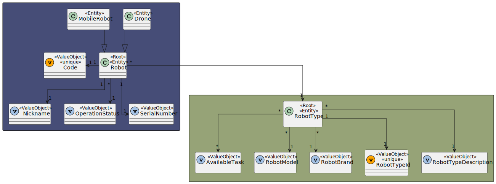
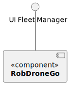
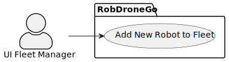
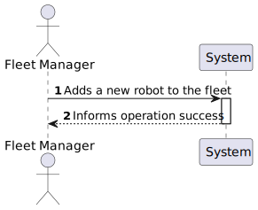
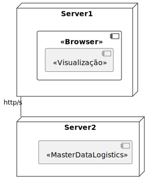
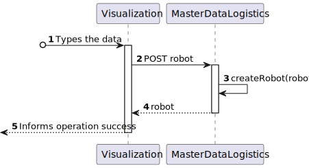
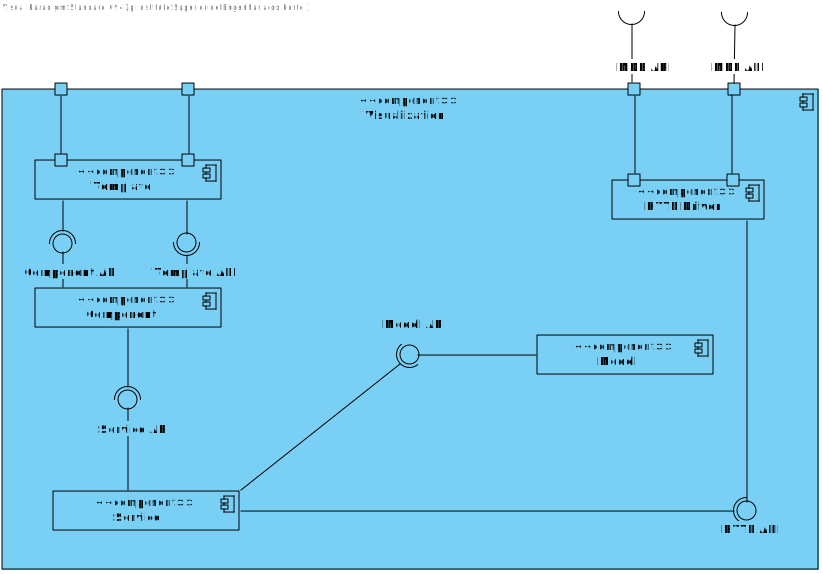
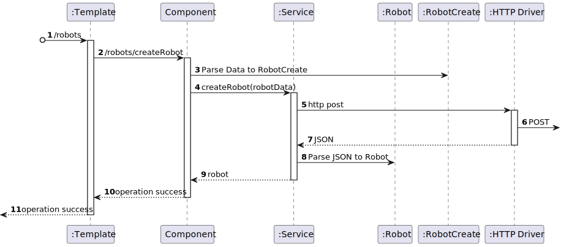

# US 1010 - As a fleet manager, I want to add a new robot to the fleet indicating its type, name, etc.

## 1. Context

* Backend developed in Sprint A.
* This task is relative to system user Fleet Manager .

## 2. Requirements

**US 1010 -** As a fleet manager, I want to add a new robot to the fleet indicating its type, name, etc.

> **Q**: ... Poderia explicar as diferenças entre estas duas user stories, US350 e US360? <br>
> **A**: ... o requisito 360 permite indicar que robots existem e de que tipo cada um é, por exemplo "Robot 'ABC32' do tipo A", "Robot 'Brian2' do tipo A" e "Robot 'Stew' do tipo B" <br>

> **Q**: Os atributos do robot têm algum tipo de formatação/restrição?  <br>
> **A**: código identificativo, obrigatório, alfanumerico, max 30 caracteres, único no sistema,
nickname, obrigatório, obrigatório, alfanumerico, max 30 caracteres, único no sistema,
tipo de robot, obrigatório,
número de série, obrigatório, alfanumerico, max 50 caracteres, único para um dado tipo de robot,
descrição, opcional, alfanumerico, max. 250 caracteres <br>

> **Q**: Ao criar um novo robo, qual o estado dele por defeito, isto é, ativo ou inativo?
Tendo em conta a US370 seria ativo por defeito certo? <br>
> **A**: ao criar um robot ele fica no estado ativo <br>


**Dependencies:**
- **US360  -** Sprint A.
- **US 350 -** As a fleet manager, I want to add a new type of robot indicating its designation and what types of tasks it can perform from the predefined list of tasks.

**Regarding this requirement we understand that:** <br>
As a Fleet Manager, an actor of the system, I will be able to access the system and choose one robot, put them in the fleet specifying his type and name.

## 3. Analysis

**Analyzing this User Story we understand that:**
* Fleet Manager is a user role that manages the data of the robots and drones and the types of tasks.
* Robisep is a type of mobile robot that can move through the corridors and elevators of the buildings, but not stairs. It can perform tasks such as surveillance, cleaning, or delivery of items.
* The robot type has a Code, a Brand and a Model.
* ex1."Tipo A: Robot marca X modelo Y com capacidade de executar tarefas de vigilância"
* ex2."Tipo B: Robot marca W modelo Z com capacidade de executar tarefas de vigilância e pickeup&delivery"
* We will need four labels (Code, Nickname, Serial Number and Description)
* We will need a label to select the robotType of Robot
* We will need a button to perform the action
* We will a notification to inform the operation success.

### 3.1. Domain Model Excerpt



## 4. Design

### 4.1. Realization

### Level1
###### LogicalView:


###### SceneryView:


###### ProcessView:


#### Level2

###### LogicalView:


###### ImplementationView:


###### PhysicalView:


###### ProcessView:


#### Level3
###### LogicalView:


###### ImplementationView:


###### ProcessView:



### 4.2. Applied Patterns

* Pipe
* Directive
* Service

### 4.3. Tests

**Test 1:** *Tests if the class has the correct title*

```typescript
  it('has correct title', function() {
  cy.get('h1').should('contain', 'Create Robot')
})
````

**Test 2:** *Tests if the class has a text input box to enter the robot code*

```typescript

it('should display a text input field for entering the robot code', () => {
  cy.get('input[id=Code]').should('be.visible');
  cy.get('input[id=Code]').should('have.attr', 'type', 'text');
});
````

**Test 3:** *Tests if the class has a select box for selecting a robot type*

```typescript
  it('should display a select box for selecting the robot type', () => {
  cy.get('select').should('exist');
});
````

**Test 4:** *Tests if the class creates a robot correctly*

```typescript
  it('fills and submits the form', function() {
  cy.get('input[id=Code]').type('RBT001');
  cy.get('input[id=Nickname]').type('Rosie');
  cy.get('input[id=SerialNumber]').type('1234567890');
  cy.get('input[id=Description]').type('A friendly and helpful robot');
  cy.get('select').select('k4');
  cy.get('button:contains("Create")').click();
  cy.wait('@createRobot')

  cy.get('input[id=Code]').should('have.value', '');
  cy.get('input[id=Nickname]').should('have.value', '')
  cy.get('input[id=SerialNumber]').should('have.value', '')
  cy.get('input[id=Description]').should('have.value', '')

})
````

**Test 5:** *Tests if the class handles errors correctly*

```typescript
  it('handles errors correctly', function() {
  cy.intercept('POST', '/api/robots/createRobot', { statusCode: 500, body: {} }).as('createRobotError')
  cy.visit('/robots/createRobot')
  cy.on('window:alert', (str) => {
    expect(str).to.include('An error occurred:')
  })
})

````

## 5. Implementation

#### Robot-Type Component
```

@Component({
  selector: 'app-robot-types',
  templateUrl: './robot-types.component.html',
  styleUrls: ['./robot-types.component.css'],
  providers: [RobotTypeService]
})
export class RobotTypesComponent implements OnInit{

  constructor(private robotTypeService: RobotTypeService) { }
    createForm = new FormGroup({
      robotTypeID: new FormControl(''),
      robotBrand: new FormControl(''),
      robotModel: new FormControl(''),
      availableTasks: new FormControl<string[]>([])
    })

  ngOnInit(): void {
    
  }

  onSubmint() {
    const robotType: RobotTypeCreate = {
      robotTypeID: this.createForm.value.robotTypeID!,
      robotBrand: this.createForm.value.robotBrand!,
      robotModel: this.createForm.value.robotModel!,
      availableTasks: this.createForm.value.availableTasks!,
    }

    this.robotTypeService.createRobotType(robotType).subscribe(
      (data: RobotType) => {
        window.alert("Robot Type " + this.createForm.value.robotTypeID + " created successfully");
        this.createForm.reset();
      },
      (error: RobotType) => {
        console.error('Error:', error);
      }
    );
  }
  
  updateTasks(task: string, event: Event) {
    const checkbox = event.target as HTMLInputElement;
    if (checkbox.checked) {
      this.createForm.value.availableTasks!.push(task);
    } else {
      const index = this.createForm.value.availableTasks!.indexOf(task);
      if (index > -1) {
        this.createForm.value.availableTasks!.splice(index, 1);
      }
    }
  }

}
````

#### Robot-Type Component HTML
```
<h1>Create Robot Type</h1>

<form [formGroup]="createForm" (ngSubmit)="onSubmint()">
  <div class="form__group field">
      <input type="text" class="form__field" name="robotTypeID" id='robotTypeID' formControlName="robotTypeID" required/>
      <label for="robotTypeID" class="form__label">ID</label>
  </div>
  <div class="form__group field">
      <input type="text" class="form__field" name="robotBrand" id='robotBrand' formControlName="robotBrand" required/>
      <label for="robotBrand" class="form__label">Brand</label>
  </div>
  <div class="form__group field">
      <input type="text" class="form__field" name="robotModel" id='robotModel' formControlName="robotModel" required/>
      <label for="robotModel" class="form__label">Model</label>
  </div>
  <div class="form__group field">
      <label class="container">Floor surveillance
        <input type="checkbox" (change)="updateTasks('Floor surveillance', $event)">
        <span class="checkmark"></span>
      </label>

      <label class="container">Object transport
        <input type="checkbox" (change)="updateTasks('Object transport', $event)">
        <span class="checkmark"></span>
      </label>
    </div>
  <div>
      <button>Create</button>
  </div>

</form>
````

## 6. Integration/Demonstration

https://github.com/Pedro-Pereira1/sem5pi_23_24_g056_Visualization/assets/128611263/a22dfc4e-b5de-4e72-92bd-f07ed4b945ea


## 7. Observations

No additional observations.
