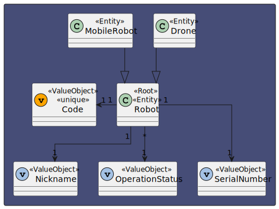
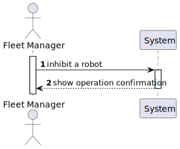
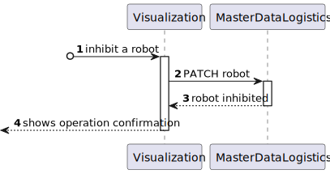
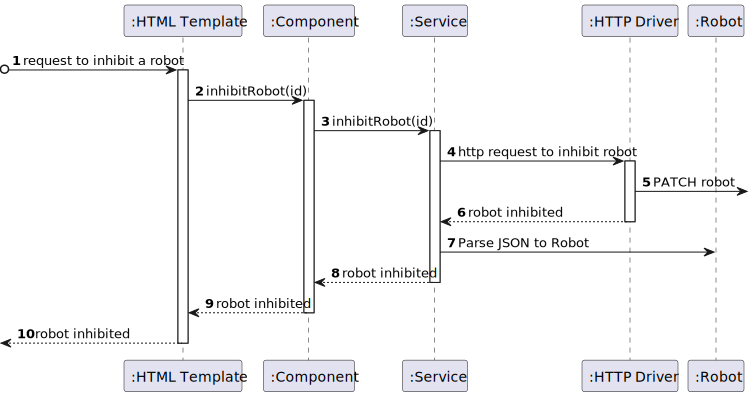

# US 1020 - As a fleet manager, inhibit a robot 

## 1. Context

* Backend developed in Sprint A.
* This task is relative to system user fleet Manager .

## 2. Requirements

**US 1020 -** As a fleet Manager inhibit a robot 

**Dependencies:**
- **US 370 -** Sprint A.
- **US 370 -** As a fleet Manager, inhibit a robot

## 3. Analysis

**Regarding this requirement we understand that:**

As a fleet Manager, an actor of the system, I will be able to access the system and 
inhibit a certain robot 

### 3.1. Domain Model Excerpt



## 4. Design

### 4.1. Realization

### Level1
###### LogicalView:


###### SceneryView:


###### ProcessView:


#### Level2

###### LogicalView:


###### ImplementationView:


###### PhysicalView:


###### ProcessView:


#### Level3
###### LogicalView:


###### ImplementationView:


###### ProcessView:



### 4.2. Applied Patterns

pipe
directive
service

### 4.3. Tests

```typescript
describe('Create Robot Page Test', function () {
    let callCount = 0;

    beforeEach(() => {

        cy.intercept('GET', 'http://localhost:4000/api/robots/listAll', (req) => {
            callCount++;
            if (callCount === 1) {
                req.reply({
                    statusCode: 200,
                    body: [
                        {
                            "code": "RBT001",
                            "nickname": "Rosie",
                            "type": "k4",
                            "serialNumber": "1234567890",
                            "description": "A friendly and helpful robot",
                            "operationStatus": true
                        },
                        {
                            "code": "RBT002",
                            "nickname": "Bender",
                            "type": "k4",
                            "serialNumber": "0987654321",
                            "description": "A foul-mouthed robot",
                            "operationStatus": true
                        }
                    ]
                });
            } else if (callCount === 2) {
                req.reply({
                    statusCode: 200,
                    body: [
                        {
                            "code": "RBT001",
                            "nickname": "Rosie",
                            "type": "k4",
                            "serialNumber": "1234567890",
                            "description": "A friendly and helpful robot",
                            "operationStatus": false
                        },
                        {
                            "code": "RBT002",
                            "nickname": "Bender",
                            "type": "k4",
                            "serialNumber": "0987654321",
                            "description": "A foul-mouthed robot",
                            "operationStatus": true
                        }
                    ]
                });
            }
        }).as('listAll');


        cy.intercept('PATCH', 'http://localhost:4000/api/robots/inhibitRobot', {
            statusCode: 201,
            body: {
                "code": "RBT001",
                "nickname": "Rosie",
                "type": "k4",
                "serialNumber": "1234567890",
                "description": "A friendly and helpful robot",
                "operationStatus": false
            }
        }).as('inhibitRobot')

        cy.visit('/robots/inhibitRobot')
    });

    it('has correct title', function () {
        cy.get('h1').should('contain', 'Inhibit Robot')
    })


    it('fills and submits the form', function () {
        cy.get('button:contains("Inhibit")').first().click()

        cy.wait('@inhibitRobot')


        cy.wait('@listAll')

        cy.get('table').then(($table) => {
            cy.get('table tbody tr:first-child td.column6').contains('Disabled');
        })
    })

    it('handles errors correctly', function () {
        cy.intercept('PATCH', '/api/robots/inhibitRobot', { statusCode: 500, body: {} }).as('InhibitRobot')
        cy.visit('/robots/inhibitRobot')
        cy.on('window:alert', (str) => {
            expect(str).to.include('An error occurred:')
        })
    })

})
```

## 5. Implementation

### inhibit-robot.component.html

```html
<h1>Inhibit Robot</h1>

<div>
    <table>
        <thead>
            <tr class="table100-head">
                <th class="column1">Code</th>
                <th class="column2">Nickname</th>
                <th class="column3">Type</th>
                <th class="column4">Serial Number</th>
                <th class="column5">Description</th>
                <th class="column6">Operation Status</th>
                <th class="column6">Select</th>
            </tr>
        </thead>
        <tbody *ngFor="let robot of robots; let i = index">
            <tr>
                <td class="column1">{{ robot.code }}</td>
                <td class="column2">{{ robot.nickname }}</td>
                <td class="column3">{{ robot.type }}</td>
                <td class="column4">{{ robot.serialNumber }}</td>
                <td class="column5">{{ robot.description }}</td>
                <td class="column6">{{ robot.operationStatus === true ? 'Working' : 'Disabled' }}</td>
                <td class="column6"> <button (click)="inhibitRobot(robot.code)">Inhibit</button> </td>
            </tr>

        </tbody>
    </table>
</div>
```

### inhibit-robot.component.ts

```typescript
export class RobotInhibitComponent {

  constructor(
    private robotService: RobotService
  ) { }

  index: number = 0
  expanded: boolean[] = [false];
  robots: Robot[] = [];

  ngOnInit() {
    this.robotService.listAllRobots().subscribe((data: Robot[]) => {
      this.robots = data;
    });
  }

  inhibitRobot(robotId: string) {
    this.robotService.inhibitRobot(robotId).subscribe((data: Robot) => {
      window.alert("Robot " + data.code + " inhibited successfully!")
      this.update()
    });
  }

  private update() {
    this.robotService.listAllRobots().subscribe((data: Robot[]) => {
      this.robots = data;
    });
  }

}

```

### robotService

```typescript
  public inhibitRobot(robotId: string): Observable<Robot> {
    const url = this.robotUrl + "/" + "inhibitRobot";
    return this.http.patch<Robot>(url, {id: robotId});
  }
```

## 6. Integration/Demonstration


## 7. Observations

No additional observations.
