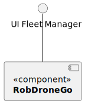

# US 1020 - As a fleet manager, inhibit a robot 

## 1. Context

* Backend developed in Sprint A.
* This task is relative to system user fleet Manager .

## 2. Requirements

**US 1020 -** As a fleet Manager inhibit a robot 

**Dependencies:**
- **US 370 -** Sprint A.
- **US 370 -** As a fleet Manager, inhibit a robot

## 3. Analysis

**Regarding this requirement we understand that:**

As a fleet Manager, an actor of the system, I will be able to access the system and 
inhibit a certain robot 

### 3.1. Domain Model Excerpt


## 4. Design

### 4.1. Realization

### Level1
###### LogicalView:


###### SceneryView:


###### ProcessView:


#### Level2

###### LogicalView:


###### ImplementationView:


###### PhysicalView:


###### ProcessView:


#### Level3
###### LogicalView:


###### ImplementationView:


###### ProcessView:


### 4.2. Applied Patterns


### 4.3. Tests

## 5. Implementation

### inhibit-robot.component.html

```html
<h1>Inhibit Robot</h1>

<div>
    <table>
        <thead>
            <tr class="table100-head">
                <th class="column1">Code</th>
                <th class="column2">Nickname</th>
                <th class="column3">Type</th>
                <th class="column4">Serial Number</th>
                <th class="column5">Description</th>
                <th class="column6">Operation Status</th>
                <th class="column6">Select</th>
            </tr>
        </thead>
        <tbody *ngFor="let robot of robots; let i = index">
            <tr>
                <td class="column1">{{ robot.code }}</td>
                <td class="column2">{{ robot.nickname }}</td>
                <td class="column3">{{ robot.type }}</td>
                <td class="column4">{{ robot.serialNumber }}</td>
                <td class="column5">{{ robot.description }}</td>
                <td class="column6">{{ robot.operationStatus === true ? 'Working' : 'Disabled' }}</td>
                <td class="column6"> <button (click)="inhibitRobot(robot.code)">Inhibit</button> </td>
            </tr>

        </tbody>
    </table>
</div>
```

### inhibit-robot.component.ts

```typescript
export class RobotInhibitComponent {

  constructor(
    private robotService: RobotService
  ) { }

  index: number = 0
  expanded: boolean[] = [false];
  robots: Robot[] = [];

  ngOnInit() {
    this.robotService.listAllRobots().subscribe((data: Robot[]) => {
      this.robots = data;
    });
  }

  inhibitRobot(robotId: string) {
    this.robotService.inhibitRobot(robotId).subscribe((data: Robot) => {
      window.alert("Robot " + data.code + " inhibited successfully!")
      this.update()
    });
  }

  private update() {
    this.robotService.listAllRobots().subscribe((data: Robot[]) => {
      this.robots = data;
    });
  }

}

```

### robotService

```typescript
  public inhibitRobot(robotId: string): Observable<Robot> {
    const url = this.robotUrl + "/" + "inhibitRobot";
    return this.http.patch<Robot>(url, {id: robotId});
  }
```

## 6. Integration/Demonstration

## 7. Observations

No additional observations.
