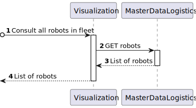
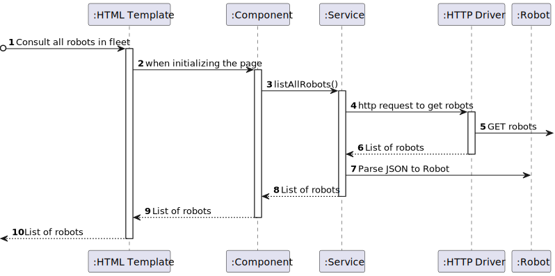

# US 1030 -  As a fleet manager, I want to consult all robots in the fleet. 

## 1. Context

* This US is relative to the frontendof the already implemented backend in Sprint A.
* This task is relative to system user Fleet Manager.

## 2. Requirements

**US 1030 -** As a fleet manager, I want to consult all robots in the fleet. 

**Dependencies:**
**US380** - Sprint A

**Regarding this requirement we understand that:** <br>
As a Fleet Manager, an actor of the system, I will be able to access the system and get a list of all the robots registered.

## 3. Analysis

**Analyzing this User Story we understand that:**
* Fleet Manager is a user role that manages the data of the robots and drones and the types of tasks.
* Robisep is a type of mobile robot that can move through the corridors and elevators of the buildings, but not stairs. It can perform tasks such as surveillance, cleaning, or delivery of items.
* We will use Angular, so we need an HTML and CSS template and TS component.
* When the page is loaded, all the robots in the system will appear in a table.
* We will a notify when there are no robots.

### 3.1. Domain Model Excerpt


## 4. Design

### 4.1. Realization

### Level1
###### LogicalView:


###### SceneryView:


###### ProcessView:


#### Level2

###### LogicalView:


###### ImplementationView:


###### PhysicalView:


###### ProcessView:


#### Level3
###### LogicalView:


###### ImplementationView:


###### ProcessView:


### 4.3. Applied Patterns


### 4.4. Tests

``` typescript

```

## 5. Implementation

### Robot List All Component
``` typescript
@Component({
  selector: 'app-robot-list-all',
  templateUrl: './robot-list-all.component.html',
  styleUrls: ['./robot-list-all.component.css'],
  providers: [RobotService]
})
export class RobotListAllComponent implements OnInit{
  robots: Robot[] = [];

  ngOnInit() {
    this.robotService.listAllRobots().subscribe(
      (data: Robot[]) => {
        this.robots = data;
      },
      (error: any) => {
        if (error.status === 400) {
          window.alert('No robots found.');
        }
      }
    );
  }

  constructor(private robotService: RobotService) { }
}
```

### Robot List All HTML Template
``` html
<h1>List All Robots</h1>

<div>
<table>
    <thead>
    <tr class="table100-head">
    <th class="column1">Code</th>
    <th class="column2">Nickname</th>
    <th class="column3">Type</th>
    <th class="column4">Serial Number</th>
    <th class="column5">Description</th>
    <th class="column6">Operation Status</th>
    </tr>
    </thead>
    <tbody>
    <tr *ngFor="let robot of robots">
        <td class="column1">{{ robot.code }}</td>
        <td class="column2">{{ robot.nickname }}</td>
        <td class="column3">{{ robot.type }}</td>
        <td class="column4">{{ robot.serialNumber }}</td>
        <td class="column5">{{ robot.description }}</td>
        <td class="column6">{{ robot.operationStatus }}</td>
    </tr>
    </tbody>
</table>
</div>
````

## 6. Integration/Demonstration
The integration of this US is demonstrated in the following video:


## 7. Observations
No observations.