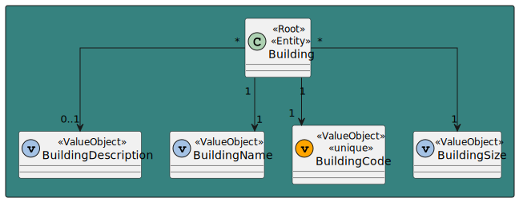
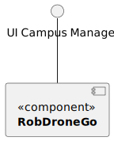
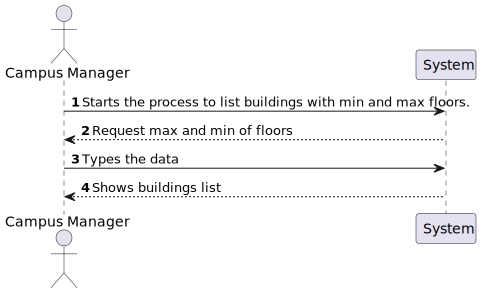
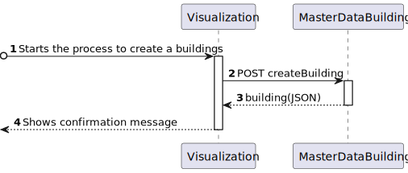

# US 1050 - As a campus manager, I want to create a building specifying [...]

## 1. Context

* Backend developed in Sprint A.
* This task is relative to system user Campus Manager .

## 2. Requirements

**US 1050 -** As a campus manager I want to create a building specifying [...]

**Dependencies:**
- **US150  -** Sprint A.
- **US 150 -** As a Campus Manager, I want to create a building

## 3. Analysis

**Regarding this requirement we understand that:**

As a Campus Manager, an actor of the system, I will be able to access the system and create a buildign with a
unique code, a name, a description, a certain lenght and width


### 3.1. Domain Model Excerpt



## 4. Design

### 4.1. Realization

### Level1
###### LogicalView:


###### SceneryView:


###### ProcessView:


#### Level2

###### LogicalView:


###### ImplementationView:


###### PhysicalView:


###### ProcessView:


#### Level3
###### LogicalView:


###### ImplementationView:


###### ProcessView:


### 4.2. Applied Patterns


### 4.3. Tests

## 5. Implementation

### building-create.component.html

```html

```

### building-create.component.ts

```typescript

```

### buildingService

```typescript

```

## 6. Integration/Demonstration

## 7. Observations

No additional observations.
