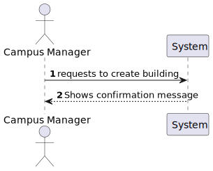
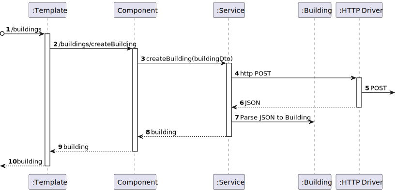

# US 1050 - As a campus manager, I want to create a building specifying [...]

## 1. Context

* Backend developed in Sprint A.
* This task is relative to system user Campus Manager .

## 2. Requirements

**US 1050 -** As a campus manager I want to create a building specifying [...]

**Dependencies:**
- **US150  -** Sprint A.
- **US 150 -** As a Campus Manager, I want to create a building

## 3. Analysis

**Regarding this requirement we understand that:**

As a Campus Manager, an actor of the system, I will be able to access the system and create a buildign with a
unique code, a name, a description, a certain lenght and width


### 3.1. Domain Model Excerpt


## 4. Design

### 4.1. Realization

### Level1

###### LogicalView:


###### SceneryView:


###### ProcessView:



#### Level2

###### LogicalView:


###### ImplementationView:


###### PhysicalView:


###### ProcessView:


#### Level3

###### LogicalView:


###### ImplementationView:


###### ProcessView:




### 4.2. Applied Patterns


### 4.3. Tests

```typescript
describe('Building Create', function () {

    beforeEach(() => {
        cy.intercept('POST', 'http://localhost:4000/api/buildings/createBuilding', {
            statusCode: 200,
            body: [
                {
                    "buildingName": "Building 1",
                    "buildingDescription": "Building 1 Description",
                    "buildingCode": "BGDT",
                    "buildingLength": 10,
                    "buildingWidth": 10,
                    "buildingFloors": [
                    ]
                }
            ]
        }).as('createBuilding');


        cy.visit('/buildings/createBuilding')
    });

    it('has correct title', function () {
        cy.get('h1').should('contain', 'Create Building')
    })

    it('Should display the text input fields', function () {
        cy.get('.form__field').each(($el, index, $list) => {
            cy.wrap($el).should('be.visible')
        })
    })

    it('fills and submits the form', function() {

        cy.get('#code').type('BGDT');
        cy.get('#name').type('Building 1');
        cy.get('#description').type('Building 1 Description');
        cy.get('#length').type('10');
        cy.get('#width').type('10');
    
        cy.get('button:contains("Submit")').click()

        cy.wait('@createBuilding')

        cy.get('#code').should('have.value', '');
        cy.get('#name').should('have.value', '')
        cy.get('#description').should('have.value', '')
        cy.get('#length').should('have.value', '')
        cy.get('#width').should('have.value', '')
    })

    it('handles errors correctly', function () {
        cy.intercept('GET', '/api/buildings', { statusCode: 500, body: {} }).as('getBuildingsError')
        cy.visit('/buildings/listBuildingsMaxMinFloors')
        cy.on('window:alert', (str) => {
            expect(str).to.include('`An error occurred:')
        })
    })

})
```

## 5. Implementation

### building-create.component.html

```html
<h1>Create Building</h1>

<form [formGroup]="createForm" (ngSubmit)="onSubmint()">

    <div class="form__group field">
        <input type="text" class="form__field" id='code' formControlName="code" required />
        <label for="code" class="form__label">Building Code</label>
    </div>

    <div class="form__group field">
        <input type="text" class="form__field" id='name' formControlName="name" required />
        <label for="name" class="form__label">Name</label>
    </div>

    <div class="form__group field">
        <input type="text" class="form__field" id='description' formControlName="description" required />
        <label for="description" class="form__label">Description</label>
    </div>

    <div class="form__group field">
        <input type="number" class="form__field" id='length' formControlName="length" required />
        <label for="length" class="form__label">Length</label>
    </div>

    <div class="form__group field">
        <input type="number" class="form__field" id='width' formControlName="width" required />
        <label for="width" class="form__label">Width</label>
    </div>


    <button>Submit</button>
</form>
```

### building-create.component.ts

```typescript
export class BuildingCreateComponent {

  constructor(
    private buildingService: BuildingService,
  ) { }

  createForm = new FormGroup({
    code: new FormControl(''),
    name: new FormControl(''),
    description: new FormControl(''),
    length: new FormControl(0),
    width: new FormControl(0),
  })

  onSubmint() {
    const buildign: BuildingCreate = {
      buildingCode: this.createForm.value.code!,
      buildingName: this.createForm.value.name!,
      buildingDescription: this.createForm.value.description!,
      buildingLength: this.createForm.value.length!,
      buildingWidth: this.createForm.value.width!
    }

    this.buildingService.createBuilding(buildign).subscribe((b: Building) => {
      window.alert("Building " + b.buildingCode + " created successfully");
    })

    this.createForm.reset();
  }
}

```

### buildingService

```typescript
  public createBuilding(buildingToCreate: BuildingCreate): Observable<Building> {
    const url = this.buildingsUrl + "/" + "createBuilding";

    return this.http.post<Building>(url, buildingToCreate)
      .pipe(
        catchError(this.handleError)
      )
  }
```

## 6. Integration/Demonstration


## 7. Observations

No additional observations.
