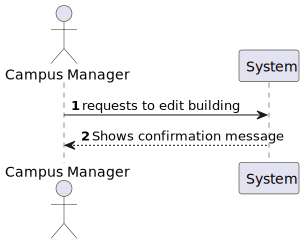
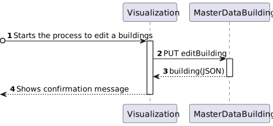

# US 1060 - As a campus manager, I want to edit a building 

## 1. Context

* Backend developed in Sprint A.
* This task is relative to system user Campus Manager .

## 2. Requirements

**US 1060 -** As a campus Manager I want to edit a building 

**Dependencies:**
- **US160  -** Sprint A.
- **US 160 -** As a Campus Manager, I want to edit a building

## 3. Analysis

**Regarding this requirement we understand that:**

As a Campus Manager, an actor of the system, I will be able to access the system and edit any information
of a building with the execption of the building unique code.


### 3.1. Domain Model Excerpt


## 4. Design

### 4.1. Realization

### Level1
###### LogicalView:


###### SceneryView:


###### ProcessView:


#### Level2

###### LogicalView:


###### ImplementationView:


###### PhysicalView:


###### ProcessView:


#### Level3
###### LogicalView:


###### ImplementationView:


###### ProcessView:


### 4.2. Applied Patterns


### 4.3. Tests

```typescript
describe('Building Edit', function () {

    beforeEach(() => {
        cy.intercept('GET', 'http://localhost:4000/api/buildings/listAllBuildings', {
            statusCode: 200,
            body: [
                {
                    "buildingName": "A",
                    "buildingDescription": "T.I Building",
                    "buildingCode": "A",
                    "buildingLength": 10,
                    "buildingWidth": 10,
                    "buildingFloors": [
                        1,
                        2,
                        3,
                        4
                    ]
                },
                {
                    "buildingName": "B",
                    "buildingDescription": "Main Building",
                    "buildingCode": "B",
                    "buildingLength": 10,
                    "buildingWidth": 10,
                    "buildingFloors": [
                        11,
                        22,
                        33
                    ]
                }
            ]
        }).as('listAllBuildings');

        cy.intercept('PUT', 'http://localhost:4000/api/buildings/editBuilding', {
            statusCode: 200,
            body: [
                {
                    "buildingName": "C",
                    "buildingDescription": "Was Building A",
                    "buildingCode": "A",
                    "buildingLength": 20,
                    "buildingWidth": 10,
                    "buildingFloors": [
                    ]
                }
            ]
        }).as('editBuilding');


        cy.visit('/buildings/editBuilding')
    });

    it('has correct title', function () {
        cy.get('h1').should('contain', 'Edit Building')
    })

    it('fills and submits the form', function () {
        cy.get('button:contains("Edit")').first().click()
        cy.get('#name').type('C');
        cy.get('#description').type('Was building A');
        cy.get('#length').type('20');
        cy.get('#width').type('10');
        cy.get('button:contains("Submit")').first().click();

        cy.wait('@editBuilding');
    })

    it('handles errors correctly', function () {
        cy.intercept('GET', '/api/buildings', { statusCode: 500, body: {} }).as('getBuildingsError')
        cy.visit('/buildings/listBuildingsMaxMinFloors')
        cy.on('window:alert', (str) => {
            expect(str).to.include('`An error occurred:')
        })
    })

})
```

## 5. Implementation

### building-edit.component.html

```html
<h1>Edit Building</h1>

<div>
    <table>
        <thead>
            <tr class="table100-head">
                <th class="column1">Code</th>
                <th class="column2">Name</th>
                <th class="column3">Description</th>
                <th class="column4">Length</th>
                <th class="column5">Width</th>
                <th class="column6">Floors</th>
                <th class="column6"></th>
            </tr>
        </thead>
        <tbody *ngFor="let building of buildings; let i = index">
            <tr>
                <td class="column1">{{ building.buildingCode }}</td>
                <td class="column2">{{ building.buildingName }}</td>
                <td class="column3">{{ building.buildingDescription }}</td>
                <td class="column4">{{ building.buildingLength }}</td>
                <td class="column5">{{ building.buildingWidth }}</td>
                <td class="column6">{{ building.buildingFloors }}</td>
                <td><button type="button" class="button" (click)="toggleExpansion(i, building)">Edit</button></td>
            </tr>

            <div class="editForm" *ngIf="expanded[i]">
                <form [formGroup]="editForm" (ngSubmit)="save(); toggleExpansion(i, building)">
                    <div class="form__group field">
                        <input type="text" class="form__field" id='code' formControlName="code" [readOnly]="true" />
                        <label for="code" class="form__label">Building Code</label>
                    </div>

                    <div class="form__group field">
                        <input type="text" class="form__field" id='name' formControlName="name"/>
                        <label for="name" class="form__label">Name</label>
                    </div>

                    <div class="form__group field">
                        <input type="text" class="form__field" id='description' formControlName="description"/>
                        <label for="description" class="form__label">Description</label>
                    </div>

                    <div class="form__group field">
                        <input type="number" class="form__field" id='length' formControlName="length"/>
                        <label for="length" class="form__label">Length</label>
                    </div>

                    <div class="form__group field">
                        <input type="number" class="form__field" id='width' formControlName="width"/>
                        <label for="width" class="form__label">Width</label>
                    </div>

                    <div class="form__group field">
                        <input type="number" class="form__field" id="floors" formControlName="floors" [readOnly]="true"/>
                        <label for="width" class="form__label">Floors</label>
                    </div>

                    <button>Submit</button>
                </form>
            </div>
        </tbody>
    </table>
</div>
```

### building-edit.component.ts

```typescript
export class BuildingEditComponent {

  buildings: Building[] = []
  index: number = 0;
  expanded: boolean[] = [false];

  editForm = new FormGroup({
    code: new FormControl(''),
    name: new FormControl(''),
    description: new FormControl(''),
    length: new FormControl(0),
    width: new FormControl(0),
    floors: new FormArray([new FormControl(0)]),
  })

  constructor(
    private buildingService: BuildingService
  ) { }

  toggleExpansion(index: number, building: Building) {
    this.expanded[index] = !this.expanded[index];
    if (this.expanded[index]) {
      this.editForm.patchValue({
        code: building.buildingCode,
        name: building.buildingName,
        description: building.buildingDescription,
        length: building.buildingLength,
        width: building.buildingWidth,
        floors: building.buildingFloors,
      })
    }
  }

  ngOnInit() {
    this.buildingService.listAll()
      .subscribe(
        (data: Building[]) => {
          this.buildings = data;
        }
      )
  }

  update() {
    this.buildings = []
    this.buildingService.listAll()
      .subscribe(
        (data: Building[]) => {
          this.buildings = data;
        }
      )
  }

  save() {
    let aux: number[] = []
    for (const f of this.editForm.value.floors!) {
      aux.push(f!)
    }

    const building: BuildingCreate = {
      buildingCode: this.editForm.value.code!,
      buildingName: this.editForm.value.name!,
      buildingDescription: this.editForm.value.description!,
      buildingLength: this.editForm.value.length!,
      buildingWidth: this.editForm.value.width!,
    }

    this.buildingService.editBuilding(building).subscribe((b: Building) => {
      window.alert("Building " + b.buildingCode + " edited successfully!")
      this.update()
    })
  }

}

```

### buildingService

```typescript
  public editBuilding(building: BuildingCreate) {
    const url = this.buildingsUrl + "/" + "editBuilding";

    return this.http.put<Building>(url, building)
      .pipe(
        catchError(this.handleError)
      )
  }
```

## 6. Integration/Demonstration


## 7. Observations

No additional observations.
