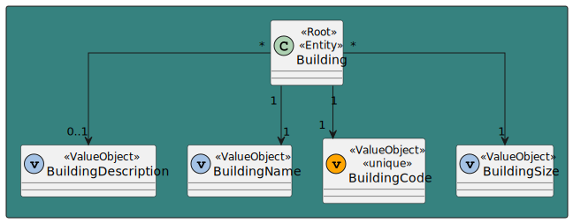
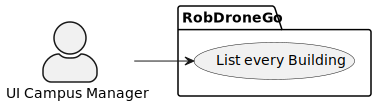
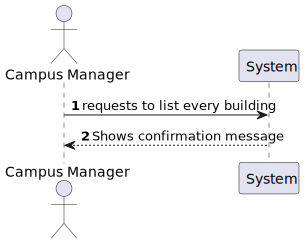
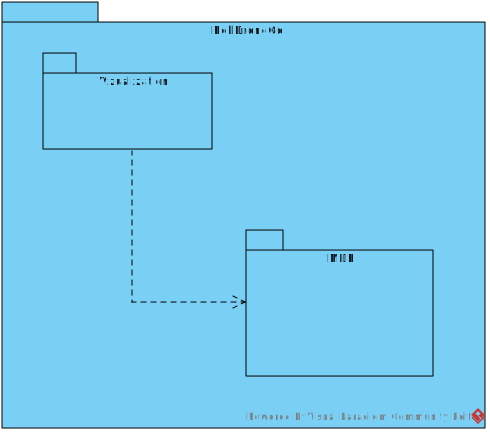
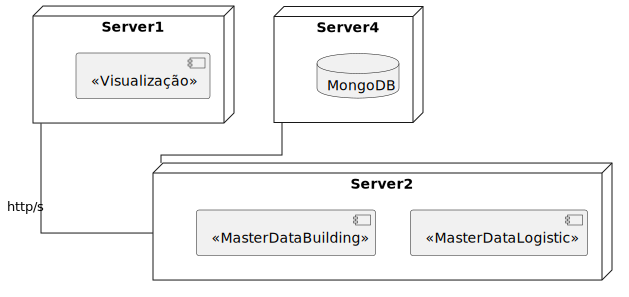
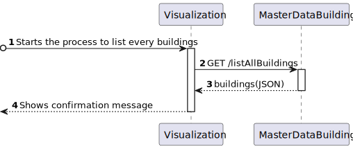

# US 1070 - As a campus manager, I want to list all buildigns

## 1. Context

* Backend developed in Sprint A.
* This task is relative to system user Campus Manager .

## 2. Requirements

**US 1070 -** As a campus Manager I want to list all buildings

**Dependencies:**
- **US 170 -** Sprint A.
- **US 170 -** As a Campus Manager, I want to list all buildings

## 3. Analysis

**Regarding this requirement we understand that:**

As a Campus Manager, an actor of the system, I will be able to access the system and list
every building registered in the system regarless the number of floors 

### 3.1. Domain Model Excerpt



## 4. Design

### 4.1. Realization

### Level1

###### LogicalView:


###### SceneryView:



###### ProcessView:



#### Level2

###### LogicalView:


###### ImplementationView:



###### PhysicalView:



###### ProcessView:



#### Level3

###### LogicalView:


###### ImplementationView:


###### ProcessView:


### 4.2. Applied Patterns

### 4.3. Tests

```typescript
describe('Building list all', function () {
  beforeEach(() => {

    cy.intercept('GET', 'http://localhost:4000/api/buildings/listAllBuildings', {
      statusCode: 200,
      body: [
        {
          "buildingName": "A",
          "buildingDescription": "T.I Building",
          "buildingCode": "A",
          "buildingLength": 10,
          "buildingWidth": 10,
          "buildingFloors": [
            1,
            2,
            3,
            4
          ]
        },
        {
          "buildingName": "B",
          "buildingDescription": "Main Building",
          "buildingCode": "B",
          "buildingLength": 10,
          "buildingWidth": 10,
          "buildingFloors": [
            11,
            22,
            33
          ]
        }
      ]
    }).as('listAllBuildings');


    cy.visit('/buildings/listAllBuildings')
  });

  it('has correct title', function () {
    cy.get('h1').should('contain', 'Buildings list')
  })

  it('checks for listed buildings', function () {

    cy.get('table').then(($table) => {
      const initialTableText = $table.text()
      cy.wait('@listAllBuildings')

      cy.get('table tbody tr:first-child td.column1').contains('A');
      cy.get('table tbody tr:first-child td.column2').contains('A');
      cy.get('table tbody tr:first-child td.column3').contains('T.I Building');
      cy.get('table tbody tr:first-child td.column4').contains('10');
      cy.get('table tbody tr:first-child td.column5').contains('10');
      cy.get('table tbody tr:first-child td.column6').contains('1,2,3,4');

      cy.get('table tbody tr:nth-child(2) td.column1').contains('B');
      cy.get('table tbody tr:nth-child(2) td.column2').contains('B');
      cy.get('table tbody tr:nth-child(2) td.column3').contains('Main Building');
      cy.get('table tbody tr:nth-child(2) td.column4').contains('10');
      cy.get('table tbody tr:nth-child(2) td.column5').contains('10');
      cy.get('table tbody tr:nth-child(2) td.column6').contains('11,22,33');

      cy.get('table').should(($tableAfter) => {
        expect($tableAfter.text()).not.to.eq(initialTableText)
      })

    })
  })


  it('handles errors correctly', function () {
    cy.intercept('GET', '/api/buildings', { statusCode: 500, body: {} }).as('getBuildingsError')
    cy.visit('/buildings/listBuildingsMaxMinFloors')
    cy.on('window:alert', (str) => {
      expect(str).to.include('`An error occurred:')
    })
  })

})
```

## 5. Implementation

### building-list-all.component.html

```html
<h1>Buildings list</h1>

<div>
<table>
    <thead>
    <tr class="table100-head">
    <th class="column1">Code</th>
    <th class="column2">Name</th>
    <th class="column3">Description</th>
    <th class="column4">Length</th>
    <th class="column5">Width</th>
    <th class="column6">Floors</th>
    </tr>
    </thead>
    <tbody>
    <tr *ngFor="let building of buildings">
        <td class="column1">{{ building.buildingCode }}</td>
        <td class="column2">{{ building.buildingName }}</td>
        <td class="column3">{{ building.buildingDescription }}</td>
        <td class="column4">{{ building.buildingLength }}</td>
        <td class="column5">{{ building.buildingWidth }}</td>
        <td class="column6">{{ building.buildingFloors }}</td>
    </tr>
    </tbody>
</table>
</div>

```

### building-list-all.component.ts

```typescript
export class BuildingListAllComponent {

  buildings: Building[] = []

  constructor(
    private buildingService: BuildingService,
  ) { }

  ngOnInit() {
    this.buildingService.listAll()
      .subscribe(
        (data: Building[]) => {
          this.buildings = data;
        }
      )
  }

}

```

### buildingService

```typescript
  public listAll(): Observable<Building[]> {
    const url = this.buildingsUrl + "/" + "listAllBuildings";

    return this.http.get<Building[]>(url)
      .pipe(
        catchError(this.handleError)
      )
  }
```

## 6. Integration/Demonstration


## 7. Observations

No additional observations.
