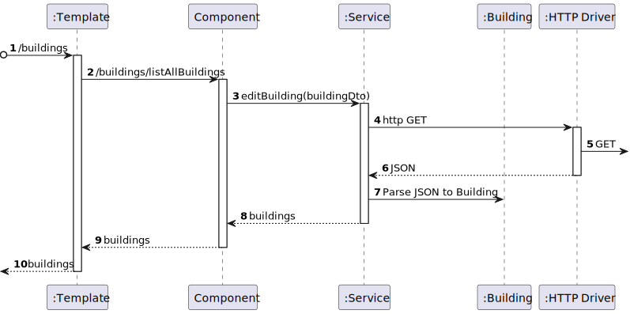

# US 1070 - As a campus manager, I want to list all buildigns

## 1. Context

* Backend developed in Sprint A.
* This task is relative to system user Campus Manager .

## 2. Requirements

**US 1070 -** As a campus Manager I want to list all buildings

**Dependencies:**
- **US 170 -** Sprint A.
- **US 170 -** As a Campus Manager, I want to list all buildings

## 3. Analysis

**Regarding this requirement we understand that:**

As a Campus Manager, an actor of the system, I will be able to access the system and list
every building registered in the system regarless the number of floors 

### 3.1. Domain Model Excerpt


## 4. Design

### 4.1. Realization

### Level1

###### LogicalView:


###### SceneryView:


###### ProcessView:


#### Level2

###### LogicalView:


###### ImplementationView:


###### PhysicalView:


###### ProcessView:


#### Level3

###### LogicalView:


###### ImplementationView:


###### ProcessView:




### 4.2. Applied Patterns

### 4.3. Tests

## 5. Implementation

### building-list-all.component.html

```html
<h1>Buildings list</h1>

<div>
<table>
    <thead>
    <tr class="table100-head">
    <th class="column1">Code</th>
    <th class="column2">Name</th>
    <th class="column3">Description</th>
    <th class="column4">Length</th>
    <th class="column5">Width</th>
    <th class="column6">Floors</th>
    </tr>
    </thead>
    <tbody>
    <tr *ngFor="let building of buildings">
        <td class="column1">{{ building.buildingCode }}</td>
        <td class="column2">{{ building.buildingName }}</td>
        <td class="column3">{{ building.buildingDescription }}</td>
        <td class="column4">{{ building.buildingLength }}</td>
        <td class="column5">{{ building.buildingWidth }}</td>
        <td class="column6">{{ building.buildingFloors }}</td>
    </tr>
    </tbody>
</table>
</div>

```

### building-list-all.component.ts

```typescript
export class BuildingListAllComponent {

  buildings: Building[] = []

  constructor(
    private buildingService: BuildingService,
  ) { }

  ngOnInit() {
    this.buildingService.listAll()
      .subscribe(
        (data: Building[]) => {
          this.buildings = data;
        }
      )
  }

}

```

### buildingService

```typescript
  public listAll(): Observable<Building[]> {
    const url = this.buildingsUrl + "/" + "listAllBuildings";

    return this.http.get<Building[]>(url)
      .pipe(
        catchError(this.handleError)
      )
  }
```

## 6. Integration/Demonstration


## 7. Observations

No additional observations.
