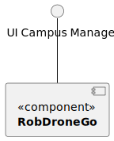
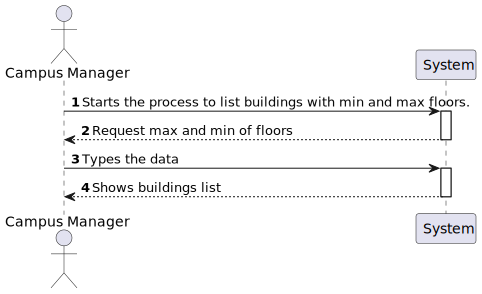
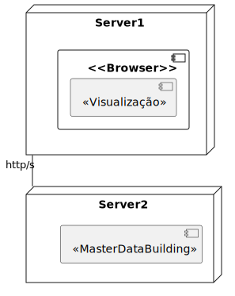
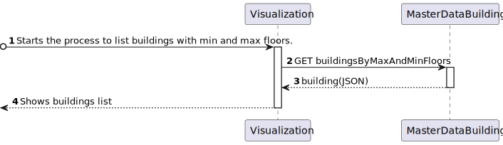
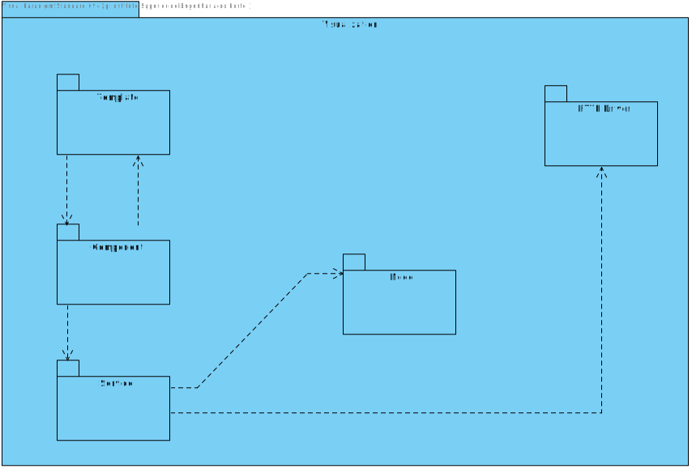
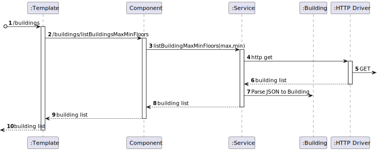

# US 1080 - As a Campus Manager, I want to list buildings with min and max floors.

## 1. Context

* Backend developed in Sprint A.
* This task is relative to system user Campus Manager .

## 2. Requirements

**US 1080 -** As a Campus Manager, I want to list buildings with min and max floors.

**Dependencies:**
- **US150 -** As a Campus Manager, I want to create a building.
- **US180 -** Sprint A.

**Regarding this requirement we understand that:** <br>
As a Campus Manager, an actor of the system, I will be able to access the system list buildings specifying a min and max of floors.

## 3. Analysis

**Analyzing this User Story we understand that:**
* Campus Manager is a user role that manages the data of the routes and maps.
* Building is a structure within the campus that houses various rooms and facilities. It can be navigated by the robisep robots using corridors and elevators.
* Floor is a level within a building. Each floor can contain multiple rooms and is accessible by elevators and stairs (though robisep robots cannot use stairs).

### 3.1. Domain Model Excerpt


## 4. Design

### 4.1. Realization

### Level1
###### LogicalView:


###### SceneryView:


###### ProcessView:


#### Level2

###### LogicalView:


###### ImplementationView:


###### PhysicalView:


###### ProcessView:


#### Level3
###### LogicalView:


###### ImplementationView:


###### ProcessView:



### 4.3. Applied Patterns


### 4.4. Tests

## 5. Implementation

### BuildingListMaxMin Component
```
@Component({
  selector: 'app-building-list-max-min',
  templateUrl: './building-list-max-min.component.html',
  styleUrls: ['./building-list-max-min.component.css'],
  providers: [BuildingService]
})


export class BuildingListMaxMinComponent implements OnInit {

  buildings: any[] = [];

  ngOnInit(): void {
    
  }

  constructor(private buildingService: BuildingService) { }
  max: number = 0;
  min: number = 0;

  listBuildingMaxMinFloors(){
    this.buildingService.listBuildingMaxMinFloors(this.max, this.min).subscribe(
      (data: any) => {
        this.buildings = data;
      },
      (error: any) => {
        console.error('Error:', error);
        this.buildings = [];
      }
    );
  }

}

````

### BuildingListMaxMin Component HTML
```
<h1>List Buildings by Max Min Floor</h1>
<div class="form__group field">
    <input type="number" class="form__field" min="0"  [(ngModel)]="max" placeholder="Max floors" min="0"/>
    <label for="max" class="form__label">Max floors</label>

    <input type="number" class="form__field" min="0"  [(ngModel)]="min" placeholder="Min floors" min="0"/>
    <label for="min" class="form__label" style="margin-left: 24%;">Min floors</label>

    <button (click)="listBuildingMaxMinFloors()">Search</button>

</div>


<div>
<table>
    <thead>
    <tr class="table100-head">
    <th class="column1">Code</th>
    <th class="column2">Name</th>
    <th class="column3">Description</th>
    <th class="column4">Length</th>
    <th class="column5">Width</th>
    <th class="column6">Floors</th>
    </tr>
    </thead>
    <tbody>
    <tr *ngFor="let building of buildings">
        <td class="column1">{{ building.buildingCode }}</td>
        <td class="column2">{{ building.buildingName }}</td>
        <td class="column3">{{ building.buildingDescription }}</td>
        <td class="column4">{{ building.buildingLength }}</td>
        <td class="column5">{{ building.buildingWidth }}</td>
        <td class="column6">{{ building.buildingFloors }}</td>
    </tr>
    </tbody>
</table>
</div>
````

## 6. Integration/Demonstration

https://github.com/Pedro-Pereira1/sem5pi_23_24_g056_Visualization/assets/128611263/6471c5cb-d9e2-48f6-a774-3116ca3dff22


## 7. Observations
