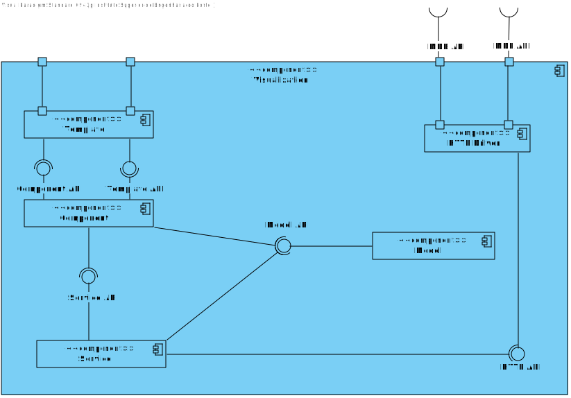

# US 1080 - As a Campus Manager, I want to list buildings with min and max floors.

## 1. Context

* Backend developed in Sprint A.
* This task is relative to system user Campus Manager .

## 2. Requirements

**US 1080 -** As a Campus Manager, I want to list buildings with min and max floors.

**Dependencies:**
- **US150 -** As a Campus Manager, I want to create a building.
- **US180 -** Sprint A.

**Regarding this requirement we understand that:**  
As a Campus Manager, an actor of the system, I will be able to access the system list buildings specifying a min and max of floors.

## 3. Analysis

**Analyzing this User Story we understand that:**
* Campus Manager is a user role that manages the data of the routes and maps.
* Building is a structure within the campus that houses various rooms and facilities. It can be navigated by the robisep robots using corridors and elevators.
* Floor is a level within a building. Each floor can contain multiple rooms and is accessible by elevators and stairs (though robisep robots cannot use stairs).

### 3.1. Domain Model Excerpt

## 4. Design

### 4.1. Realization

### Level1
###### LogicalView:

###### SceneryView:

###### ProcessView:

#### Level2

###### LogicalView:

###### ImplementationView:

###### PhysicalView:

###### ProcessView:

#### Level3
###### LogicalView:

###### ImplementationView:

###### ProcessView:

### 4.3. Applied Patterns

### 4.4. Tests

## 5. Implementation

## 6. Integration/Demonstration

## 7. Observations
