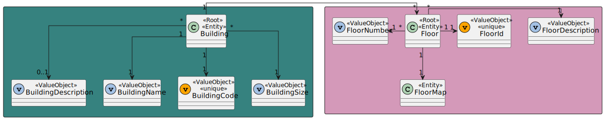
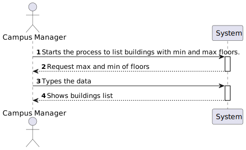

# US 1080 - As a Campus Manager, I want to list buildings with min and max floors.

## 1. Context

* Backend developed in Sprint A.
* This task is relative to system user Campus Manager .

## 2. Requirements

**US 1080 -** As a Campus Manager, I want to list buildings with min and max floors.

**Dependencies:**
- **US150 -** As a Campus Manager, I want to create a building.
- **US180 -** Sprint A.

**Regarding this requirement we understand that:** <br>
As a Campus Manager, an actor of the system, I will be able to access the system list buildings specifying a min and max of floors.

## 3. Analysis

**Analyzing this User Story we understand that:**
* Campus Manager is a user role that manages the data of the routes and maps.
* Building is a structure within the campus that houses various rooms and facilities. It can be navigated by the robisep robots using corridors and elevators.
* Floor is a level within a building. Each floor can contain multiple rooms and is accessible by elevators and stairs (though robisep robots cannot use stairs).
* We will use Angular, so we need an HTML, CSS and TS file.
* We will need two labels, one for max number and one for min number.
* We will need a button to search for buildings
* We will need a table so show the result (updated when button search is clicked)

### 3.1. Domain Model Excerpt



## 4. Design

### 4.1. Realization

### Level1
###### LogicalView:


###### SceneryView:


###### ProcessView:


#### Level2

###### LogicalView:


###### ImplementationView:


###### PhysicalView:


###### ProcessView:


#### Level3
###### LogicalView:


###### ImplementationView:


###### ProcessView:


### 4.3. Applied Patterns


### 4.4. Tests

**Test 1:** *It intercepts a GET request to the specified API endpoint using cy.intercept. The intercepted request returns mock data containing information about two buildings.*
```
beforeEach(() => {
    
      cy.intercept('GET', 'http://localhost:4000/api/buildings/listBuildingsMaxMinFloors/*/*', {
        statusCode: 200,
        body: [
          {
              "buildingName": "A",
              "buildingDescription": "T.I Building",
              "buildingCode": "A",
              "buildingLength": 10,
              "buildingWidth": 10,
              "buildingFloors": [
                  1,
                  2,
                  3,
                  4
              ]
          },
          {
              "buildingName": "B",
              "buildingDescription": "Joi.string().max(255)",
              "buildingCode": "B",
              "buildingLength": 10,
              "buildingWidth": 10,
              "buildingFloors": [
                  11,
                  22,
                  33
              ]
          }
      ]
      }).as('listBuildingMaxMinFloors');  


      cy.visit('/buildings/listBuildingsMaxMinFloors')
    });
````

**Test 2:** *It checks if the page contains an <h1> element with the text 'List Buildings by Max Min Floor'.*
```
it('has correct title', function() {
        cy.get('h1').should('contain', 'List Buildings by Max Min Floor')
    })
````

**Test 3:** *It ensures that the initial values of form fields (presumably numerical input fields) are set to '0'.*
```
it('has correct initial input values', function() {
        cy.get('.form__field').each(($el, index, $list) => {
          cy.wrap($el).should('have.value', '0')
        })
      })
````

**Test 4:** *Verify a completed call*
```
it('fills and submits the form', function() {

        cy.get('table').then(($table) => {
          const initialTableText = $table.text()

          cy.get('.form__field').first().clear().type('10')
          cy.get('.form__field').last().clear().type('5')
          cy.get('button:contains("Search")').click()

          cy.get('.form__field').first().should('have.value', '10')
          cy.get('.form__field').last().should('have.value', '5')

          cy.wait('@listBuildingMaxMinFloors')

          cy.get('table').should(($tableAfter) => {
            expect($tableAfter.text()).not.to.eq(initialTableText)
          })
        })
      })
````

**Test 5:** *It intercepts a GET request to '/api/buildings' and responds with a status code of 500 (Internal Server Error) and an empty body, simulating an error.*
```
it('handles errors correctly', function() {
        cy.intercept('GET', '/api/buildings', { statusCode: 500, body: {} }).as('getBuildingsError')
        cy.visit('/buildings/listBuildingsMaxMinFloors')
        cy.on('window:alert', (str) => {
          expect(str).to.include('`An error occurred:')
        })
      })

````


## 5. Implementation

### BuildingListMaxMin Component
```
@Component({
  selector: 'app-building-list-max-min',
  templateUrl: './building-list-max-min.component.html',
  styleUrls: ['./building-list-max-min.component.css'],
  providers: [BuildingService]
})


export class BuildingListMaxMinComponent implements OnInit {

  buildings: any[] = [];

  ngOnInit(): void {
    
  }

  constructor(private buildingService: BuildingService) { }
  max: number = 0;
  min: number = 0;

  listBuildingMaxMinFloors(){
    this.buildingService.listBuildingMaxMinFloors(this.max, this.min).subscribe(
      (data: any) => {
        this.buildings = data;
      },
      (error: any) => {
        console.error('Error:', error);
        this.buildings = [];
      }
    );
  }

}

````

### BuildingListMaxMin Component HTML
```
<h1>List Buildings by Max Min Floor</h1>
<div class="form__group field">
    <input type="number" class="form__field" min="0"  [(ngModel)]="max" placeholder="Max floors" min="0"/>
    <label for="max" class="form__label">Max floors</label>

    <input type="number" class="form__field" min="0"  [(ngModel)]="min" placeholder="Min floors" min="0"/>
    <label for="min" class="form__label" style="margin-left: 24%;">Min floors</label>

    <button (click)="listBuildingMaxMinFloors()">Search</button>

</div>


<div>
<table>
    <thead>
    <tr class="table100-head">
    <th class="column1">Code</th>
    <th class="column2">Name</th>
    <th class="column3">Description</th>
    <th class="column4">Length</th>
    <th class="column5">Width</th>
    <th class="column6">Floors</th>
    </tr>
    </thead>
    <tbody>
    <tr *ngFor="let building of buildings">
        <td class="column1">{{ building.buildingCode }}</td>
        <td class="column2">{{ building.buildingName }}</td>
        <td class="column3">{{ building.buildingDescription }}</td>
        <td class="column4">{{ building.buildingLength }}</td>
        <td class="column5">{{ building.buildingWidth }}</td>
        <td class="column6">{{ building.buildingFloors }}</td>
    </tr>
    </tbody>
</table>
</div>
````

## 6. Integration/Demonstration

https://github.com/Pedro-Pereira1/sem5pi_23_24_g056_Visualization/assets/128611263/6471c5cb-d9e2-48f6-a774-3116ca3dff22


## 7. Observations
