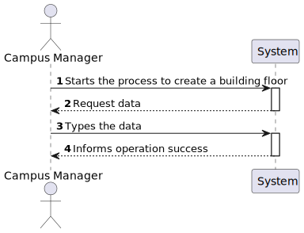

# US 1090 - As a Campus Manager, I want to create building floor

## 1. Context

* Backend developed in Sprint A.
* This task is relative to system user Fleet Manager .

## 2. Requirements

**US 1090 -** As a Campus Manager, I want to create building floor

> **Q**: Será possível esclarecer como funcionarão estas user stories?? <br>
> **A**: O requisito 190 Criar piso permite definir um piso para um dos edificios criados anteriormente, por exemplo, o piso 1 do edificio B com uma breve descrição (ex., "salas TP". <br>


**Dependencies:**
- **US150 -** As a Campus Manager, I want to create a building.
- **US190 -** Sprint A 

**Regarding this requirement we understand that:** <br>
As a Campus Manager, an actor of the system, I will be able to access the system and create building floor.

## 3. Analysis

**Analyzing this User Story we understand that:**
* Campus Manager is a user role that manages the data of the routes and maps.
* Building is a structure within the campus that houses various rooms and facilities. It can be navigated by the robisep robots using corridors and elevators.
* Floor is a level within a building. Each floor can contain multiple rooms and is accessible by elevators and stairs (though robisep robots cannot use stairs).
* The floor information is based on: Floor Number, Floor Description and each floor coordinate info(wall,door,elevator,etc)
* Floor example:

|  7  |  6  |  6  |  6  |  6  |  7  |  6  |  6  |  2  |
|:---:|:---:|:---:|:---:|:---:|:---:|:---:|:---:|:---:|
|  5  |  4  |  4  |  4  |  4  |  5  |  4  |  4  |  2  |
| 13  |  2  |  2  |  9  |  2  |  2  |  9  |  2  | 14  |
|  0  |  0  |  0  |  0  |  0  |  0  |  0  |  0  | 14  |
|  7  |  6  |  6  |  6  |  6  |  6  |  8  |  0  |  2  |
|  5  |  4  |  4  |  4  |  4  |  4  |  1  |  0  | 12  |
|  5  |  4  |  4  |  4  |  4  |  4  |  1  |  0  | 12  |
|  2  |  2  |  2  |  2  |  2  |  2  |  2  |  2  |  0  |


| description.map[][] | North wall | West wall | Door | Elevator | Passageway | Room |
|:-------------------:|:----------:|:---------:|:----:|:--------:|:----------:|:----:|
|          0          |     No     |    No     |  No  |    No    |     No     |  No  |
|          1          |     No     |    Yes    |  No  |    No    |     No     |  No  |
|          2          |    Yes     |    No     |  No  |    No    |     No     |  No  |
|          3          |    Yes     |    Yes    |  No  |    No    |     No     |  No  |
|          4          |     No     |    No     |  No  |    No    |     No     | Yes  |
|          5          |     No     |    Yes    |  No  |    No    |     No     | Yes  |
|          6          |    Yes     |    No     |  No  |    No    |     No     | Yes  |
|          7          |    Yes     |    Yes    |  No  |    No    |     No     | Yes  |
|          8          |     No     |    Yes    | Yes  |    No    |     No     |  No  |
|          9          |    Yes     |    No     | Yes  |    No    |     No     |  No  |
|         10          |     No     |    Yes    | Yes  |    No    |     No     | Yes  |
|         11          |    Yes     |    No     | Yes  |    No    |     No     | Yes  |
|         12          |     No     |    No     |  No  |    No    |    Yes     |  No  |
|         13          |    Yes     |    No     |  No  |    No    |    Yes     |  No  |
|         14          |     No     |    No     |  No  |   Yes    |     No     |  No  |


* We will use Angular, so we need an HTML, CSS and TS file.
* We will need three labels (ID, floorNumber and Description)
* We will need a label to select the building to create a Floor
* We will need a button to perform the action
* We will a notification to inform the operation success.


### 3.1. Domain Model Excerpt


## 4. Design

### 4.1. Realization

### Level1
###### LogicalView:


###### SceneryView:


###### ProcessView:


#### Level2

###### LogicalView:


###### ImplementationView:


###### PhysicalView:


###### ProcessView:


#### Level3
###### LogicalView:


###### ImplementationView:


###### ProcessView:


### 4.3. Applied Patterns


### 4.4. Tests


## 5. Implementation

###  Floors Component
```
@Component({
  selector: 'app-floors',
  templateUrl: './floors.component.html',
  styleUrls: ['./floors.component.css'],
  providers: [BuildingService,FloorService]
})
export class FloorsComponent implements OnInit{
  constructor(private floorService: FloorService, private buildingService:BuildingService) { }
  

  createForm = new FormGroup({
    floorID: new FormControl(0),
    floorNumber: new FormControl(0),
    floorDescription: new FormControl(''),
    buildingCode: new FormControl(''),
  })

  buildings: any[] = [];

  ngOnInit(): void {
    this.buildingService.listAll().subscribe(
      (data: any) => {
        this.buildings = data;
      },
      (error: any) => {
        console.error('Error:', error);
        this.buildings = [];
      }
    );
  }

  onSubmint() {
    const floor: FloorCreate = {
      floorId: this.createForm.value.floorID!,
      floorNumber: this.createForm.value.floorNumber!,
      floorDescription: this.createForm.value.floorDescription!,
      buildingCode: this.createForm.value.buildingCode!,
    }
    this.floorService.createFloor(floor).subscribe(
      (data: Floor) => {
        window.alert("Floor " + floor.floorId + " created successfully");
        this.createForm.reset();
      },
      (error: Floor) => {
        console.error('Error:', error);
        this.createForm.reset();
      }
    );
  }

}

````

###  Floors Component HTML
```
<h1>Create Floor</h1>

<form [formGroup]="createForm" (ngSubmit)="onSubmint()">
    <div class="form__group field">
        <input type="number" class="form__field" min="0"  id='floorID' formControlName="floorID" required/>
        <label for="floorID" class="form__label">FloorID</label>
    </div>
    <div class="form__group field">
        <input type="number" class="form__field" min="0" id='floorNumber' formControlName="floorNumber" required/>
        <label for="floorNumber" class="form__label">FloorNumber</label>
    </div>
    <div class="form__group field">
        <input type="text" class="form__field"  id='floorDescription'  formControlName="floorDescription"/>
        <label for="floorDescription" class="form__label">Description</label>
    </div>
    <div class="form__group field">
        <select class="form_select" formControlName="buildingCode">
            <option value="">Select a building</option>
            <option *ngFor="let building of buildings" [value]="building.buildingCode">{{ building.buildingCode }}</option>
        </select>
    </div>
    <div>
        <button>Create</button>
    </div>
</form>

````

## 6. Integration/Demonstration


## 7. Observations
