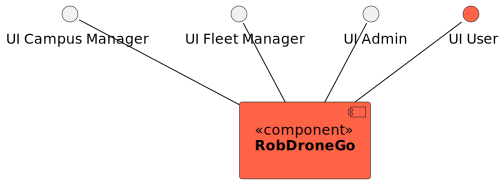
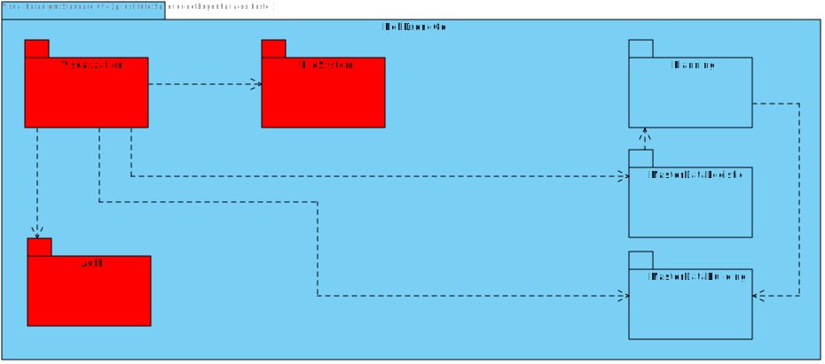
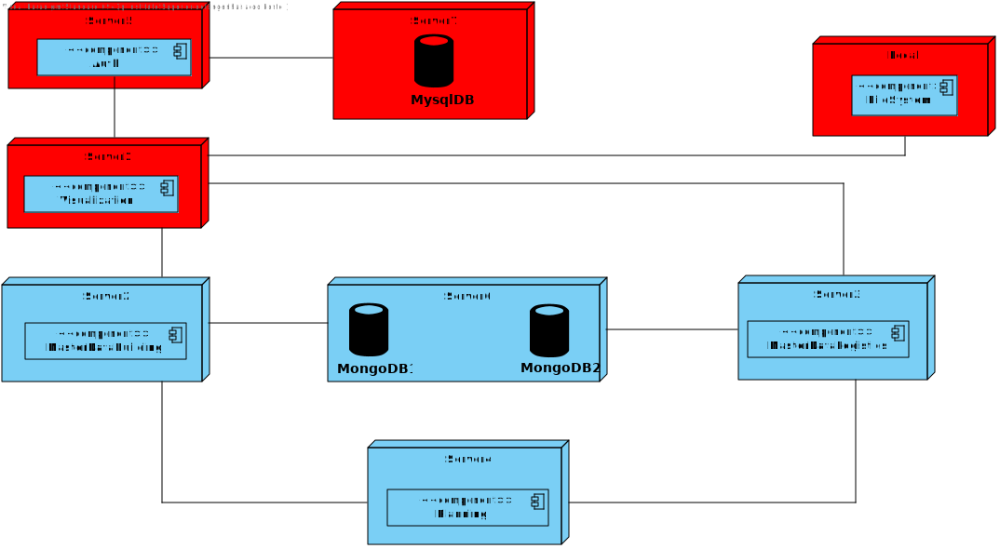
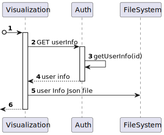
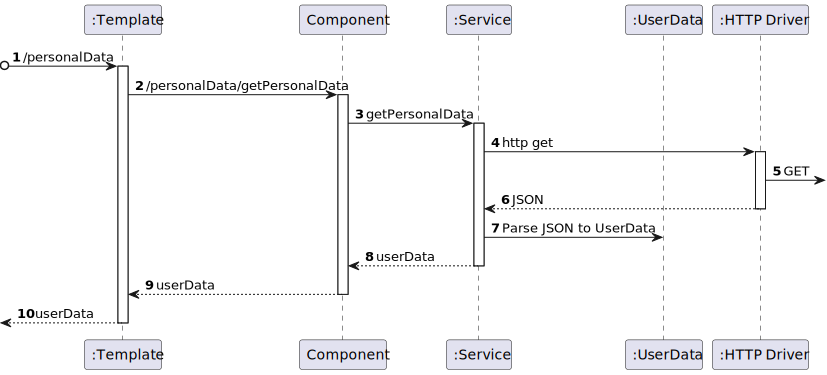

# US 110 - As a system user I intend to copy my personal data.

## 1. Context

* This is the first time this task is being developed

## 2. Requirements

**US 110 -** As a system user I intend to copy my personal data.

## 3. Analysis

### Questions to the client
> Q: como utente do sistema pretendo uma cópia dos meus dos meus dados pessoais - devemos considerar o utente como qualquer utilizador do sistema ou só mesmo os utentes (aluno, docente, funcionario)?
>  A: apenas os utentes

> Q: Gostaria de saber como a cópia dos dados pessoais deve ser feita.
>  A: deve ser gerado um ficheiro json com a informação que o sistema guardou sobre a pessoa.

**Regarding this requirement we understand that:**
As an actor of the system, I want to be able to copy my personal data.
In the process of copying my personal data the user should be able to download a json file with his/hers personal data.
The user should be able to download the file from the system by clicking a button.

## 4. Design

### 4.1. Realization

### Level1
###### LogicalView:

###### SceneryView:

###### ProcessView:

#### Level2

###### LogicalView:

###### ImplementationView:

###### PhysicalView:

###### ProcessView:

#### Level3
###### LogicalView:

###### ImplementationView:

###### ProcessView:

### 4.2. Applied Patterns

### 4.3. Tests

## 5. Implementation

## 6. Integration/Demonstration

## 7. Observations
