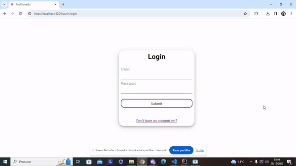

# US 110 - As a system user I intend to copy my personal data.

## 1. Context

* This is the first time this task is being developed

## 2. Requirements

**US 110 -** As a system user I intend to copy my personal data.

## 3. Analysis

### Questions to the client
> Q: como utente do sistema pretendo uma cópia dos meus dos meus dados pessoais - devemos considerar o utente como qualquer utilizador do sistema ou só mesmo os utentes (aluno, docente, funcionario)?
> <br>A: apenas os utentes

> Q: Gostaria de saber como a cópia dos dados pessoais deve ser feita.
> <br>A: deve ser gerado um ficheiro json com a informação que o sistema guardou sobre a pessoa.


**Regarding this requirement we understand that:**
As an actor of the system, I want to be able to copy my personal data.
In the process of copying my personal data the user should be able to download a json file with his/hers personal data.
The user should be able to download the file from the system by clicking a button.


## 4. Design

### 4.1. Realization

### Level1
###### LogicalView:


###### SceneryView:


###### ProcessView:


#### Level2

###### LogicalView:


###### ImplementationView:


###### PhysicalView:


###### ProcessView:


#### Level3
###### LogicalView:


###### ImplementationView:


###### ProcessView:


### 4.2. Applied Patterns
* Pipe
* Directive
* Service

### 4.3. Tests

**Test 1:** **Check Title**
```
it('has correct title', function() {
    cy.get('h4').should('contain', 'Profile Settings');
  })
```

**Test 2:** **Check existence of download button**
```
it('should display a button for dowload the data', () => {
    cy.get('button:contains("Dowload My Personal Data")').should('be.visible');
  });
```

**Test 3:** **Check download action**
```
it('dowloads data', function() {
    const dateTime1 = new Date().toLocaleString();
    const date1 = dateTime1.split(',')[0].replaceAll('/', '');
    const time1 = dateTime1.split(',')[1].replaceAll(':', '');
    const fileName1 = 'MyData_' + date1 +'T'+ time1 + '.json';
    cy.get('button:contains("Dowload My Personal Data")').should('be.visible').click();
    cy.wait('@getUserInfo')
    cy.readFile('cypress/downloads/' + fileName1).should('exist');
  })
```

## 5. Implementation

#### HTML
```
<div>
    <div>
        <div >
            <div>
                
            </div>
        </div>
        <div>
            <div>
                <div>
                    <h4>Profile Settings</h4>
                </div>
                <div>

                    <form [formGroup]="userForm">
                        <div class="form__group field">
                            <input type="text" class="form__field" id='name'  formControlName="name">
                            <label for="name" class="form__label">Name</label>
                        </div>

                        <div class="form__group field">
                            <input type="text" class="form__field" id='email' formControlName="email" [readOnly]="true"/>
                            <label for="email" class="form__label">Email</label>
                        </div>

                        <div class="form__group field">
                            <input type="text" class="form__field" id='phoneNumber' formControlName="phoneNumber">
                            <label for="phoneNumber" class="form__label">Phone Number</label>
                        </div>

                      <div class="form__group field">
                        <input type="text" class="form__field" id='taxPayerNumber' formControlName="taxPayerNumber">
                        <label for="taxPayerNumber" class="form__label">Tax Payer Number</label>
                      </div>

                        <div class="form__group field" [style.visibility]="passwordVisibility ? 'visible' : 'hidden'">
                            <input type="password" class="form__field" id='password' formControlName="password">
                            <label for="password" class="form__label">Password</label>
                          </div>

                        <div class="form__group field">
                            <select class="form_select" formControlName="role" >
                                <option value="">User</option>
                            </select>
                        </div>
                    </form>

                </div>
                <div>
                    <button (click)="editProfile()" >Edit Profile</button>
                    <button (click)="deleteProfile()" style="margin-left: 10px;">Delete Profile</button>
                    <button (click)="dowloadData()" style="margin-left: 10px;">Dowload My Personal Data</button>
                  <div *ngIf="wantsToDeleteProfile">
                    <h2>Are you sure you want to delete your profile? (This action is irreversible)</h2>
                    <button (click)="confirmDeleteProfile()" style="margin-left: 10px;">Yes</button>
                    <button (click)="cancelDeleteProfile()" style="margin-left: 10px;">No</button>
                  </div>
                  <div *ngIf="confirmEdit">
                    <button (click)="confirmUpdate()" style="margin-left: 10px;">Submit</button>
                  </div>

                </div>
            </div>
        </div>
    </div>
</div>

```

#### COMPONENT
```
dowloadData(){
    let user: UserDto = {
      name: "",
      email: "",
      phoneNumber: 0,
      taxPayerNumber: 0,
      role: "",
    }

    const userEmail = this.authService.getEmailByToken(this.authService.getToken())
    this.authService.getUserInfo(userEmail).subscribe(userInfo => {
      user.name = userInfo.name;
      user.email = userEmail;
      user.phoneNumber = userInfo.phoneNumber;
      user.taxPayerNumber = userInfo.taxPayerNumber;
      user.role = userInfo.role;
      const fileContent = JSON.stringify(user);

      const blob = new Blob([fileContent], { type: 'text/plain' });

      const link = document.createElement('a');
      link.href = URL.createObjectURL(blob);

      const dateTime = new Date().toLocaleString();
      const date = dateTime.split(',')[0].replaceAll('/', '');
      const time = dateTime.split(',')[1].replaceAll(':', '');

      link.download = 'MyData_' + date +'T'+ time + '.json';

      document.body.appendChild(link);

      link.click();

      document.body.removeChild(link);
    });

  }
```

## 6. Integration/Demonstration

## 7. Observations
