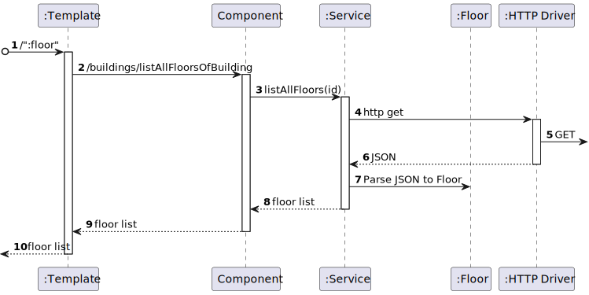

# US 1100 - As a Campus Manager, I want to list all floors of a building

## 1. Context

* Backend developed in Sprint A.
* This task is relative to system user Campus Manager .

## 2. Requirements

**US 1100 -** As a Campus Manager, I want to list all floors of a building.

**Dependencies:**
- **US150 -** As a Campus Manager, I want to create a building.
- **US190 -** As a Campus Manager, I want to create building floor.
- **US210 -** Sprint A

**Regarding this requirement we understand that:** <br>
As a Campus Manager, an actor of the system, I will be able to access the system and list all floors in a specified building.

## 3. Analysis

**Analyzing this User Story we understand that:**
* Campus Manager is a user role that manages the data of the routes and maps.
* Building is a structure within the campus that houses various rooms and facilities. It can be navigated by the robisep robots using corridors and elevators.
* Floor is a level within a building. Each floor can contain multiple rooms and is accessible by elevators and stairs (though robisep robots cannot use stairs).
* The floor information is based on: Floor Number, Floor Description and each floor coordinate info(wall,door,elevator,etc)
* Floor example:

|  7  |  6  |  6  |  6  |  6  |  7  |  6  |  6  |  2  |
|:---:|:---:|:---:|:---:|:---:|:---:|:---:|:---:|:---:|
|  5  |  4  |  4  |  4  |  4  |  5  |  4  |  4  |  2  |
| 13  |  2  |  2  |  9  |  2  |  2  |  9  |  2  | 14  |
|  0  |  0  |  0  |  0  |  0  |  0  |  0  |  0  | 14  |
|  7  |  6  |  6  |  6  |  6  |  6  |  8  |  0  |  2  |
|  5  |  4  |  4  |  4  |  4  |  4  |  1  |  0  | 12  |
|  5  |  4  |  4  |  4  |  4  |  4  |  1  |  0  | 12  |
|  2  |  2  |  2  |  2  |  2  |  2  |  2  |  2  |  0  |


| description.map[][] | North wall | West wall | Door | Elevator | Passageway | Room |
|:-------------------:|:----------:|:---------:|:----:|:--------:|:----------:|:----:|
|          0          |     No     |    No     |  No  |    No    |     No     |  No  |
|          1          |     No     |    Yes    |  No  |    No    |     No     |  No  |
|          2          |    Yes     |    No     |  No  |    No    |     No     |  No  |
|          3          |    Yes     |    Yes    |  No  |    No    |     No     |  No  |
|          4          |     No     |    No     |  No  |    No    |     No     | Yes  |
|          5          |     No     |    Yes    |  No  |    No    |     No     | Yes  |
|          6          |    Yes     |    No     |  No  |    No    |     No     | Yes  |
|          7          |    Yes     |    Yes    |  No  |    No    |     No     | Yes  |
|          8          |     No     |    Yes    | Yes  |    No    |     No     |  No  |
|          9          |    Yes     |    No     | Yes  |    No    |     No     |  No  |
|         10          |     No     |    Yes    | Yes  |    No    |     No     | Yes  |
|         11          |    Yes     |    No     | Yes  |    No    |     No     | Yes  |
|         12          |     No     |    No     |  No  |    No    |    Yes     |  No  |
|         13          |    Yes     |    No     |  No  |    No    |    Yes     |  No  |
|         14          |     No     |    No     |  No  |   Yes    |     No     |  No  |


### 3.1. Domain Model Excerpt


### 3.1. Domain Model Excerpt


## 4. Design

### 4.1. Realization

### Level1
###### LogicalView:


###### SceneryView:


###### ProcessView:


#### Level2

###### LogicalView:


###### ImplementationView:


###### PhysicalView:


###### ProcessView:


#### Level3
###### LogicalView:


###### ImplementationView:


###### ProcessView:


### 4.3. Applied Patterns

### 4.4. Tests


## 5. Implementation
###  FloorListAllFloorsOfBuilding Component
```
@Component({
  selector: 'app-floor-list-all-floors-of-building',
  templateUrl: './floor-list-all-floors-of-building.component.html',
  styleUrls: ['./floor-list-all-floors-of-building.component.css'],
  providers: [FloorService,BuildingService]
})
export class FloorListAllFloorsOfBuildingComponent implements OnInit {
  constructor(private floorService: FloorService, private buildingService:BuildingService) { }
  id: string = "";
  floors: any[] = [];
  buildings: any[] = [];

  ngOnInit(): void {
    this.buildingService.listAll().subscribe(
      (data: any) => {
        this.buildings = data;
      },
      (error: any) => {
        console.error('Error:', error);
        this.buildings = [];
      }
    );
  }

  listAllFloors(){
    this.floorService.listAllFloors(this.id).subscribe(
      (data: any) => {
        this.floors = data;
      },
      (error: any) => {
        console.error('Error:', error);
        this.floors = [];
      }
    );
  }

}

````

###  FloorListAllFloorsOfBuilding Component HTML
```
<h1>List All Floors</h1>
<select [(ngModel)]="id">
    <option value="">Select a building</option>
    <option *ngFor="let building of buildings" [value]="building.buildingCode">{{ building.buildingCode }}</option>
  </select>
<button (click)="listAllFloors()">Search</button>
<div>
    <table>
        <thead>
        <tr class="table100-head">
        <th class="column1">ID</th>
        <th class="column2">Number</th>
        <th class="column3">Description</th>
        <th class="column4">Map</th>
        </tr>
        </thead>
        <tbody>
        <tr *ngFor="let floor of floors">
            <td class="column1">{{ floor.floorId }}</td>
            <td class="column2">{{ floor.floorNumber }}</td>
            <td class="column3">{{ floor.floorDescription }}</td>
            <td class="column4">{{ floor.floorMap }}</td>
        </tr>
        </tbody>
    </table>
    </div>
````

## 6. Integration/Demonstration

## 7. Observations
