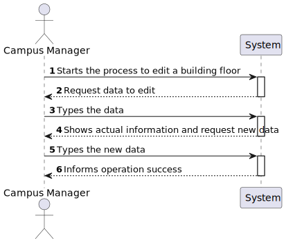

# US 1110 - As a Campus Manager, I want to edit building floor information.

## 1. Context

* Backend developed in Sprint A.
* This task is relative to system user Campus Manager .

## 2. Requirements

**US 200 -** As a Campus Manager, I want to edit building floor information.

**Dependencies:**
- **US150 -** As a Campus Manager, I want to create a building.
- **US190 -** As a Campus Manager, I want to create building floor.
  **200** - Sprint A


**Regarding this requirement we understand that:** <br>
As a Campus Manager, an actor of the system, I will be able to access the system and edit building floor information(floor number, floor description).

## 3. Analysis

**Analyzing this User Story we understand that:**
* Campus Manager is a user role that manages the data of the routes and maps.
* Building is a structure within the campus that houses various rooms and facilities. It can be navigated by the robisep robots using corridors and elevators.
* Floor is a level within a building. Each floor can contain multiple rooms and is accessible by elevators and stairs (though robisep robots cannot use stairs).
* Floor example:

|  7  |  6  |  6  |  6  |  6  |  7  |  6  |  6  |  2  |
|:---:|:---:|:---:|:---:|:---:|:---:|:---:|:---:|:---:|
|  5  |  4  |  4  |  4  |  4  |  5  |  4  |  4  |  2  |
| 13  |  2  |  2  |  9  |  2  |  2  |  9  |  2  | 14  |
|  0  |  0  |  0  |  0  |  0  |  0  |  0  |  0  | 14  |
|  7  |  6  |  6  |  6  |  6  |  6  |  8  |  0  |  2  |
|  5  |  4  |  4  |  4  |  4  |  4  |  1  |  0  | 12  |
|  5  |  4  |  4  |  4  |  4  |  4  |  1  |  0  | 12  |
|  2  |  2  |  2  |  2  |  2  |  2  |  2  |  2  |  0  |


| description.map[][] | North wall | West wall | Door | Elevator | Passageway | Room |
|:-------------------:|:----------:|:---------:|:----:|:--------:|:----------:|:----:|
|          0          |     No     |    No     |  No  |    No    |     No     |  No  |
|          1          |     No     |    Yes    |  No  |    No    |     No     |  No  |
|          2          |    Yes     |    No     |  No  |    No    |     No     |  No  |
|          3          |    Yes     |    Yes    |  No  |    No    |     No     |  No  |
|          4          |     No     |    No     |  No  |    No    |     No     | Yes  |
|          5          |     No     |    Yes    |  No  |    No    |     No     | Yes  |
|          6          |    Yes     |    No     |  No  |    No    |     No     | Yes  |
|          7          |    Yes     |    Yes    |  No  |    No    |     No     | Yes  |
|          8          |     No     |    Yes    | Yes  |    No    |     No     |  No  |
|          9          |    Yes     |    No     | Yes  |    No    |     No     |  No  |
|         10          |     No     |    Yes    | Yes  |    No    |     No     | Yes  |
|         11          |    Yes     |    No     | Yes  |    No    |     No     | Yes  |
|         12          |     No     |    No     |  No  |    No    |    Yes     |  No  |
|         13          |    Yes     |    No     |  No  |    No    |    Yes     |  No  |
|         14          |     No     |    No     |  No  |   Yes    |     No     |  No  |

* We will use Angular, so we need an HTML, CSS and TS file.
* We will need a labels to select the building to edit a Floor
* We will need a button to perform the search of floor to an intended Building
* We will need a table to show the floor information and a button to edit each floor 
* We will need three labels (ID, floorNumber and Description) with the actual data, that ca be edited
* We will need a button to commit changes of floor information
* We will a notification to inform the operation success.

### 3.1. Domain Model Excerpt


## 4. Design

### 4.1. Realization

### Level1
###### LogicalView:


###### SceneryView:


###### ProcessView:


#### Level2

###### LogicalView:


###### ImplementationView:


###### PhysicalView:


###### ProcessView:


#### Level3
###### LogicalView:


###### ImplementationView:


###### ProcessView:


### 4.3. Applied Patterns

### 4.4. Tests


## 5. Implementation

###  FloorEdit Component
```
@Component({
  selector: 'app-floor-edit',
  templateUrl: './floor-edit.component.html',
  styleUrls: ['./floor-edit.component.css'],
  providers: [FloorService]
})
export class FloorEditComponent {
  constructor(private floorService: FloorService, private buildingService:BuildingService) { }
  id: string = "";
  floors: any[] = [];
  buildings: any[] = [];

  index: number = 0;
  expanded: boolean[] = [false];

  editForm = new FormGroup({
    floorId: new FormControl(0),
    floorNumber: new FormControl(0),
    description: new FormControl(''),
  })

  ngOnInit(): void {
    this.buildingService.listAll().subscribe(
      (data: any) => {
        this.buildings = data;
      },
      (error: any) => {
        console.error('Error:', error);
        this.buildings = [];
      }
    );
  }

  listAllFloors(){
    this.floorService.listAllFloors(this.id).subscribe(
      (data: any) => {
        this.floors = data;
      },
      (error: any) => {
        console.error('Error:', error);
        this.floors = [];
      }
    );
  }

  toggleExpansion(index: number, floor: Floor) {
    this.expanded[index] = !this.expanded[index];
    if (this.expanded[index]) {
      this.editForm.patchValue({
        floorId: floor.floorId,
        floorNumber: floor.floorNumber,
        description: floor.floorDescription,
      })
    }
  }

  save() {
    const floor: FloorEdit = {
      floorId: this.editForm.value.floorId!,
      floorNumber: this.editForm.value.floorNumber!,
      floorDescription: this.editForm.value.description!,
    }

    this.floorService.editFloor(floor).subscribe(
      (data: Floor) => {
        window.alert("Floor " + data.floorId + " edited successfully!")
        this.update()
      }
    );
  }

  update() {
    this.floors = []
    this.buildingService.listAll().subscribe(
      (data: any) => {
        this.buildings = data;
      },
      (error: any) => {
        console.error('Error:', error);
        this.buildings = [];
      }
    );
  }

}

````

###  FloorEdit Component HTML
```
<h1>Edit Floor</h1>

<select [(ngModel)]="id">
    <option value="">Select a building</option>
    <option *ngFor="let building of buildings" [value]="building.buildingCode">{{ building.buildingCode }}</option>
</select>
<button (click)="listAllFloors()">Search</button>

<div>
    <table>
        <thead>
            <tr class="table100-head">
                <th class="column1">ID</th>
                <th class="column2">Number</th>
                <th class="column3">Description</th>
                <th class="column4">Map</th>
                <th class="column5"></th>
            </tr>
        </thead>

        <tbody *ngFor="let floor of floors; let i = index">
            <tr>
                <td class="column1">{{ floor.floorId }}</td>
                <td class="column2">{{ floor.floorNumber }}</td>
                <td class="column3">{{ floor.floorDescription }}</td>
                <td class="column4">{{ floor.floorMap }}</td>
                <td class="column5"><button type="button" class="button" (click)="toggleExpansion(i, floor)">Edit</button></td>
            </tr>

            <div class="editForm" *ngIf="expanded[i]">
                <form [formGroup]="editForm" (ngSubmit)="save(); toggleExpansion(i, floor)">
                    <div class="form__group field">
                        <input type="text" class="form__field" id='floorId' formControlName="floorId" [readOnly]="true" />
                        <label for="floorId" class="form__label">FloorId</label>
                    </div>
                    <div class="form__group field">
                        <input type="number" class="form__field" id='floorNumber' formControlName="floorNumber"/>
                        <label for="floorNumber" class="form__label">floorNumber</label>
                    </div>            
                    <div class="form__group field">
                        <input type="text" class="form__field" id='description' formControlName="description"/>
                        <label for="description" class="form__label">Description</label>
                    </div>       
                    <button>Submit</button>
                </form>
            </div>
        </tbody>   
    </table>
</div>
````

## 6. Integration/Demonstration


https://github.com/Pedro-Pereira1/sem5pi_23_24_g056_Visualization/assets/128611263/ba72db8a-9438-4ee4-80c6-6a1f450c873c


## 7. Observations
