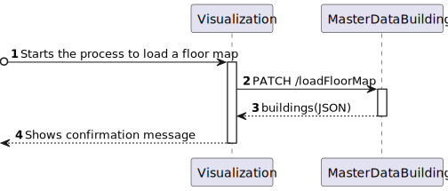

# US 1120 - As a campus manager, I want to load a floor map

## 1. context

* backend developed in sprint a.
* this task is relative to system user campus manager .

## 2. requirements

**us 1120 -** As a campus manager I want to load a floor map

**dependencies:**
- **us 230 -** sprint A.
- **us 230 -** as a campus manager, I want to load a floor map

## 3. analysis

**regarding this requirement we understand that:**

as a campus manager, an actor of the system, i will be able to access the system and be able to
select a certain building and one of its floors and load a file containing the layout of that floor

### 3.1. domain model excerpt


## 4. design

### 4.1. realization

### Level1

###### LogicalView:


###### SceneryView:


###### ProcessView:


#### Level2

###### LogicalView:


###### ImplementationView:


###### PhysicalView:


###### ProcessView:



#### Level3

###### LogicalView:


###### ImplementationView:


###### ProcessView:


### 4.2. Applied Patterns

### 4.3. Tests

## 5. Implementation

### load-floor-map.component.html

```html

```

### load-floor-map.component.ts

```typescript

```

### floorService

```typescript

```

## 6. Integration/Demonstration

## 7. Observations

No additional observations.
