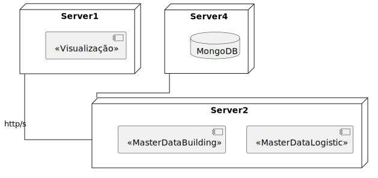

# US 1120 - As a campus manager, I want to load a floor map

## 1. context

* backend developed in sprint a.
* this task is relative to system user campus manager .

## 2. requirements

**us 1120 -** As a campus manager I want to load a floor map

**dependencies:**
- **us 230 -** sprint A.
- **us 230 -** as a campus manager, I want to load a floor map

## 3. analysis

**regarding this requirement we understand that:**

as a campus manager, an actor of the system, i will be able to access the system and be able to
select a certain building and one of its floors and load a file containing the layout of that floor

### 3.1. domain model excerpt


## 4. design

### 4.1. realization

### Level1

###### LogicalView:


###### SceneryView:


###### ProcessView:


#### Level2

###### LogicalView:


###### ImplementationView:


###### PhysicalView:



###### ProcessView:


#### Level3

###### LogicalView:


###### ImplementationView:


###### ProcessView:


### 4.2. Applied Patterns

### 4.3. Tests

## 5. Implementation

### load-floor-map.component.html

```html
<h1>Load Floor Map</h1>
<select [(ngModel)]="id">
    <option value="">Select a building</option>
    <option *ngFor="let building of buildings" [value]="building.buildingCode">{{ building.buildingCode }}</option>
</select>
<button (click)="listAllFloors()">Search</button>

<div>
    <table>
        <thead>
            <tr class="table100-head">
                <th class="column1">ID</th>
                <th class="column2">Number</th>
                <th class="column3">Description</th>
                <th class="column4">Map</th>
                <th class="column5"></th>
            </tr>
        </thead>

        <tbody *ngFor="let floor of floors; let i = index">
            <tr>
                <td class="column1">{{ floor.floorId }}</td>
                <td class="column2">{{ floor.floorNumber }}</td>
                <td class="column3">{{ floor.floorDescription }}</td>
                <td class="column4">{{ floor.floorMap }}</td>
                <td class="column5"><button type="button" class="button"
                        (click)="toggleExpansion(i, floor)">Map</button></td>
            </tr>

            <div class="loadForm" *ngIf="expanded[i]">
                <input class="file-input" type="file" (change)="onFileSelected($event)" #fileUpload>

                <div class="file-upload">

                    {{ fileName || 'No file selected' }}

                    <button mat-mini-fab color="primary" class="upload-btn" (click)="fileUpload.click()">
                        Choose File
                    </button>
                </div>
            </div>

        </tbody>
    </table>
</div>
```

### load-floor-map.component.ts

```typescript
export class LoadFloorMapComponent {

  constructor(
    private floorService: FloorService,
    private buildingService: BuildingService
  ) { }

  id: string = ""
  floors: any[] = []
  buildings: any[] = []

  index: number = 0
  expanded: boolean[] = [false]

  fileName = ""

  ngOnInit(): void {
    this.buildingService.listAll().subscribe(
      (data: any) => {
        this.buildings = data
      }
    );
  }

  listAllFloors() {
    this.floorService.listAllFloors(this.id).subscribe(
      (data: any) => {
        this.floors = data
      }
    );
  }

  toggleExpansion(index: number, floor: Floor) {
    this.expanded[index] = !this.expanded[index];
  }

  onFileSelected(event: any) {
    const file: File = event.target.files[0];

    if (file) {
      this.fileName = file.name

      const fileReader = new FileReader();

      fileReader.onload = (e: any) => {
        const fileContent: string = fileReader.result!.toString()
        const dto = JSON.parse(fileContent) as LoadFloorMap
        this.floorService.loadFloorMap(dto).subscribe(
          (data: Floor) => {
            console.log(data)
          }
        );
      }

      fileReader.readAsText(file)
    }

  }

}

```

### floorService

```typescript
  loadFloorMap(loadFloorMap: LoadFloorMap): Observable<Floor> {
    const url = this.floorsUrl + "/" + "loadFloorMap";
    return this.http.patch<Floor>(url, loadFloorMap)
    .pipe(
      catchError(this.handleError)
    )
  }
```

## 6. Integration/Demonstration


## 7. Observations

No additional observations.
