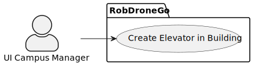
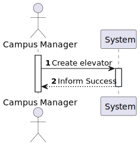

# US 1130 -  As a Campus Manager, I want to create an elevator in a building.

## 1. Context

* This US is relative to the frontendof the already implemented backend in Sprint A.
* This task is relative to system user Campus Manager.

## 2. Requirements

**US 1030 -** As a Campus Manager, I want to create an elevator in a building.

**Dependencies:**
**US270** - Sprint A

**Regarding this requirement we understand that:** <br>
As a Campus Manager, an actor of the system, I will be able to access the system and create an elevator, specifying its building and floors that it accesses.

## 3. Analysis

**Analyzing this User Story we understand that:**
* Campus Manager is a user role that manages the data of the routes and maps.
* Building is a structure within the campus that houses various rooms and facilities. It can be navigated by the robisep robots using corridors and elevators.
* Floor is a level within a building. Each floor can contain multiple rooms and is accessible by elevators and stairs (though robisep robots cannot use stairs). 
* Elevator is a transport device for moving between different floors of a building. The robisep robots are capable of using elevators to navigate multi-story buildings. 


### 3.1. Domain Model Excerpt


## 4. Design

### 4.1. Realization

### Level1
###### LogicalView:


###### SceneryView:


###### ProcessView:


#### Level2

###### LogicalView:


###### ImplementationView:


###### PhysicalView:


###### ProcessView:


#### Level3
###### LogicalView:


###### ImplementationView:


###### ProcessView:


### 4.3. Applied Patterns


### 4.4. Tests

``` typescript

```

## 5. Implementation

### Elevator Create Component
``` typescript
@Component({
  selector: 'app-elevator-create',
  templateUrl: './elevator-create.component.html',
  styleUrls: ['./elevator-create.component.css'],
  providers: [ElevatorService, FloorService, BuildingService]
})
export class ElevatorCreateComponent {
  constructor(
    private elevatorService: ElevatorService,
    private floorService: FloorService,
    private buildingService: BuildingService
  ) { }

  floors: any[] = [];
  buildings: any[] = [];
 

  createForm = new FormGroup({
    id: new FormControl(0),
    brand: new FormControl(""),
    description: new FormControl(""),
    model: new FormControl(""),
    serialNumber: new FormControl(""),
    buildingCode: new FormControl(""),
    floorsIds: new FormArray([])});


  ngOnInit() {
    this.buildingService.listAll().subscribe(
      (data: any) => {
        this.buildings = data;
      },
      (error: any) => {
        console.error('Error:', error);
        this.buildings = [];
      }
    );
  }

  onBuildingSelect() {
    if (this.createForm.value.buildingCode !== null) {
      this.listAllFloors();
    }
  }

  listAllFloors() {
    this.floorService.listAllFloors(this.createForm.value.buildingCode!).subscribe(
      (data: any) => {
        this.floors = data;
      },
      (error: any) => {
        window.alert('Error:' + error.error.message);
        this.floors = [];
      }
    );
  }

  updateFloors(id: number, event: Event) {
    const checkbox = event.target as HTMLInputElement;
    let floorsIds = this.createForm.get('floorsIds') as FormArray;
    if (checkbox.checked) {
      floorsIds.push(new FormControl(id));
    } else {
      let index = floorsIds.controls.findIndex(control => control.value === id);
      if (index > -1){
        floorsIds.removeAt(index);
      }
    }
  }

  onSubmit() {
    const elevator: ElevatorCreate = {
      elevatorId: this.createForm.value.id!,
      elevatorBrand: this.createForm.value.brand!,
      elevatorDescription: this.createForm.value.description!,
      elevatorModel: this.createForm.value.model!,
      elevatorSerialNumber: this.createForm.value.serialNumber!,
      buildingCode: this.createForm.value.buildingCode!,
      floorIds: this.createForm.value.floorsIds!
    }

    this.elevatorService.createElevator(elevator).subscribe((e: Elevator) => {
      window.alert("Elevator " + e.elevatorId + " created successfully");
    })
  }
}

```

### Elevator Service
``` typescript
@Injectable({
  providedIn: 'root'
})
export class ElevatorService {
  private elevatorUrl = "http://localhost:4000/api/elevators"
  
  constructor(private http: HttpClient) { }

  createElevator(elevatorToCreate: ElevatorCreate): Observable<Elevator>{
    const url = this.elevatorUrl + "/" + "create";
    return this.http.post<Elevator>(url, elevatorToCreate).pipe(
      catchError((error: HttpErrorResponse) => {
        let errorMessage = '';
        if (error.error instanceof ErrorEvent) {
          errorMessage = `An error occurred: ${error.error.message}`;
          window.alert(errorMessage);
        } else {
          errorMessage = `An error occurred: ${error.error}`;
          window.alert(errorMessage);
        }
        console.error(errorMessage);
        return throwError(errorMessage);
      })
    );
  }

  editElevator(elevatorToEdit: ElevatorEdit): Observable<Elevator>{
    const url = this.elevatorUrl + "/" + "edit";
    return this.http.put<Elevator>(url, elevatorToEdit).pipe(
      catchError((error: HttpErrorResponse) => {
        let errorMessage = '';
        if (error.error instanceof ErrorEvent) {
          errorMessage = `An error occurred: ${error.error.message}`;
          window.alert(errorMessage);
        } else {
          errorMessage = `An error occurred: ${error.error}`;
          window.alert(errorMessage);
        }
        console.error(errorMessage);
        return throwError(errorMessage);
      })
    );
  }

  listElevatorsInBuilding(buildingCode: string): Observable<ElevatorList[]>{
    const url = this.elevatorUrl + "/" + "listInBuilding" + "/" + buildingCode;
    return this.http.get<ElevatorList[]>(url).pipe(
      catchError((error: HttpErrorResponse) => {
        let errorMessage = '';
        if (error.error instanceof ErrorEvent) {
          errorMessage = `An error occurred: ${error.error.message}`;
          window.alert(errorMessage);
        } else {
          errorMessage = `An error occurred: ${error.error}`;
          window.alert(errorMessage);
        }
        console.error(errorMessage);
        return throwError(errorMessage);
      })
    );
  }
}
```


### Elevator Create HTML Template
``` html
<h1>Create Elevator</h1>

<form [formGroup]="createForm" (ngSubmit)="onSubmit()">

    <div class="form__group field">
        <input type="number" class="form__field" min="0"  id='id' formControlName="id" required/>
        <label for="id" class="form__label">Elevator Id</label>
    </div>

    <div class="form__group field">
        <input type="text" class="form__field" id='brand'  formControlName="brand">
        <label for="brand" class="form__label">Brand</label>
    </div>

    <div class="form__group field">
        <input type="text" class="form__field" id='description' formControlName="description">
        <label for="description" class="form__label">Description</label>
    </div>

    <div class="form__group field">
        <input type="text" class="form__field" id='model' formControlName="model">
        <label for="model" class="form__label">Model</label>
    </div>

    <div class="form__group field">
        <input type="text" class="form__field" id='serialNumber'  formControlName="serialNumber">
        <label for="serialNumber" class="form__label">Serial Number</label>
    </div>

    <div class="form__group field">
        <select class="form_select" formControlName="buildingCode" (change)="onBuildingSelect()">
            <option value="">--Select a building--</option>
            <option *ngFor="let building of buildings" [value]="building.buildingCode">{{ building.buildingCode }}</option>
        </select>
    </div>

    <div class="form__group field">
        <div *ngFor="let floor of floors">
            <label class="container">Floor {{ floor.floorNumber }}
                <input type="checkbox" (change)="updateFloors(floor.floorId, $event)">
                <span class="checkmark"></span>
            </label>
        </div>
    </div>

    <div>
        <button>Create</button>
    </div>
</form>
````

## 6. Integration/Demonstration
The integration of this US is demonstrated in the following video:

https://github.com/Pedro-Pereira1/sem5pi_23_24_g056_Visualization/assets/128607684/9a92d6c4-2852-4a7b-9272-caff4a37f475

## 7. Observations
No observations.
