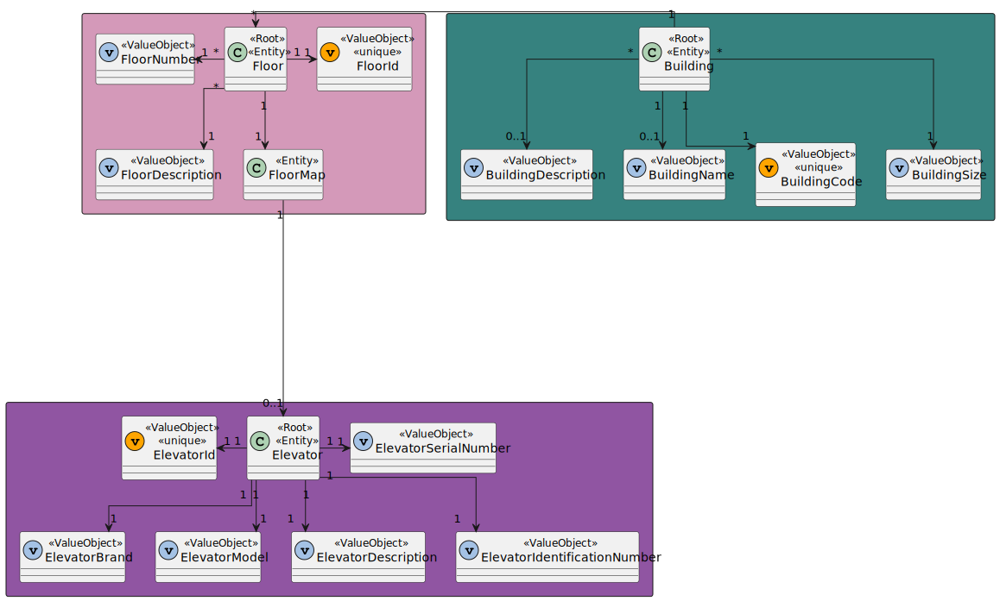
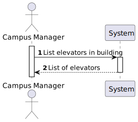

# US 1140 - As a Campus Manager, I want to list elevators in building

## 1. Context

* This US is relative to the frontendof the already implemented backend in Sprint A.
* This task is relative to system user Campus Manager.

## 2. Requirements

**US 1140 -** As a Campus Manager, I want to list elevators in building.

**Dependencies:**
**US290** - Sprint A

**Regarding this requirement we understand that:** <br>
As a Campus Manager, an actor of the system, I will be able to access the system and get a list of all the elevators in a building and the floors that it accesses.

## 3. Analysis

**Analyzing this User Story we understand that:**
* Campus Manager is a user role that manages the data of the routes and maps.
* Building is a structure within the campus that houses various rooms and facilities. It can be navigated by the robisep robots using corridors and elevators.
* Floor is a level within a building. Each floor can contain multiple rooms and is accessible by elevators and stairs (though robisep robots cannot use stairs). 
* Elevator is a transport device for moving between different floors of a building. The robisep robots are capable of using elevators to navigate multi-story buildings. 
* We will use Angular, so we need an HTML and CSS template and TS component.
* When the page is loaded, it will be searched for all the buildings of the system.
* The Campus Manager will select a building and then click a button to search for the elevators. 
* We will a notify when there are no elevators.

### 3.1. Domain Model Excerpt



## 4. Design

### 4.1. Realization

### Level1
###### LogicalView:


###### SceneryView:


###### ProcessView:


#### Level2

###### LogicalView:


###### ImplementationView:


###### PhysicalView:


###### ProcessView:


#### Level3
###### LogicalView:


###### ImplementationView:


###### ProcessView:


### 4.3. Applied Patterns
* Pipe
* Directive
* Service

### 4.4. Tests

``` typescript
describe('Elevator list all', function () {
    beforeEach(() => {
  
      cy.intercept('GET', 'http://localhost:4000/api/elevators/listInBuilding/A', {
        statusCode: 200,
        body: [
            {
                "elevatorId": 1,
                "elevatorIdentificationNumber": 1,
                "elevatorBrand": "Apple",
                "elevatorDescription": "description",
                "elevatorModel": "Iphone",
                "elevatorSerialNumber": "x1",
                "floorsNumber": [
                    1,
                    2,
                    3
                ]
            },
            {
                "elevatorId": 2,
                "elevatorIdentificationNumber": 2,
                "elevatorBrand": "Samsung",
                "elevatorDescription": "description",
                "elevatorModel": "Galaxy",
                "elevatorSerialNumber": "x1",
                "floorsNumber": [
                    1,
                    2,
                    3
                ]
            },
        ]
      }).as('listInBuilding');
  
  
      cy.visit('/elevators/listInBuilding')
    });
  
    it('has correct title', function () {
      cy.get('h1').should('contain', 'List Elevators In Buildings')
    })
  
    it('checks for listed elevators', function () {
  
      cy.get('table').then(($table) => {
        const initialTableText = $table.text()
        cy.get('select').select('A');
        cy.get('button:contains("Search")').click()

        cy.get('table').should('be.visible');
        cy.get('table thead tr th').should('have.length', 7);
        cy.get('table tbody tr').should('have.length', 2);
  
        cy.get('table tbody tr:first-child td.column1').contains('1');
        cy.get('table tbody tr:first-child td.column2').contains('Apple');
        cy.get('table tbody tr:first-child td.column3').contains('Iphone');
        cy.get('table tbody tr:first-child td.column4').contains('x1');
        cy.get('table tbody tr:first-child td.column5').contains('description');
        cy.get('table tbody tr:first-child td.column6').contains('1,2,3');
        cy.get('table tbody tr:first-child td.column7').contains('1');

        cy.get('table').should(($tableAfter) => {
          expect($tableAfter.text()).not.to.eq(initialTableText)
        })
  
      })
    })
  
  
    it('handles building errors correctly', function () {
      cy.intercept('GET', '/api/buildings', { statusCode: 500, body: {} }).as('getBuildingsError')
      cy.visit('/elevators/listInBuilding')
      cy.on('window:alert', (str) => {
        expect(str).to.include('`An error occurred:')
      })
    })
    
    it('handles elevators errors correctly', function () {
        cy.intercept('GET', '/api/elevators', { statusCode: 500, body: {} }).as('getElevatorsError')
        cy.visit('/elevators/listInBuilding')
        cy.on('window:alert', (str) => {
          expect(str).to.include('`An error occurred:')
        })
      })
  })
```

## 5. Implementation

### Elevator List Component
``` typescript
@Component({
  selector: 'app-elevator-list-in-building',
  templateUrl: './elevator-list-in-building.component.html',
  styleUrls: ['./elevator-list-in-building.component.css'],
  providers: [ElevatorService, BuildingService]
})
export class ElevatorListInBuildingComponent {
  constructor(private elevatorService: ElevatorService, private buildingService: BuildingService) { }
  buildingCode: string = "";
  elevators: ElevatorList[] = [];
  buildings: any[] = [];

  ngOnInit(): void {
    this.buildingService.listAll().subscribe(
      (data: any) => {
        this.buildings = data;
      },
      (error: any) => {
        console.error('Error:', error);
        this.buildings = [];
      }
    );
  }

  listElevatorsInBuilding() {
    this.elevators = [];
    this.elevatorService.listElevatorsInBuilding(this.buildingCode).subscribe(
      (data: any) => {
        this.elevators = data;
      },
      (error: any) => {
        if (error.status === 400) {
          window.alert('No elevators found.');
          this.elevators = [];
        }
      }
    );
  }
}
```

### Elevator Service
``` typescript
@Injectable({
  providedIn: 'root'
})
export class ElevatorService {
  private elevatorUrl = "http://localhost:4000/api/elevators"
  
  constructor(private http: HttpClient) { }

  createElevator(elevatorToCreate: ElevatorCreate): Observable<Elevator>{
    const url = this.elevatorUrl + "/" + "create";
    return this.http.post<Elevator>(url, elevatorToCreate).pipe(
      catchError((error: HttpErrorResponse) => {
        let errorMessage = '';
        if (error.error instanceof ErrorEvent) {
          errorMessage = `An error occurred: ${error.error.message}`;
          window.alert(errorMessage);
        } else {
          errorMessage = `An error occurred: ${error.error}`;
          window.alert(errorMessage);
        }
        console.error(errorMessage);
        return throwError(errorMessage);
      })
    );
  }

  editElevator(elevatorToEdit: ElevatorEdit): Observable<Elevator>{
    const url = this.elevatorUrl + "/" + "edit";
    return this.http.put<Elevator>(url, elevatorToEdit).pipe(
      catchError((error: HttpErrorResponse) => {
        let errorMessage = '';
        if (error.error instanceof ErrorEvent) {
          errorMessage = `An error occurred: ${error.error.message}`;
          window.alert(errorMessage);
        } else {
          errorMessage = `An error occurred: ${error.error}`;
          window.alert(errorMessage);
        }
        console.error(errorMessage);
        return throwError(errorMessage);
      })
    );
  }

  listElevatorsInBuilding(buildingCode: string): Observable<ElevatorList[]>{
    const url = this.elevatorUrl + "/" + "listInBuilding" + "/" + buildingCode;
    return this.http.get<ElevatorList[]>(url).pipe(
      catchError((error: HttpErrorResponse) => {
        let errorMessage = '';
        if (error.error instanceof ErrorEvent) {
          errorMessage = `An error occurred: ${error.error.message}`;
          window.alert(errorMessage);
        } else {
          errorMessage = `An error occurred: ${error.error}`;
          window.alert(errorMessage);
        }
        console.error(errorMessage);
        return throwError(errorMessage);
      })
    );
  }
}
```


### Elevator List HTML Template
``` html
<h1>List Elevators In Buildings</h1>

<select [(ngModel)]="buildingCode">
    <option value="">Select a building</option>
    <option *ngFor="let building of buildings" [value]="building.buildingCode">{{ building.buildingCode }}</option>
</select>
<button (click)="listElevatorsInBuilding()">Search</button>

<div>
    <table>
        <thead>
            <tr class="table100-head">
                <th class="column1">ID</th>
                <th class="column2">Brand</th>
                <th class="column3">Model</th>
                <th class="column4">Serial Number</th>
                <th class="column5">Description</th>
                <th class="column6">Floors</th>
                <th class="column7">ID Number</th>
                <th class="column8"></th>
            </tr>
        </thead>

        <tbody *ngFor="let elevator of elevators; let i = index">
            <tr>
                <td class="column1">{{ elevator.elevatorId }}</td>
                <td class="column2">{{ elevator.elevatorBrand }}</td>
                <td class="column3">{{ elevator.elevatorModel }}</td>
                <td class="column4">{{ elevator.elevatorSerialNumber }}</td>
                <td class="column5">{{ elevator.elevatorDescription }}</td>
                <td class="column6">{{ elevator.floorsNumber }}</td>
                <td class="column7">{{ elevator.elevatorIdentificationNumber }}</td>
            </tr>
        </tbody>   
    </table>
</div>
````

## 6. Integration/Demonstration
The integration of this US is demonstrated in the following video:

https://github.com/Pedro-Pereira1/sem5pi_23_24_g056_Visualization/assets/128607684/a2c97f5c-2461-4d45-890b-7355c7f02157

## 7. Observations
No observations.
