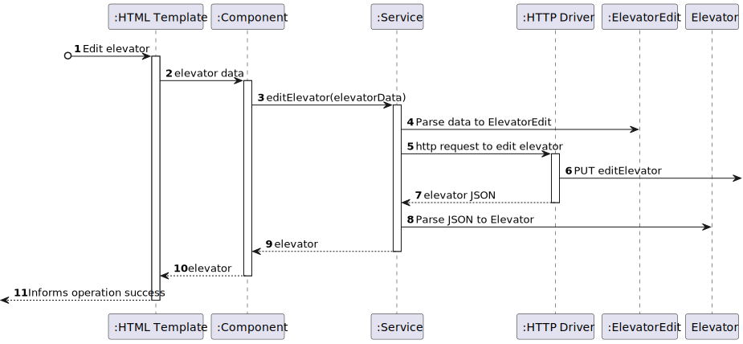

# US 1150 - As a Campus Manager, I want to edit an elevator in a building

## 1. Context

* This US is relative to the frontendof the already implemented backend in Sprint A.
* This task is relative to system user Campus Manager.

## 2. Requirements

**US 1150 -** As a Campus Manager, I want to edit an elevator in a building.

**Dependencies:**
**US280** - Sprint A

**Regarding this requirement we understand that:** <br>
As a Campus Manager, an actor of the system, I will be able to access the system and edit the information of an elevator such as brand, model, serial number, description and add and remove floors that it accesses.

## 3. Analysis

**Analyzing this User Story we understand that:**
* Campus Manager is a user role that manages the data of the routes and maps.
* Building is a structure within the campus that houses various rooms and facilities. It can be navigated by the robisep robots using corridors and elevators.
* Floor is a level within a building. Each floor can contain multiple rooms and is accessible by elevators and stairs (though robisep robots cannot use stairs). 
* Elevator is a transport device for moving between different floors of a building. The robisep robots are capable of using elevators to navigate multi-story buildings. 
* We will use Angular, so we need an HTML and CSS template and TS component.
* When the page is loaded, it will be searched for all the buildings of the system.
* The Campus Manager will select a building and then click a button to search for the elevators. 
* A table with all the elevators of the building will appear.
* The Campus Manager will start editing an elevator by clicking the button "Edit". When clicked, the button will show a menu to edit the information of the elevator. To save the changes it will be necessary to click the button "Submit"  

### 3.1. Domain Model Excerpt


## 4. Design

### 4.1. Realization

### Level1
###### LogicalView:


###### SceneryView:


###### ProcessView:


#### Level2

###### LogicalView:


###### ImplementationView:


###### PhysicalView:


###### ProcessView:


#### Level3
###### LogicalView:


###### ImplementationView:


###### ProcessView:


### 4.3. Applied Patterns


### 4.4. Tests

``` typescript

```

## 5. Implementation

### Elevator Edit Component
``` typescript
@Component({
  selector: 'app-elevator-edit',
  templateUrl: './elevator-edit.component.html',
  styleUrls: ['./elevator-edit.component.css'],
  providers: [ElevatorService, FloorService, BuildingService]
})

export class ElevatorEditComponent {
  constructor(private elevatorService: ElevatorService, private floorService: FloorService, private buildingService: BuildingService) { }
  buildingCode: string = "";
  elevators: ElevatorList[] = [];
  buildings: any[] = [];
  floors: Floor[] = [];
  floorsWithoutElevator: Floor[] = [];
  floorsWithElevator: Floor[] = [];

  index: number = 0;
  expanded: boolean[] = [false];

  editForm = new FormGroup({
    elevatorIdentificationNumber: new FormControl(0),
    elevatorBrand: new FormControl(''),
    elevatorDescription: new FormControl(''),
    elevatorModel: new FormControl(''),
    elevatorSerialNumber: new FormControl(''),
    floorsIdToAdd: new FormArray([]),
    floorsIdToRemove: new FormArray([])    
  })

  ngOnInit(): void {
    this.buildingService.listAll().subscribe(
      (data: any) => {
        this.buildings = data;
      },
      (error: any) => {
        console.error('Error:', error);
        this.buildings = [];
      }
    );
  }

  listElevatorsInBuilding() {
    this.elevatorService.listElevatorsInBuilding(this.buildingCode).subscribe(
      (data: any) => {
        this.elevators = data;
      },
      (error: any) => {
        if (error.status === 400) {
          window.alert('No elevators found.');
          this.elevators = [];
        }
      }
    );
  }

  listAllFloors() {
    this.floorService.listAllFloors(this.buildingCode!).subscribe(
      (data: any) => {
        this.floors = data;
      },
      (error: any) => {
        window.alert('Error:' + error.error.message);
        this.floors = [];
      }
    );
  }

  getFloorsWithoutElevator(id: number) {
    this.floorsWithoutElevator = [];
    for (let floor of this.floors) {
      if (floor.floorMap.elevators.find(elevator => elevator === id) === undefined) {
        this.floorsWithoutElevator.push(floor);
      }
    }
  }

  getFloorsWithElevator(id: number) {
    this.floorsWithElevator = [];
    for (let floor of this.floors) {
      if (floor.floorMap.elevators.find(elevator => elevator === id)) {
        this.floorsWithElevator.push(floor);
      }
    }
  }

  toggleExpansion(index: number, elevator: Elevator) {
    this.expanded[index] = !this.expanded[index];
    if (this.expanded[index]) {
      this.editForm.patchValue({
        elevatorIdentificationNumber: elevator.elevatorIdentificationNumber,
        elevatorBrand: elevator.elevatorBrand,
        elevatorDescription: elevator.elevatorDescription,
        elevatorModel: elevator.elevatorModel,
        elevatorSerialNumber: elevator.elevatorSerialNumber
      })
    }
  }

  save() {
    const elevator: ElevatorEdit = {
      elevatorBrand: this.editForm.value.elevatorBrand!,
      elevatorDescription: this.editForm.value.elevatorDescription!,
      elevatorIdentificationNumber: this.editForm.value.elevatorIdentificationNumber!,
      elevatorModel: this.editForm.value.elevatorModel!,
      elevatorSerialNumber: this.editForm.value.elevatorSerialNumber!,
      buildingCode: this.buildingCode
    }

    if (this.editForm.value.floorsIdToAdd?.length !== 0) {
      elevator.floorsIdToAdd = this.editForm.value.floorsIdToAdd!;

    } 
    if (this.editForm.value.floorsIdToRemove?.length !== 0){
      elevator.floorsIdToRemove = this.editForm.value.floorsIdToRemove!;
    }

    this.elevatorService.editElevator(elevator).subscribe(
      (data: Elevator) => {
        window.alert("Elevator " + data.elevatorId + " edited successfully!")
        this.ngOnInit()
      }
    );
    this.editForm.reset();
  }

  updateFloorsToAdd(number: number, event: Event) {
    const checkbox = event.target as HTMLInputElement;
    let floorsNumber = this.editForm.get('floorsIdToAdd') as FormArray;
    if (checkbox.checked) {
      floorsNumber.push(new FormControl(number));
    } else {
      let index = floorsNumber.controls.findIndex(control => control.value === number);
      if (index > -1){
        floorsNumber.removeAt(index);
      }
    }
  }

  updateFloorsToRemove(number: number, event: Event) {
    const checkbox = event.target as HTMLInputElement;
    let floorsNumberToRemove = this.editForm.get('floorsIdToRemove') as FormArray;
    if (checkbox.checked) {
      floorsNumberToRemove.push(new FormControl(number));

    } else {
      let index = floorsNumberToRemove.controls.findIndex(control => control.value === number);
      if (index > -1){
        floorsNumberToRemove.removeAt(index);
      }
    }
  }

}
```

### Elevator Service
``` typescript
@Injectable({
  providedIn: 'root'
})
export class ElevatorService {
  private elevatorUrl = "http://localhost:4000/api/elevators"
  
  constructor(private http: HttpClient) { }

  createElevator(elevatorToCreate: ElevatorCreate): Observable<Elevator>{
    const url = this.elevatorUrl + "/" + "create";
    return this.http.post<Elevator>(url, elevatorToCreate).pipe(
      catchError((error: HttpErrorResponse) => {
        let errorMessage = '';
        if (error.error instanceof ErrorEvent) {
          errorMessage = `An error occurred: ${error.error.message}`;
          window.alert(errorMessage);
        } else {
          errorMessage = `An error occurred: ${error.error}`;
          window.alert(errorMessage);
        }
        console.error(errorMessage);
        return throwError(errorMessage);
      })
    );
  }

  editElevator(elevatorToEdit: ElevatorEdit): Observable<Elevator>{
    const url = this.elevatorUrl + "/" + "edit";
    return this.http.put<Elevator>(url, elevatorToEdit).pipe(
      catchError((error: HttpErrorResponse) => {
        let errorMessage = '';
        if (error.error instanceof ErrorEvent) {
          errorMessage = `An error occurred: ${error.error.message}`;
          window.alert(errorMessage);
        } else {
          errorMessage = `An error occurred: ${error.error}`;
          window.alert(errorMessage);
        }
        console.error(errorMessage);
        return throwError(errorMessage);
      })
    );
  }

  listElevatorsInBuilding(buildingCode: string): Observable<ElevatorList[]>{
    const url = this.elevatorUrl + "/" + "listInBuilding" + "/" + buildingCode;
    return this.http.get<ElevatorList[]>(url).pipe(
      catchError((error: HttpErrorResponse) => {
        let errorMessage = '';
        if (error.error instanceof ErrorEvent) {
          errorMessage = `An error occurred: ${error.error.message}`;
          window.alert(errorMessage);
        } else {
          errorMessage = `An error occurred: ${error.error}`;
          window.alert(errorMessage);
        }
        console.error(errorMessage);
        return throwError(errorMessage);
      })
    );
  }
}
```


### Elevator Edit HTML Template
``` html
<h1>Edit Elevator</h1>

<select [(ngModel)]="buildingCode">
    <option value="">Select a building</option>
    <option *ngFor="let building of buildings" [value]="building.buildingCode">{{ building.buildingCode }}</option>
</select>
<button (click)="listElevatorsInBuilding(); listAllFloors()">Search</button>

<div>
    <table>
        <thead>
            <tr class="table100-head">
                <th class="column1">ID</th>
                <th class="column2">Brand</th>
                <th class="column3">Model</th>
                <th class="column4">Serial Number</th>
                <th class="column5">Description</th>
                <th class="column6">Floors</th>
                <th class="column7">ID Number</th>
                <th class="column8"></th>
            </tr>
        </thead>

        <tbody *ngFor="let elevator of elevators; let i = index">
            <tr>
                <td class="column1">{{ elevator.elevatorId }}</td>
                <td class="column2">{{ elevator.elevatorBrand }}</td>
                <td class="column3">{{ elevator.elevatorModel }}</td>
                <td class="column4">{{ elevator.elevatorSerialNumber }}</td>
                <td class="column5">{{ elevator.elevatorDescription }}</td>
                <td class="column6">{{ elevator.floorsNumber }}</td>
                <td class="column7">{{ elevator.elevatorIdentificationNumber }}</td>
                <td class="column8"><button type="button" class="button" (click)="toggleExpansion(i, elevator); getFloorsWithoutElevator(elevator.elevatorId); getFloorsWithElevator(elevator.elevatorId)">Edit</button></td>
            </tr>

            <div class="editForm" *ngIf="expanded[i]">
                <form [formGroup]="editForm" (ngSubmit)="save(); toggleExpansion(i, elevator)">
                    <div class="form__group field">
                        <input type="number" class="form__field" id='elevatorIdentificationNumber' formControlName="elevatorIdentificationNumber" [readOnly]="true"/>
                        <label for="elevatorIdentificationNumber" class="form__label">ID Number</label>
                    </div>
                    <div class="form__group field">
                        <input type="text" class="form__field" id='elevatorBrand' formControlName="elevatorBrand"/>
                        <label for="elevatorBrand" class="form__label">Brand</label>
                    </div>
                    <div class="form__group field"> 
                        <input type="text" class="form__field" id='elevatorModel' formControlName="elevatorModel"/>
                        <label for="elevatorModel" class="form__label">Model</label>
                    </div>            
                    <div class="form__group field">
                        <input type="text" class="form__field" id='elevatorSerialNumber' formControlName="elevatorSerialNumber"/>
                        <label for="elevatorSerialNumber" class="form__label">Serial Number</label>
                    </div>   
                    <div class="form__group field">
                        <input type="text" class="form__field" id='elevatorDescription' formControlName="elevatorDescription"/>
                        <label for="elevatorDescription" class="form__label">Description</label>
                    </div>         
                    <div class="form__group field">
                        <label class="form__label">Floors To Add</label>
                        <div *ngFor="let floor of floorsWithoutElevator">
                            <label class="container">Floor {{ floor.floorNumber }}
                                <input type="checkbox" (change)="updateFloorsToAdd(floor.floorNumber, $event)">
                                <span class="checkmark"></span>
                            </label>
                        </div>
                    </div>
                    <div class="form__group field">
                        <label class="form__label">Floors To Remove</label>
                        <div *ngFor="let floor of floorsWithElevator">
                            <label class="container">Floor {{ floor.floorNumber }}
                                <input type="checkbox" (change)="updateFloorsToRemove(floor.floorNumber, $event)">
                                <span class="checkmark"></span>
                            </label>
                        </div>
                    </div>     
                    <button>Submit</button>
                </form>
            </div>
        </tbody>   
    </table>
</div>
````

## 6. Integration/Demonstration
The integration of this US is demonstrated in the following video:


## 7. Observations
No observations.
