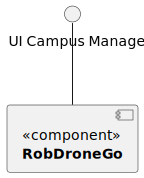
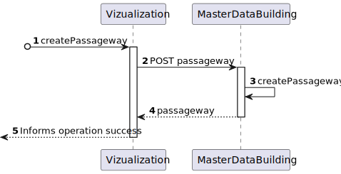

# US 1170 -  As a Campus Manager, I want to create a passageway between buildings.

## 1. Context

* This US is relative to the frontend of the already implemented backend in Sprint A.
* This task is relative to system user Campus Manager.

## 2. Requirements

**US 1170 -** As a Campus Manager, I want to create a passageway between buildings.

**Dependencies:**
- **US150 -** As a Campus Manager, I want to create a building.
- **US190 -** As a Campus Manager, I want to create building floor.
- **US270** - Sprint A

## 3. Analysis

Regarding this requirement we understand that as a Campus Manager, an actor of the system,
I will be able to access the system and create a passageway choosing the 2 buildings in the Campus area.
A passageway is defined by its ID and the 2 buildings that it connects.

### 3.1. Domain Model Excerpt


## 4. Design

### 4.1. Realization

### Level1
###### LogicalView:


###### SceneryView:


###### ProcessView:


#### Level2

###### LogicalView:


###### ImplementationView:


###### PhysicalView:


###### ProcessView:


#### Level3
###### LogicalView:


###### ImplementationView:


###### ProcessView:


### 4.2. Applied Patterns

* Pipe
* Directive
* Service

### 4.3. Tests

**Test 1:** *Tests if the class has the correct title*

```typescript
it('has correct title', function() {
  cy.get('h1').should('contain', 'Create Passageway')
})
````

**Test 2:** *Tests if the class creates the passageway correctly*

```typescript
  it('fills and submits the form', function() {

  cy.get('#passagewayId').type('4');
  cy.get('#building1Id').type('A');
  cy.get('#floor1Id').type('1');
  cy.get('#building1Id').type('B');
  cy.get('#floor2Id').type('2');

  cy.get('button:contains("Create")').click()

  cy.wait('@createPassageway')

  cy.get('#passagewayId').should('have.value', '')
  cy.get('#floor1Id').should('have.value', '')
  cy.get('#floor2Id').should('have.value', '')
})
````

**Test 3:** *Tests if the class handles errors correctly*

```typescript
  it('handles errors correctly', function() {
  cy.intercept('POST', '/api/passageways/createPassageway', { statusCode: 500, body: {} }).as('createPassagewayError')
  cy.visit('/passageways/createPassageway')
  cy.on('window:alert', (str) => {
    expect(str).to.include('An error occurred:')
  })
})

````

## 5. Implementation

### Passageway Create Component
``` typescript
@Component({
  selector: 'app-passageways',
  templateUrl: './passageways.component.html',
  styleUrls: ['./passageways.component.css'],
  providers: [PassagewayService]
})
export class PassagewaysComponent {

  constructor(private passagewayService: PassagewayService) { }

  createForm = new FormGroup({
    passagewayId: new FormControl(0),
    building1Id: new FormControl(''),
    floor1Id: new FormControl(0),
    building2Id: new FormControl(''),
    floor2Id: new FormControl(0),
  })

  onCreate(){
    const passageway = {
      passagewayId: this.createForm.value.passagewayId!,
      building1Id: this.createForm.value.building1Id!,
      floor1Id: this.createForm.value.floor1Id!,
      building2Id: this.createForm.value.building2Id!,
      floor2Id: this.createForm.value.floor2Id!,
    }

    this.passagewayService.createPassageways(passageway).subscribe((p: Passageway) => {
      window.alert("Passageway " + p.passagewayId + " created successfully");
    })

    this.createForm.reset();

  }

```


### Elevator Create HTML Template
``` html
<h1>Create Passageways</h1>

<form [formGroup]="createForm" (ngSubmit)="onCreate()">

  <div class="form__group field">
    <input type="number" class="form__field" id='passagewayId' formControlName="passagewayId" required min="1" />
    <label for="passagewayId" class="form__label">PassagewayID</label>
  </div>

  <div class="form__group field">
    <input type="text" class="form__field" id='building1Id' formControlName="building1Id" required />
    <label for="building1Id" class="form__label">Building1ID</label>
  </div>

  <div class="form__group field">
    <input type="number" class="form__field" id='floor1Id' formControlName="floor1Id" required min="1" />
    <label for="floor1Id" class="form__label">Floor1ID</label>
  </div>

  <div class="form__group field">
    <input type="text" class="form__field" id='building2Id' formControlName="building2Id" required />
    <label for="building2Id" class="form__label">Building2ID</label>
  </div>

  <div class="form__group field">
    <input type="number" class="form__field" id='floor2Id' formControlName="floor2Id" required min="1" />
    <label for="floor2Id" class="form__label">Floor2ID</label>
  </div>

  <div>
    <button>Create</button>
  </div>
</form>

````

## 6. Integration/Demonstration
The integration of this US is demonstrated in the following video:


## 7. Observations
No observations.
