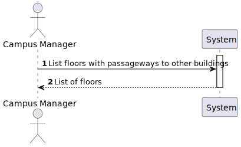
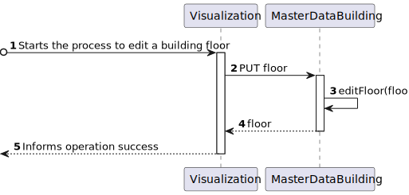

# US 1180 - As a Campus Manager, I want to list the floors of a building with a passageway

## 1. Context

* Backend developed in Sprint A.
* This task is relative to system user Campus Manager.

## 2. Requirements

**US 1180 -** As a Campus Manager, I want to:

* list floors of a building with a passageway.

**Dependencies:**
- **US150 -** As a Campus Manager, I want to create a building.
- **US190 -** As a Campus Manager, I want to create building floor.
- **US240 -** As a Campus Manager, I want to create a passageway between buildings.
- **US220 -** Sprint A

## 3. Analysis

Regarding this requirement we understand that: As a Campus Manager, an actor of the system, I will be able to list the floors of a building with a passageway,describing the floor and description
and also the building and floor where the passageway connects to.
* Campus Manager is a user role that manages the data of the routes and maps.
* Building is a structure within the campus that houses various rooms and facilities. It can be navigated by the robisep robots using corridors and elevators.
* Floor is a level within a building. Each floor can contain multiple rooms and is accessible by elevators and stairs (though robisep robots cannot use stairs).
* Passageway is a connection between two buildings. It can be navigated by the robisep robots using corridors and elevators.

### 3.1. Domain Model Excerpt


## 4. Design

### 4.1. Realization

### Level1
###### LogicalView:


###### SceneryView:


###### ProcessView:


#### Level2

###### LogicalView:


###### ImplementationView:


###### PhysicalView:


###### ProcessView:


#### Level3
###### LogicalView:


###### ImplementationView:


###### ProcessView:


### 4.2. Applied Patterns

### 4.3. Tests


## 5. Implementation

###  ListAllFloorsPassageways Component
```typescript
@Component({
  selector: 'app-floor-list-floors-passageways',
  templateUrl: './floor-list-floors-passageways.component.html',
  styleUrls: ['./floor-list-floors-passageways.component.css']
})
export class FloorListFloorsPassagewaysComponent {

  constructor(private floorService: FloorService, private buildingService : BuildingService) { }
  id: string = "";
  floors: FloorList[] = [];
  buildings: Building[] = [];

  ngOnInit(): void {
    this.buildingService.listAll().subscribe(
      (data: any) => {
        this.buildings = data;
      },
      (error: any) => {
        console.error('Error:', error);
        this.buildings = [];
      }
    );
  }

  listFloorsPassageway(){
    this.floorService.listFloorsPassageway(this.id).subscribe(
      (data: any) => {
        this.floors = data;
      },
      (error: any) => {
        console.error('Error:', error);
        this.floors = [];
      }
    );
  }
}
````

###  ListAllFloorsPassageways Component HTML
```html
<h1>List Floor Passageways</h1>
<select [(ngModel)]="id">
  <option value="">Select a building</option>
  <option *ngFor="let building of buildings" [value]="building.buildingCode">{{ building.buildingCode }}</option>
</select>
<button (click)="listFloorsPassageway()">Search</button>
<div>
  <table>
    <thead>
    <tr class="table100-head">
      <th class="column1">ID</th>
      <th class="column2">Number</th>
      <th class="column3">Description</th>
      <th class="column4">PassagewayID</th>
      <th class="column5">Floors Connected</th>
    </tr>
    </thead>
    <tbody>
    <tr *ngFor="let floor of floors">
      <td class="column1">{{ floor.floorId }}</td>
      <td class="column2">{{ floor.floorNumber }}</td>
      <td class="column3">{{ floor.floorDescription }}</td>
      <td class="column4">{{ floor.floorMap.passageways }}</td>
      <td class="column5">{{ floor.floorConnected }}</td>
    </tr>
    </tbody>
  </table>
</div>
````

## 6. Integration/Demonstration


## 7. Observations
