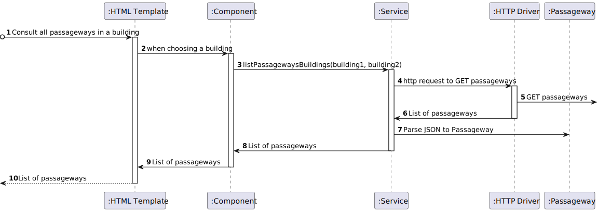

# US 1190 - As a Campus Manager, I want to list passageways between 2 buildings.

## 1. Context

* Backend developed in Sprint A.
* This task is relative to system user Campus Manager.

## 2. Requirements

**US 1190 -** As a Campus Manager, I want to:

* list passageways between 2 buildings.

**Dependencies:**
- **US150 -** As a Campus Manager, I want to create a building.
- **US190 -** As a Campus Manager, I want to create building floor.
- **US240 -** As a Campus Manager, I want to create a passageway between buildings.
- **US260 -** Sprint A

## 3. Analysis
* Campus Manager is a user role that manages the data of the routes and maps.
* Building is a structure within the campus that houses various rooms and facilities. It can be navigated by the robisep robots using corridors and elevators.
* Floor is a level within a building. Each floor can contain multiple rooms and is accessible by elevators and stairs (though robisep robots cannot use stairs).
* Passageway allows movement between buildings. Both robisep robots and droneisep drones can use passages for navigation.

Regarding this requirement we understand that: As a Campus Manager, an actor of the system, I will be able to list the floors of a building with a passageway,describing the floor and description
and also the building and floor where the passageway connects to.
* Campus Manager is a user role that manages the data of the routes and maps.
* Building is a structure within the campus that houses various rooms and facilities. It can be navigated by the robisep robots using corridors and elevators.
* Floor is a level within a building. Each floor can contain multiple rooms and is accessible by elevators and stairs (though robisep robots cannot use stairs).
* Passageway is a connection between two buildings.

### 3.1. Domain Model Excerpt


## 4. Design

### 4.1. Realization

### Level1
###### LogicalView:


###### SceneryView:


###### ProcessView:


#### Level2

###### LogicalView:


###### ImplementationView:


###### PhysicalView:


###### ProcessView:


#### Level3
###### LogicalView:


###### ImplementationView:


###### ProcessView:



### 4.2. Applied Patterns

### 4.3. Tests


## 5. Implementation

###  ListPassagewayBetweenBuildings Component
```typescript
@Component({
  selector: 'app-passageway-list-passageways-between-buildings',
  templateUrl: './passageway-list-passageways-between-buildings.component.html',
  styleUrls: ['./passageway-list-passageways-between-buildings.component.css'],
  providers: [PassagewayService, BuildingService]
})
export class PassagewayListPassagewaysBetweenBuildingsComponent {
  constructor(private passagewayService: PassagewayService, private buildingService:BuildingService) { }
  passageways: PassagewayList[] = [];
  buildings: Building[] = [];
  building1: string = "";
  building2: string = "";

  ngOnInit(): void {
    this.buildingService.listAll().subscribe(
      (data: any) => {
        this.buildings = data;
      },
      (error: any) => {
        console.error('Error:', error);
        this.buildings = [];
      }
    );
  }
````

###  ListPassagewayBetweenBuildings Component HTML
```html
<h1>List Passageways</h1>
<select [(ngModel)]="building1">
  <option value="">Select building 1</option>
  <option *ngFor="let building of buildings" [value]="building.buildingCode">{{ building.buildingCode }}</option>
</select>
<select [(ngModel)]="building2">
  <option value="">Select building 2</option>
  <option *ngFor="let building of buildings" [value]="building.buildingCode">{{ building.buildingCode }}</option>
</select>
<button (click)="listPassagewaysBuildings()">Search</button>
<div>
  <table>
    <thead>
    <tr class="table100-head">
      <th class="column1">PassagewayID</th>
      <th class="column2">FloorNumberBuilding1</th>
      <th class="column3">FloorNumberBuilding2</th>
    </tr>
    </thead>
    <tbody>
    <tr *ngFor="let passagewayList of passageways">
      <td class="column1">{{ passagewayList.passagewayId }}</td>
      <td class="column2">{{ passagewayList.floorNumberBuilding1 }}</td>
      <td class="column3">{{ passagewayList.floorNumberBuilding2 }}</td>
    </tr>
    </tbody>
  </table>
</div>
````

## 6. Integration/Demonstration

## 7. Observations

No observations
