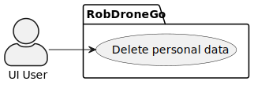
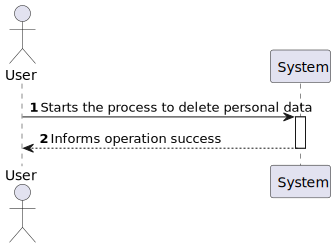
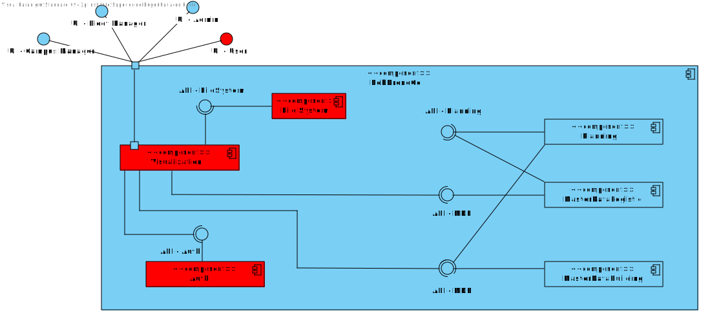
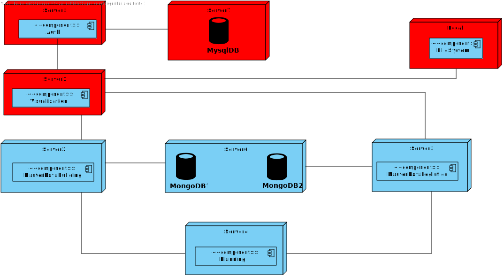
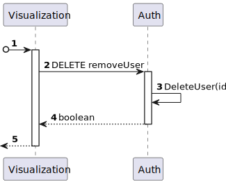
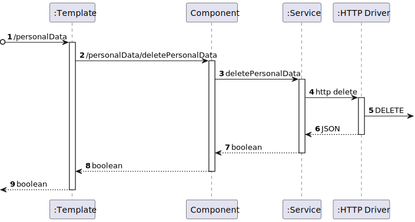

# US 120 - As a system user I intend to delete my account, assuring that my personal data is deleted.

## 1. Context

* This is the first time this task is being developed

## 2. Requirements

**US 120 -** As a system user I intend to delete my account, assuring that my personal data is deleted.

## 3. Analysis

**Regarding this requirement we understand that:**


As an actor of the system, I want to be able to delete my account.
When I delete my account, I want to be sure that my personal data is deleted.

## 4. Design

### 4.1. Realization

### Level1
###### LogicalView:


###### SceneryView:


###### ProcessView:


#### Level2

###### LogicalView:



###### ImplementationView:


###### PhysicalView:


###### ProcessView:


#### Level3
###### LogicalView:


###### ImplementationView:


###### ProcessView:


### 4.2. Applied Patterns

* Service
* Directive
* Repository

### 4.3. Tests

**Test 1:** *Controller Test with valid user*
```
[TestMethod]
    public async Task Check_DeleteUser_ReturnsOkResult()
    {
        string id = "1211089@isep.ipp.pt";

        var userServiceMock = new Mock<IUserService>();
        userServiceMock.Setup(x => x.DeleteUser(id)).ReturnsAsync(true);
        var userController = new UserController(userServiceMock.Object);

        var result = await userController.DeleteUser(id);

        Assert.IsInstanceOfType(result.Result, typeof(OkObjectResult));
        var okResult = (OkObjectResult)result.Result;
        Assert.AreEqual(true, okResult.Value);
    }
````

**Test 2:** *Controller Test with invalid user*
```
[TestMethod]
    public async Task Check_DeleteUser_ReturnsBadRequestResult()
    {
        string id = "1211089@isep.ipp.pt";

        var userServiceMock = new Mock<IUserService>();
        userServiceMock.Setup(x => x.DeleteUser(id)).ThrowsAsync(new Exception("Some error occurred."));
        var userController = new UserController(userServiceMock.Object);

        var result = await userController.DeleteUser(id);

        Assert.IsInstanceOfType(result.Result, typeof(BadRequestObjectResult));
        var badRequestResult = (BadRequestObjectResult)result.Result;
        Assert.AreEqual("Some error occurred.", badRequestResult.Value);
    }
````

**Test 3:** *Service Test with valid user*
```
[TestMethod]
public async Task Check_Deletion_Of_User()
    {
        var userId = "jocas@isep.ipp.pt";
        var user = User.Create("Jocas", userId, "290088123", "912345678", "123456789aA!", "Utente");
        _userRepository.Setup(repo => repo.GetByIdAsync(It.IsAny<Email>())).ReturnsAsync(user);
        var deleted = await _userService.DeleteUser(user.Id.Value);

        Assert.IsTrue(deleted);
    }
````

**Test 4:** *Service Test with invalid user*
```
[TestMethod]
    public async Task Check_Deletion_Of_User_With_Invalid_Id()
    {
        var userId = "jocas@isep.ipp.pt";
        var email = Email.Create(userId);
        _userRepository.Setup(x => x.GetByIdAsync(email)).ReturnsAsync((User)null);

        await Assert.ThrowsExceptionAsync<BusinessRuleValidationException>(() => _userService.DeleteUser(userId));
    }
````

## 5. Implementation

UserService:

````
public async Task<bool> DeleteUser(string id){
try
{
_logger.LogInformation("UserService: Getting current user\n\n");

                var email = Email.Create(id);
                var user = await this._userRepository.GetByIdAsync(email);
                if (user == null)
                {
                    throw new BusinessRuleValidationException("User not found");
                } 
                this._userRepository.Remove(user);
                await this._unitOfWork.CommitAsync();
                return true;
            }
            catch (BusinessRuleValidationException e)
            {
                _logger.LogWarning("UserService: Error has occurred while getting current user: " + e.Message + "\n\n");
                throw new BusinessRuleValidationException(e.Message);
            }
            catch (Exception e)
            {
                _logger.LogError("UserService: Error has occurred while getting current user: " + e.Message + "\n\n");
                throw new Exception(e.Message);
            }
        }
````

UserController:

````
[HttpDelete("{id}")]
        public async Task<ActionResult<bool>> DeleteUser(string id){
            try
            {
                var user = await this._userService.DeleteUser(id);
                return Ok(user);
            }
            catch (Exception e)
            {
                return BadRequest(e.Message);
            }
        }
````

User-data.component.ts:

```` typescript
  deleteProfile(){
    this.wantsToDeleteProfile = true;
  }

  cancelDeleteProfile(){
    this.wantsToDeleteProfile = false;
  }
  
  confirmDeleteProfile(){
    const userEmail = this.authService.getEmailByToken(this.authService.getToken())
    this.authService.removeUser(userEmail).subscribe((b:boolean) =>{
      window.alert("This account has been deleted");
      this.authService.logout();
      this.router.navigate(["/home"]);
    });

  }
````

## 6. Integration/Demonstration

To see this functionality working, a user needs to be registered in the system. After that, the user can delete his account by clicking on the delete account button, situated in the profile tab. A second button confirming the action will appear, warning the user that the action is irreversible. After that, the user will be redirected to the login page, with a screen prompt that will show that the account has been successfully deleted.

## 7. Observations

No additional observations
