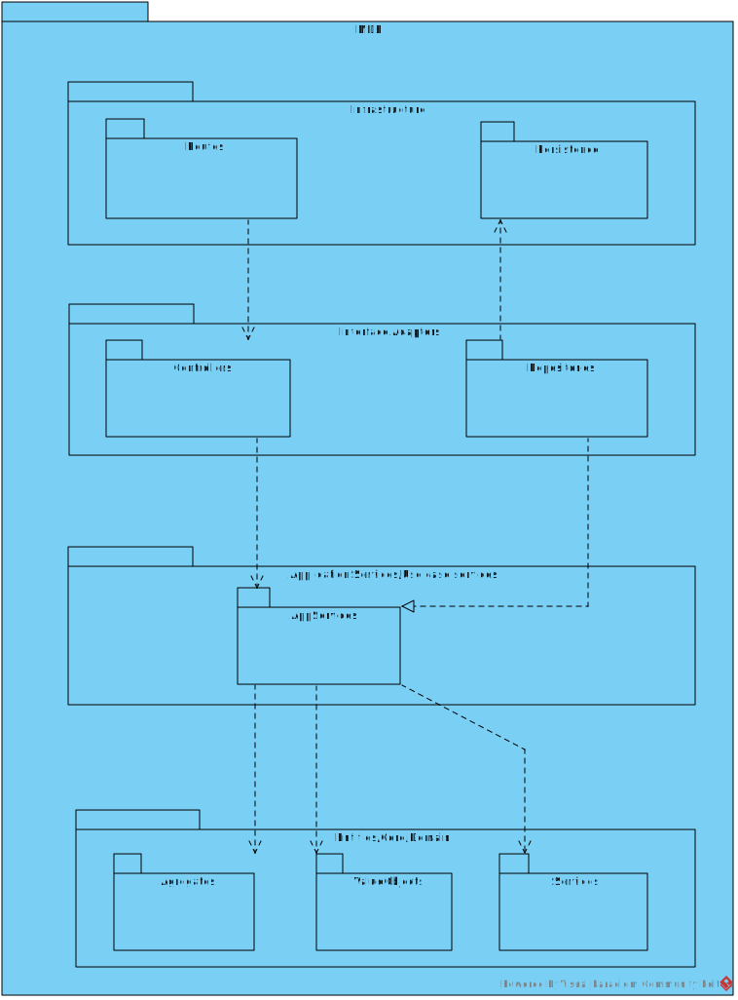

# US 1200 - As a Campus Manager, I want to edit the passageway between buildings.

## 1. Context

* Backend developed in Sprint A.
* This task is relative to system user Campus Manager.

## 2. Requirements

**US 1200 -** As a Campus Manager, I want to:

* Edit a passageway between buildings

**Dependencies:**
- **US150 -** As a Campus Manager, I want to create a building.
- **US190 -** As a Campus Manager, I want to create building floor.
- **US240 -** As a Campus Manager, I want to create a passageway between buildings.
- **US250 -** Sprint A

## 3. Analysis

Regarding this requirement we understand that: As a Campus Manager, an actor of the system, I will be able to edit a passageway
between buildings, changing the points where it connects to.
* Campus Manager is a user role that manages the data of the routes and maps.
* Building is a structure within the campus that houses various rooms and facilities. It can be navigated by the robisep robots using corridors and elevators.
* Floor is a level within a building. Each floor can contain multiple rooms and is accessible by elevators and stairs (though robisep robots cannot use stairs).
* Passageway is a connection between two buildings.

### 3.1. Domain Model Excerpt


## 4. Design

### 4.1. Realization

### Level 1

* Logical:


* Process


* Scenary


### level 2

* Logical:


* Process


* Physical


* Implementation


### Level 3

* Logical:


* Implementation



* Process


### 4.2. Applied Patterns


### 4.3. Tests


## 5. Implementation


```

````

## 6. Integration/Demonstration


## 7. Observations

No additional observations.
