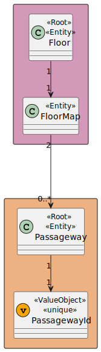
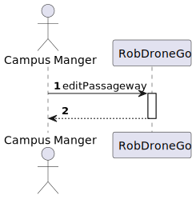
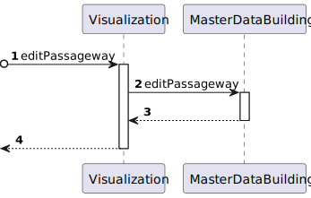
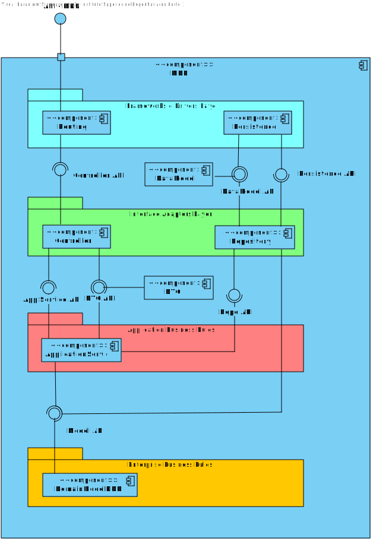
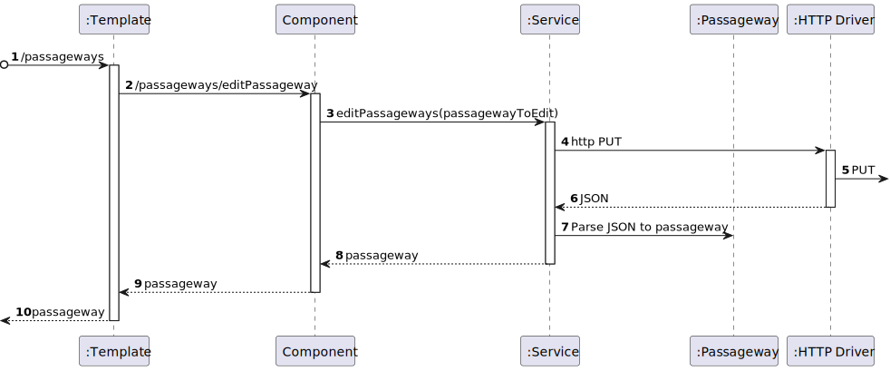

# US 1200 - As a Campus Manager, I want to edit the passageway between buildings.

## 1. Context

* Backend developed in Sprint A.
* This task is relative to system user Campus Manager.

## 2. Requirements

**US 1200 -** As a Campus Manager, I want to:

* Edit a passageway between buildings

**Dependencies:**
- **US150 -** As a Campus Manager, I want to create a building.
- **US190 -** As a Campus Manager, I want to create building floor.
- **US240 -** As a Campus Manager, I want to create a passageway between buildings.
- **US250 -** Sprint A

## 3. Analysis

Regarding this requirement we understand that: As a Campus Manager, an actor of the system, I will be able to edit a passageway
between buildings, changing the points where it connects to.
* Campus Manager is a user role that manages the data of the routes and maps.
* Building is a structure within the campus that houses various rooms and facilities. It can be navigated by the robisep robots using corridors and elevators.
* Floor is a level within a building. Each floor can contain multiple rooms and is accessible by elevators and stairs (though robisep robots cannot use stairs).
* Passageway is a connection between two buildings.

### 3.1. Domain Model Excerpt



## 4. Design

### 4.1. Realization

### Level 1

* Logical:


* Process



* Scenary


### level 2

* Logical:


* Process



* Physical


* Implementation


### Level 3

* Logical:



* Implementation


* Process



### 4.2. Applied Patterns


### 4.3. Tests


## 5. Implementation

###  PassagewayEdit Component
```typescript
@Component({
  selector: 'app-passageway-edit',
  templateUrl: './passageway-edit.component.html',
  styleUrls: ['./passageway-edit.component.css'],
  providers: [PassagewayService, BuildingService]
})
export class PassagewayEditComponent {

  constructor(private passagewayService: PassagewayService) { }

  passageways: PassagewayEdit[]= [];
  index:number = 0;
  expanded: boolean[] = [false];

  createForm = new FormGroup({
    id: new FormControl(0),
    floor1Id: new FormControl(0),
    floor2Id: new FormControl(0),
  })

  toggleExpansion(index: number, passageway: PassagewayEdit) {
    this.expanded[index] = !this.expanded[index];
    if (this.expanded[index]) {
      this.createForm.patchValue({
        id: passageway.passagewayId,
        floor1Id: passageway.floor1Id,
        floor2Id: passageway.floor2Id,
      })
    }
  }

  ngOnInit() {
    this.passagewayService.listAllPassageways()
      .subscribe(
        (data: PassagewayEdit[]) => {
          this.passageways = data;
        }
      )
  }

  update(){
    this.passageways=[]
    this.passagewayService.listAllPassageways()
      .subscribe(
        (data: PassagewayEdit[]) => {
          this.passageways = data;
        }
      )
  }

  onEdit(){

    const passageway: PassagewayEdit ={
      passagewayId: this.createForm.value.id!,
      floor1Id: this.createForm.value.floor1Id!,
      floor2Id: this.createForm.value.floor2Id!,
    }

    this.passagewayService.editPassageways(passageway).subscribe((p:Passageway) => {
      window.alert("Passageway " + p.passagewayId + " edited successfully");
      this.update();
    })

    this.createForm.reset();
  }

}
````

###  PassagewayEdit Component HTML
```html
<h1>Edit Passageways</h1>

<div>
  <table>
    <thead>
    <tr class="table100-head">
      <th class="column1">PassagewayID</th>
      <th class="column2">Floor1ID</th>
      <th class="column3">Floor2ID</th>
      <th class="column4"></th>
    </tr>
    </thead>
    <tbody *ngFor="let passageway of passageways; let i = index">
    <tr>
      <td class="column1">{{ passageway.passagewayId }}</td>
      <td class="column2">{{ passageway.floor1Id }}</td>
      <td class="column3">{{ passageway.floor2Id }}</td>

      <td><button type="button" class="button" (click)="toggleExpansion(i,passageway)">Edit</button></td>
    </tr>

    <div class="editForm" *ngIf="expanded[i]">
      <form [formGroup]="createForm" (ngSubmit)="onEdit(); toggleExpansion(i,passageway)">
        <div class="form__group field">
          <input type="number" class="form__field" id='id' formControlName="id" [readOnly]="true" />
          <label for="id" class="form__label">PassagewayID</label>
        </div>

        <div class="form__group field">
          <input type="number" class="form__field" id='floor1Id' formControlName="floor1Id" required min="1" />
          <label for="floor1Id" class="form__label">Floor1ID</label>
        </div>

        <div class="form__group field">
          <input type="number" class="form__field" id='floor2Id' formControlName="floor2Id" required min="1" />
          <label for="floor2Id" class="form__label">Floor2ID</label>
        </div>

        <button>Save</button>
      </form>
    </div>
    </tbody>
  </table>
</div>
````

## 6. Integration/Demonstration


## 7. Observations

No additional observations.
