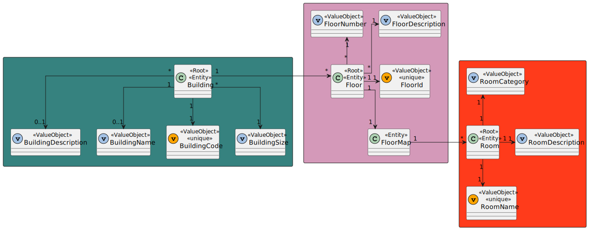
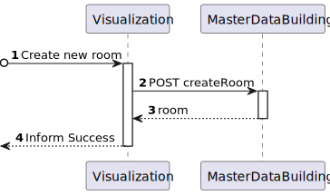
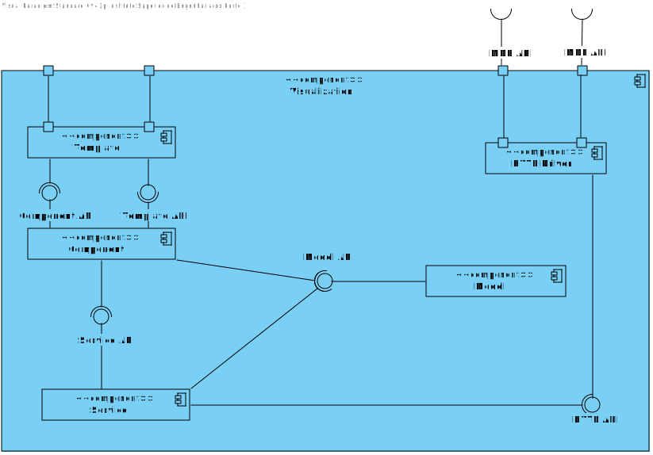
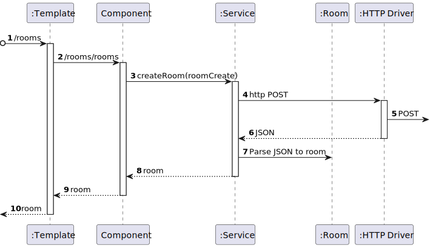

# US 1210 - As a Campus Manager, I want to create a room in a floor of a building

## 1. Context

* Backend developed in Sprint A.
* This task is relative to system user Campus Manager.

## 2. Requirements

**US 1210 -** As a Campus Manager, I want to:

* create a room in a floor of a building

**Dependencies:**

* This User Stories requires that there are buildings and floors created, so it has dependencies on US150 and US190.
- **US310 -** Sprint A

## 3. Analysis

* Campus Manager is a user role that manages the data of the routes and maps.
* Building is a structure within the campus that houses various rooms and facilities. It can be navigated by the robisep robots using corridors and elevators.
* Floor is a level within a building. Each floor can contain multiple rooms and is accessible by elevators and stairs (though robisep robots cannot use stairs).
* Room is a part of a floor defined by Name, and two sets of coordinates from opposite corners.

### 3.1. Domain Model Excerpt



## 4. Design

### 4.1. Realization

### Level1
###### LogicalView:


###### SceneryView:


###### ProcessView:


#### Level2

###### LogicalView:


###### ImplementationView:


###### PhysicalView:


###### ProcessView:


#### Level3
###### LogicalView:


###### ImplementationView:


###### ProcessView:



### 4.2. Applied Patterns

### 4.3. Tests


## 5. Implementation

###  ListAllFloorsPassageways Component
```typescript
@Component({
  selector: 'app-rooms',
  templateUrl: './rooms.component.html',
  styleUrls: ['./rooms.component.css'],
  providers: [RoomService]
})
export class RoomsComponent {
  constructor(private roomService: RoomService) { }
  categories: string[] = ["Office","Amphitheater", "Laboratory", "Other"];

  createForm = new FormGroup({
    roomName: new FormControl(''),
    roomDescription: new FormControl(''),
    roomCategory: new FormControl(''),
    floorId: new FormControl(0),
  })

  onCreate(){
    const room = {
      roomName: this.createForm.value.roomName!,
      roomDescription: this.createForm.value.roomDescription!,
      roomCategory: this.createForm.value.roomCategory!,
      floorId: this.createForm.value.floorId!,
    }

    this.roomService.createRoom(room).subscribe((r: Room) => {
      window.alert("Room " + r.roomName + " created successfully");
    })

    this.createForm.reset();
  }
}

````

###  ListAllFloorsPassageways Component HTML
```html
<h1>Create Room</h1>

<form [formGroup]="createForm" (ngSubmit)="onCreate()">

  <div class="form__group field">
    <input type="text" class="form__field" id='roomName' formControlName="roomName" required />
    <label for="roomName" class="form__label">Room Name</label>
  </div>

  <div class="form__group field">
    <input type="text" class="form__field" id='roomDescription' formControlName="roomDescription" required />
    <label for="roomDescription" class="form__label">Room Description</label>
  </div>

  <div class="form__group field">
    <select class="form__field" id="roomCategory" formControlName="roomCategory" required>
      <option value="">Select a category</option>
      <option *ngFor="let type of categories" [value]="type.toString()">{{type.toString()}}</option>
    </select>
    <label for="roomCategory" class="form__label">Room Category</label>
  </div>

  <div class="form__group field">
    <input type="number" class="form__field" id='floorId' formControlName="floorId" required min="1" />
    <label for="floorId" class="form__label">FloorID</label>
  </div>

  <div>
    <button>Create</button>
  </div>
</form>

````

## 6. Integration/Demonstration


## 7. Observations
