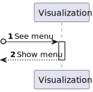

# US 1300- As a User, I want the app menu to adjust according to my user type. 

## 1. Context

* This US is relative to the frontendof the already implemented backend in Sprint A.

## 2. Requirements

**US 1150 -** As a User, I want the app menu to:
* adjust according to my user type. 

**Dependencies:**
US10 and US20 since in order to have users it is necessary to create them.

## 3. Analysis
**Regarding this requirement we understand that:**
As a User of the system with a specific role (Admin, Campus Manager, Fleet Manager, Task Manager or User), the menu of the app will automatically adjust itself, only displaying the functionalities the my role permit. It is also important to make sure that, after the initial loading of the page, other functionalities that the user does not have permission are not accessible through directly typing their URL. 

- System Manager/Admin: User role that has overall control of the RobDroneGo system. They are responsible for the maintenance and configuration of the system, ensuring that it is operating correctly and efficiently. They can manage user accounts, system settings, and have access to all data in the system.

- Campus Manager: User role that manages the data of the routes and maps.

- Fleet Manager: User role that manages the data of the robots and drones and the types of tasks.

- Task Manager: User role that manages the data of the tasks. 

## 4. Design

### 4.1. Realization

### Level1

###### ProcessView:


#### Level2

###### ProcessView:


#### Level3

###### ProcessView of Side Nav Menu Options:


###### ProcessView when Routing to Menus:


### 4.3. Applied Patterns
* Guard
* Service

## 5. Implementation

### Sidenav Component
``` typescript
  ngOnInit(): void {
    this.screenWidth = window.innerWidth;
    this.userRole = this.authService.getRoleByToken(this.authService.getToken()!);
  }

  checkPermission(data: INavbarData): boolean {
    if(data.permission){
      return data.permission.includes(this.userRole);
    }
    return true;
  }
```

### Auth Service
``` typescript
  public getRoleByToken(token: any) {
    let _token = token.split('.')[1];
    let tokenParsed = JSON.parse(atob(_token));
    return tokenParsed['http://schemas.microsoft.com/ws/2008/06/identity/claims/role'];
  }
```

### Sidenav HTML Template
``` html
  <div class="scrollwrap scrollwrap_delayed">
        <ul class="sidenav-nav">
        <li class="sidenav-nav-item" *ngFor="let data of navData">
            <a class="sidenav-nav-link" (click)="handleClick(data)"
                *ngIf="(data.items && data.items.length > 0) && checkPermission(data)"
                [ngClass]="getActiveClass(data)"
            >
                <i class="sidenav-link-icon" [class]="data.icon"></i>
                <span class="sidenav-link-text" @fadeInOut *ngIf="collapsed">
                    {{data.label}}
                </span>
                <i *ngIf="data.items && collapsed" class="menu-collapse-icon"
                    [ngClass]="!data.expanded ? 'fal fa-angle-right' : 'fal fa-angle-down'"
                ></i>
            </a>

            <a class="sidenav-nav-link" 
                *ngIf = "(!data.items || (data.items && data.items.length === 0)) && checkPermission(data)"
                [routerLink]="[data.routerLink]"
                routerLinkActive="active"
                [routerLinkActiveOptions]="{exact: true}">
                <i class="sidenav-link-icon" [class]="data.icon"></i>
                <span class="sidenav-link-text" @fadeInOut *ngIf="collapsed">
                    {{data.label}}
                </span>
            </a>
            <div *ngIf="collapsed && data.items && data.items.length>0">
                <app-sublevel-menu
                    [data]="data"
                    [collapsed]="collapsed"
                    [multiple]="multiple"
                    [expanded]="data.expanded"
                ></app-sublevel-menu>
            </div>            
        </li>
        </ul>
    </div>
```

#### BackofficeGuard
Other Guards are implemented, the only change is the role they permit.

``` typescript
@Injectable({
  providedIn: 'root'
})

export class BackofficeGuard implements CanActivate {
  constructor(
    private router: Router,
    private authService: AuthServiceService
    ) { }

  canActivate(route: ActivatedRouteSnapshot,
    state: RouterStateSnapshot): boolean | UrlTree | Observable<boolean | UrlTree> | Promise<boolean | UrlTree> {
    if (localStorage.getItem('token')) {
      if (this.authService.getRoleByToken(this.authService.getToken()!) === 'Admin') {
        return true;
      } else {
        alert('You do not have permission to access this page');
        this.router.navigate(['home']);
        return false;
      }
    }

    this.router.navigate(['auth/login']);
    return false;
  }
};
```

### App Routing Module
``` typescript
const routes: Routes = [
  {path: '', redirectTo: 'auth/login', pathMatch: 'full'},
  {path: 'home', component: HomeComponent , canActivate: [VerifyAuthServiceService]},
  {path: 'buildings',
    loadChildren: () => import('./buildings/buildings.module').then(m => m.BuildingsModule), canActivate: [CampusGuard]
  },
  {path: 'floors',
  loadChildren: () => import('./floors/floors.module').then(m => m.FloorsModule), canActivate: [CampusGuard]},
  {path: 'passageways',
  loadChildren: () => import('./passageways/passageways.module').then(m => m.PassagewaysModule), canActivate: [CampusGuard]},
  {path: 'elevators',
  loadChildren: () => import('./elevators/elevators.module').then(m => m.ElevatorsModule), canActivate: [CampusGuard]},
  {path: 'rooms',
  loadChildren: () => import('./rooms/rooms.module').then(m => m.RoomsModule), canActivate: [CampusGuard]},
  {path: 'robot-types',
  loadChildren: () => import('./robot-types/robot-types.module').then(m => m.RobotTypesModule), canActivate: [RobotsGuard]},
  {path: 'robots', 
  loadChildren: () => import('./robots/robots.module').then(m => m.RobotsModule), canActivate: [RobotsGuard]},
  {path: 'view3d', component: View3dComponent, canActivate: [VerifyAuthServiceService]},
  {path: 'shortest-path', component: ShortestPathComponent, canActivate: [VerifyAuthServiceService]},
  {path: 'auth', loadChildren: () => import('./auth/auth.module').then(m => m.AuthModule)},
  {path: 'backoffice-user', component: BackofficeUserComponent, canActivate: [BackofficeGuard]},
  {path: 'user-data', component: UserDataComponent, canActivate: [VerifyAuthServiceService]},
  {path: 'privacy', component: PrivacyComponent}
];
```

## 6. Integration/Demonstration
To see this functionality in action, it is needed to log in the web app with a valid account. When this is done, it will be possible to see in the side bar the group of functionalities that the account has access. If then, the log in is made with an account with a different role, the group of functionalities will be different. 

## 7. Observations
No observations.
