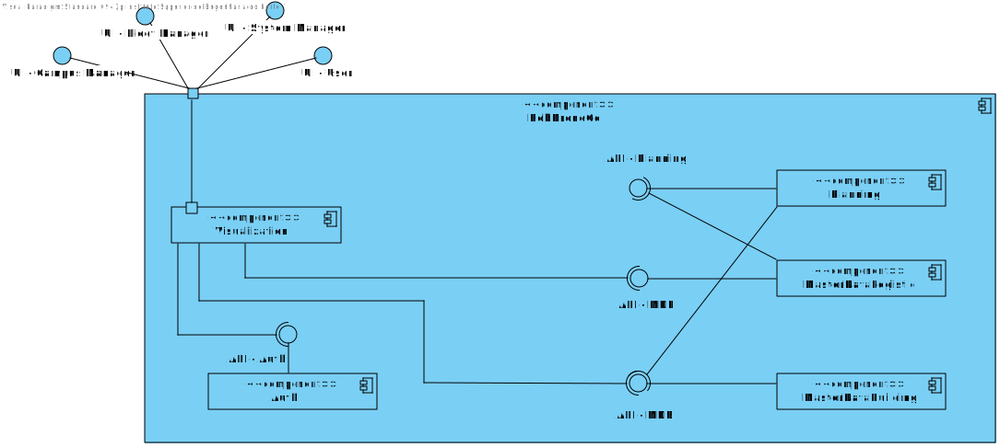

# US 20 - As a potencial system user(eg. student, teacher), I want to register as a user of the system

## 1. Context

* This is the first time this task is being developed

## 2. Requirements

**US 20 -** Como potencial utente do sistema (ex., aluno, docente) pretendo registar-me como utente do sistema.

## 3. Analysis

**Regarding this requirement we understand that:**

As an actor of the system, I want to be able to register
into the system, in the process of registering into the 
system the user should introduce his/hers name, e-mail
phone number and tax payer number.

NOTE: the only e-mail domain to be accepted is "isep.ipp.pt"

### Questions to the client

>Caro cliente,
>
>Que dados são necessários para a criação/registo de um utilizador, para além do seu Role?

>bom dia,
>
>criação de utilizadores e registo de utilizadores são dois casos de uso diferentes e com necessidades distintas.
>
>a criação de utilizadores serve para os administradores de sistema criarem os diversos utilizadores de backoffice do sistema num dos papeis designados, ex., gestor de campus, gestor de frota, gestor de tarefas
>
>o registo de utentes serve para o registo de utilizadores com o papel utente 
>em ambos os casos será necessário obter nome, email e telefone.
>
>no registo de utentes deve adicionalmente ser recolhido o número de contribuinte para faturação de serviços
>
> 
>
>apenas serão aceites emails da organização, ex., isep.ipp.pt.


NOTA: a parametrização do dominio de email aceite deve ser mantida fora do código fonte do projeto, ex., ficheiro de propriedades ou variavel de ambiente 

## 4. Design

We will create auth module which will store information
about the system users, name, email, phone number and tax 
payer number

This module will store that information in a relational
database 

### 4.1. Realization

### Level1

###### LogicalView:


###### SceneryView:


###### ProcessView:


#### Level2

###### LogicalView:



###### ImplementationView:


###### PhysicalView:


###### ProcessView:


#### Level3

###### LogicalView:


###### ImplementationView:


###### ProcessView:


### 4.2. Applied Patterns

* Controller
* Service
* Dto


### 4.3. Tests

#### Unit

##### UserService

```csharp
public class UserServiceTest
{

    private static Mock<IUserRepository> _userRepository = new Mock<IUserRepository>();
    private static Mock<IUnitOfWork> _unitOfWork = new Mock<IUnitOfWork>();
    private static Mock<ILogger<UserService>> _logger = new Mock<ILogger<UserService>>();
    private static Mock<IConfiguration> _configuration = new Mock<IConfiguration>();
    private static UserService _userService = new UserService(_logger.Object, _unitOfWork.Object, _userRepository.Object, _configuration.Object);

    [TestMethod]
    public async Task Check_Invalid_Values_For_User_Creation()
    {
        string name = "Jose Gouveia";
        string email = "1211089isep.ipp.pt";
        string phoneNumber = "930597721";
        string taxPayerNumber = "290088763";
        string password = "1211089aA!";

        CreateUserDto dto = new CreateUserDto(name, email, phoneNumber, taxPayerNumber, password);
        try
        {
            var user = await _userService.RegisterUser(dto);
        }
        catch (Exception e)
        {
            Assert.IsTrue(e is BusinessRuleValidationException);
        }
    }

    [TestMethod]
    public async Task Check_Valid_Values_For_User_Creation()
    {
        string name = "Jose Gouveia";
        string email = "1211089@isep.ipp.pt";
        string phoneNumber = "930597721";
        string taxPayerNumber = "290088763";
        string password = "1211089aA!";

        CreateUserDto dto = new CreateUserDto(name, email, phoneNumber, taxPayerNumber, password);
        _userRepository.Setup(x => x.AddAsync(It.IsAny<User>()));
        _unitOfWork.Setup(x => x.CommitAsync());

        var user = await _userService.RegisterUser(dto);

        Assert.AreEqual(user.Name, name);
        Assert.AreEqual(user.Email, email);
        Assert.AreEqual(user.PhoneNumber, phoneNumber);
        Assert.AreEqual(user.TaxPayerNumber, taxPayerNumber);
    }
}
```

##### UserController

```csharp
public class UserControllerTest
{


    [TestMethod]
    public async Task Check_Invalid_Values_For_User_Creation()
    {
        Mock<IUserService> userService = new Mock<IUserService>();
        userService.Setup(x => x.RegisterUser(It.IsAny<CreateUserDto>()))
            .ThrowsAsync(new BusinessRuleValidationException("Email must contain '@'."));

        UserController userController = new UserController(userService.Object);

        string name = "Jose Gouveia";
        string email = "1211089isep.ipp.pt";
        string phoneNumber = "930597721";
        string taxPayerNumber = "290088763";
        string password = "1211089aA!";

        CreateUserDto dto = new CreateUserDto(name, email, phoneNumber, taxPayerNumber, password);
        var result = await userController.RegisterUser(dto);

        Assert.IsInstanceOfType(result.Result, typeof(BadRequestObjectResult));
    }

    [TestMethod]
    public async Task Check_Valid_Values_For_User_Creation()
    {
        string name = "Jose Gouveia";
        string email = "1211089@isep.ipp.pt";
        string phoneNumber = "930597721";
        string taxPayerNumber = "290088763";
        string password = "1211089aA!";

        CreateUserDto dto = new CreateUserDto(name, email, phoneNumber, taxPayerNumber, password);
        UserDto userDto = new UserDto(name, email, phoneNumber, taxPayerNumber);

        Mock<IUserService> userService = new Mock<IUserService>();
        userService.Setup(x => x.RegisterUser(It.IsAny<CreateUserDto>()))
            .ReturnsAsync(userDto);

        UserController userController = new UserController(userService.Object);

        var result = await userController.RegisterUser(dto);

        Assert.IsInstanceOfType(result.Result, typeof(OkObjectResult));
        Assert.AreEqual(((OkObjectResult)result.Result).Value, userDto);
    }
}
```

##### User

```csharp
public class UserTest
{

    [TestMethod]
    [DataRow("Jose!")]
    [DataRow("Jose@")]
    [DataRow("Jose1")]
    public void Check_Invalid_Name(string value)
    {
        Assert.ThrowsException<BusinessRuleValidationException>(() => Name.Create(value));
    }    

    [TestMethod]
    [DataRow("Jose Gouveia")]
    public void Check_Valid_Name(string value)
    {
        Name name = Name.Create(value);
        Assert.AreEqual(value, name.NameString);
    }    

    [TestMethod]
    [DataRow("")]
    [DataRow("1211089isep.ipp.pt")]
    [DataRow("1211089@")]
    [DataRow("1211089@isep.pt")]
    public void Check_Invalid_Email(string value)
    {
        Assert.ThrowsException<BusinessRuleValidationException>(() => Email.Create(value));
    }

    [TestMethod]
    [DataRow("1211089@isep.ipp.pt")]
    public void Check_Valid_Email(string value)
    {
        Email email = Email.Create(value);
        Assert.AreEqual(value, email.Value);
    }

    [TestMethod]
    [DataRow("1211089")]
    [DataRow("12110890")]
    [DataRow("1211089A")]
    [DataRow("1211089a")]
    [DataRow("121108aA")]
    [DataRow("121108a0!")]
    [DataRow("12110890!")]
    [DataRow("1211089A!")]
    public void Check_Invalid_Password(string value)
    {
        Assert.ThrowsException<BusinessRuleValidationException>(() => Password.Create(value));
    }

    [TestMethod]
    [DataRow("1211089aA!")]
    public void Check_Valid_Password(string value)
    {
        Password password = Password.Create(value);
        Assert.AreEqual(value, password.PasswordString);
    }

    [TestMethod]
    [DataRow("93059772")]
    public void Check_Invalid_PhoneNumber(string value)
    {
        Assert.ThrowsException<BusinessRuleValidationException>(() => PhoneNumber.Create(value));
    }

    [TestMethod]
    [DataRow("930597721")]
    public void Check_Valid_PhoneNumber(string value)
    {
        PhoneNumber phoneNumber = PhoneNumber.Create(value);
        Assert.AreEqual(value, phoneNumber.Number);
    }

    [TestMethod]
    [DataRow("29008876")]
    public void Check_Invalid_TaxPayerNumber(string value)
    {
        Assert.ThrowsException<BusinessRuleValidationException>(() => PhoneNumber.Create(value));
    }

    [TestMethod]
    [DataRow("290088763")]
    public void Check_Valid_TaxPayerNumber(string value)
    {
        TaxPayerNumber taxPayerNumber = TaxPayerNumber.Create(value);
        Assert.AreEqual(value, taxPayerNumber.Number);
    }

    [TestMethod]
    public void Check_Invalid_User()
    {
        string name = "Jose Gouveia";
        string email = "1211089isep.ipp.pt";
        string phoneNumber = "930597721";
        string taxPayerNumber = "290088763";
        string password = "1211089aA!";
        string role = "utente";

        Assert.ThrowsException<BusinessRuleValidationException>(() => User.Create(name, email, taxPayerNumber, phoneNumber, password, role));
    }

    [TestMethod]
    public void Check_Valid_User()
    {
        string name = "Jose Gouveia";
        string email = "1211089@isep.ipp.pt";
        string phoneNumber = "930597721";
        string taxPayerNumber = "290088763";
        string password = "1211089aA!";
        string role = "utente";

        User user = User.Create(name, email, taxPayerNumber, phoneNumber, password, role);
        Assert.AreEqual(name, user.Name.NameString);
        Assert.AreEqual(email, user.Id.Value);
        Assert.AreEqual(phoneNumber, user.PhoneNumber.Number);
        Assert.AreEqual(taxPayerNumber, user.TaxPayerNumber.Number);
        Assert.AreEqual(password, user.Password.PasswordString);
    }
}
```

#### Integration

```csharp
public class RegisterUsersTest
{
    [TestMethod]
    public async Task Check_Invalid_Values_For_User_Creation()
    {
        Mock<IUserRepository> userRepository = new Mock<IUserRepository>();
        Mock<IUnitOfWork> unitOfWork = new Mock<IUnitOfWork>();
        Mock<ILogger<UserService>> logger = new Mock<ILogger<UserService>>();
        Mock<IConfiguration> configuration = new Mock<IConfiguration>();

        userRepository.Setup(x => x.AddAsync(It.IsAny<User>()));
        unitOfWork.Setup(x => x.CommitAsync());

        IUserService userService = new UserService(logger.Object, unitOfWork.Object, userRepository.Object, configuration.Object);

        UserController userController = new UserController(userService);

        string name = "Jose Gouveia";
        string email = "1211089isep.ipp.pt";
        string phoneNumber = "930597721";
        string taxPayerNumber = "290088763";
        string password = "1211089aA!";

        CreateUserDto dto = new CreateUserDto(name, email, phoneNumber, taxPayerNumber, password);
        var result = await userController.RegisterUser(dto);

        Assert.IsInstanceOfType(result.Result, typeof(BadRequestObjectResult));
    }

    [TestMethod]
    public async Task Check_Valid_Values_For_User_Creation()
    {
        Mock<IUserRepository> userRepository = new Mock<IUserRepository>();
        Mock<IUnitOfWork> unitOfWork = new Mock<IUnitOfWork>();
        Mock<ILogger<UserService>> logger = new Mock<ILogger<UserService>>();
        Mock<IConfiguration> configuration = new Mock<IConfiguration>();
        userRepository.Setup(x => x.AddAsync(It.IsAny<User>()));
        unitOfWork.Setup(x => x.CommitAsync());

        IUserService userService = new UserService(logger.Object, unitOfWork.Object, userRepository.Object, configuration.Object);
        UserController userController = new UserController(userService);

        string name = "Jose Gouveia";
        string email = "1211089@isep.ipp.pt";
        string phoneNumber = "930597721";
        string taxPayerNumber = "290088763";
        string password = "1211089aA!";
        CreateUserDto dto = new CreateUserDto(name, email, phoneNumber, taxPayerNumber, password);
        UserDto userDto = new UserDto(name, email, phoneNumber, taxPayerNumber);

        var result = await userController.RegisterUser(dto);

        Assert.IsInstanceOfType(result.Result, typeof(OkObjectResult));
        Assert.AreEqual(((OkObjectResult)result.Result).Value.ToString(), userDto.ToString());
    }
}
```


## 5. Implementation

### UserService

```csharp
namespace RobDroneGoAuth.Infrastructure.Users
{
    public class UserService : IUserService
    {
        private readonly IUnitOfWork _unitOfWork;
        private readonly IUserRepository _userRepository;
        private readonly ILogger<UserService> _logger;
        private readonly IConfiguration _configuration;
        private readonly string _defaultRole = "utente";

        public UserService(ILogger<UserService> logger, IUnitOfWork unitOfWork,
         IUserRepository userRepository, IConfiguration configuration)
        {
            this._logger = logger;
            this._unitOfWork = unitOfWork;
            this._userRepository = userRepository;
            this._configuration = configuration;
        }

        public async Task<UserDto> RegisterUser(CreateUserDto dto)
        {
            try
            {
                _logger.LogInformation("UserService: Registering user\n\n");

                var email = Email.Create(dto.Email);
                var userInDb = await this._userRepository.GetByIdAsync(email);
                if (userInDb != null)
                {
                    throw new BusinessRuleValidationException("Email already in use");
                }

                var user = User.Create(dto.Name, dto.Email, dto.TaxPayerNumber, dto.PhoneNumber, dto.Password, _defaultRole);
                await this._userRepository.AddAsync(user);
                await this._unitOfWork.CommitAsync();
                return new UserDto(user.Name.NameString, user.Id.Value, user.PhoneNumber.Number, user.TaxPayerNumber.Number);
            }
            catch (BusinessRuleValidationException e)
            {
                _logger.LogWarning("UserService: Error has occurred while registering user: " + e.Message + "\n\n");
                throw new BusinessRuleValidationException(e.Message);
            }
            catch (Exception e)
            {
                _logger.LogError("UserService: Error has occurred while registering user: " + e.Message + "\n\n");
                throw new Exception(e.Message);
            }
        }

        public async Task<UserSessionDto> LogIn(LogInDto dto)
        {
            try
            {
                _logger.LogInformation("UserService: Logging in user\n\n");

                Email email = Email.Create(dto.Email);
                var user = await this._userRepository.GetByIdAsync(email);
                if (user == null)
                {
                    _logger.LogWarning("UserService: Error has occurred while logging in user: User not found\n\n");
                    throw new BusinessRuleValidationException("User not found");
                }
                if (!user.Password.Equals(dto.Password))
                {
                    _logger.LogWarning("UserService: Error has occurred while logging in user: Wrong password\n\n");
                    throw new BusinessRuleValidationException("Wrong password");
                }

                return new UserSessionDto(CreateToken(user));
            }
            catch (BusinessRuleValidationException e)
            {
                _logger.LogWarning("UserService: Error has occurred while logging in user: " + e.Message + "\n\n");
                throw new BusinessRuleValidationException(e.Message);
            }
            catch (Exception e)
            {
                _logger.LogError("UserService: Error has occurred while logging in user: " + e.StackTrace + "\n\n");
                throw new Exception(e.Message);
            }
        }

        private string CreateToken(User user)
        {
            List<Claim> claims = new List<Claim>
            {
                new Claim(ClaimTypes.NameIdentifier, user.Id.Value),
            };
            var key = new SymmetricSecurityKey(
                Encoding.UTF8.GetBytes(_configuration.GetSection("AppSettings:Token").Value!));
            var credentials = new SigningCredentials(key, SecurityAlgorithms.HmacSha256Signature);
            var jwt = new JwtSecurityToken(
                claims: claims,
                expires: DateTime.Now.AddDays(1),
                signingCredentials: credentials
            );
            var tokenHandler = new JwtSecurityTokenHandler();
            return tokenHandler.WriteToken(jwt);
        }
    }
}
```

### UserController

```csharp
namespace RobDroneGoAuth.Controllers.User
{
    [Route("api/users")]
    [ApiController]
    public class UserController : ControllerBase
    {
        private readonly IUserService _userService;
        public UserController(IUserService userService)
        {
            this._userService = userService;
        }

        [HttpPost("login")]
        public async Task<ActionResult<UserSessionDto>> LogIn([FromBody] LogInDto dto)
        {
            try
            {
                var userSession = await this._userService.LogIn(dto);
                return Ok(userSession);
            }
            catch (Exception e)
            {
                return BadRequest(e.Message);
            }
        }

        [HttpPost]
        public async Task<ActionResult<UserDto>> RegisterUser([FromBody] CreateUserDto dto)
        {
            try
            {
                var user = await this._userService.RegisterUser(dto);
                return Ok(user);
            }
            catch (Exception e)
            {
                return BadRequest(e.Message);
            }
        }
    }
}
```

### User

```csharp
namespace RobDroneGoAuth.Domain.Users
{
    public class User : Entity<Email>, IAggregateRoot
    {
        public Name Name { get; }
        public TaxPayerNumber TaxPayerNumber { get; }
        public PhoneNumber PhoneNumber { get; }
        public Password Password { get; }
        public Role Role { get; }

        protected User()
        {
        }
        protected User(Name name, Email email, TaxPayerNumber taxPayerNumber, PhoneNumber phoneNumber, Password password, Role role)
        {
            this.Id = email;
            Name = name;
            TaxPayerNumber = taxPayerNumber;
            PhoneNumber = phoneNumber;
            Password = password;
            Role = role;
        }

        public static User Create(string name, string email, string taxPayerNumber, string phoneNumber, string password, string role)
        {
            return new User(Name.Create(name),
                Email.Create(email),
                TaxPayerNumber.Create(taxPayerNumber),
                PhoneNumber.Create(phoneNumber),
                Password.Create(password),
                Role.Create(role));
        }

    }
}
```

## 6. Integration/Demonstration

To make use of register and login functionalities you'll have to send an https request to the server

### Register

for the registration process you have to send an POST request at https://serverAddress/api/users
with the following body :

{
    "name": "jose gouveia",
    "email": "1211089@isep.ipp.pt",
    "phoneNumber": 930597723,
    "taxPayerNumber": 290088763,
    "password": "1D345678bA!"
}

## 7. Observations

No additional observations.
