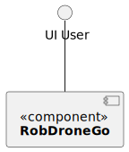
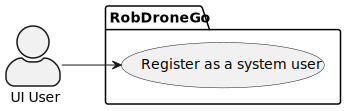
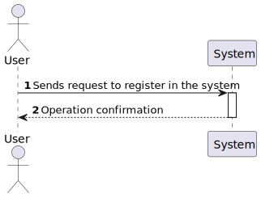
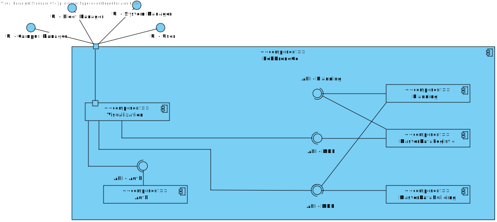
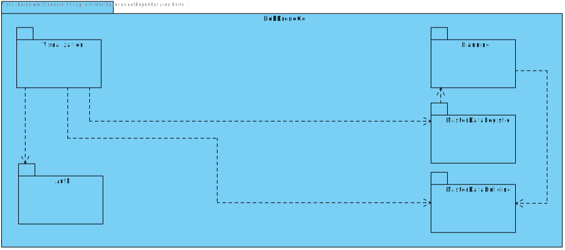
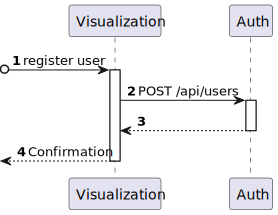
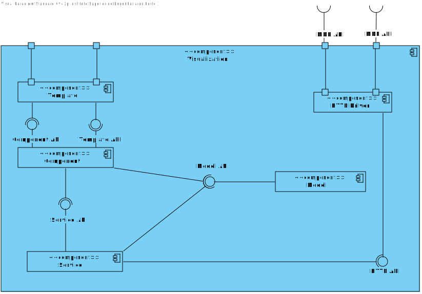
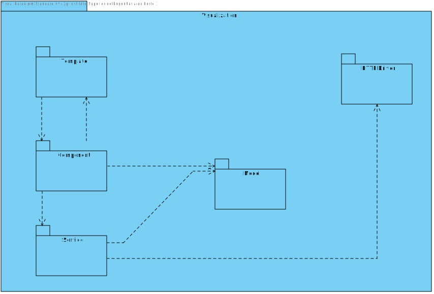
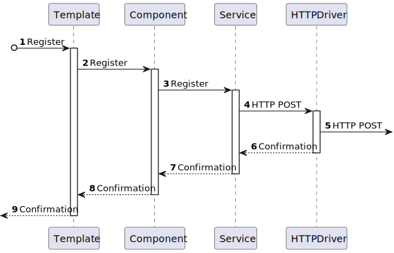

# US 20 - As a potencial system user(eg. student, teacher), I want to register as a user of the system

## 1. Context

* This is the first time this task is being developed

## 2. Requirements

**US 20 -** Como potencial utente do sistema (ex., aluno, docente) pretendo registar-me como utente do sistema.

## 3. Analysis

**Regarding this requirement we understand that:**

As an actor of the system, I want to be able to register
into the system, in the process of registering into the 
system the user should introduce his/hers name, e-mail
phone number and tax payer number.

NOTE: the only e-mail domain to be accepted is "isep.ipp.pt"

### Questions to the client

>Caro cliente,
>
>Que dados são necessários para a criação/registo de um utilizador, para além do seu Role?

>bom dia,
>
>criação de utilizadores e registo de utilizadores são dois casos de uso diferentes e com necessidades distintas.
>
>a criação de utilizadores serve para os administradores de sistema criarem os diversos utilizadores de backoffice do sistema num dos papeis designados, ex., gestor de campus, gestor de frota, gestor de tarefas
>
>o registo de utentes serve para o registo de utilizadores com o papel utente 
>em ambos os casos será necessário obter nome, email e telefone.
>
>no registo de utentes deve adicionalmente ser recolhido o número de contribuinte para faturação de serviços
>
> 
>
>apenas serão aceites emails da organização, ex., isep.ipp.pt.

NOTA: a parametrização do dominio de email aceite deve ser mantida fora do código fonte do projeto, ex., ficheiro de propriedades ou variavel de ambiente

## 4. Design

We will create auth module which will store information
about the system users, name, email, phone number and tax
payer number

This module will store that information in a relational
database

## 4.1 Realization

### Level1

#### LogicalView:



#### SceneryView:



#### ProcessView:


### Level2

#### LogicalView:



#### ImplementationView:



#### PhysicalView:


#### ProcessView:



### Level3

#### LogicalView:



#### ImplementationView:



#### ProcessView:



### 4.2. Applied Patterns

* Repository
* Directive
* Service

### 4.3. Tests

```ts
describe('Regist User Page Test', function () {
  beforeEach(() => {
    cy.intercept('POST', 'https://localhost:7094/api/users', {
      statusCode: 200,
      body: [
        {
          "name": "Jose Gouveia",
          "email": "1211089@isep.ipp.pt",
          "phoneNumber": "912345678",
          "taxPayerNumber": "123456789"
        }
      ]
    }).as('register');

    localStorage.removeItem('token')
    cy.visit('/auth/register')
  });

  it('has correct title', function () {
    cy.get('h1').should('contain', 'Create an account')
  })

  it('should display a form for creating a new User', () => {
    cy.get('form').should('be.visible');
  });

  it('should display a text input field for entering the User name', () => {
    cy.get('input[id=name]').should('be.visible');
    cy.get('input[id=name]').should('have.attr', 'type', 'text');
  });

  it('should display a text input field for entering the User email', () => {
    cy.get('input[id=email]').should('be.visible');
    cy.get('input[id=email]').should('have.attr', 'type', 'text');
  });

  it('should display a text input field for entering the User phone number', () => {
    cy.get('input[id=phoneNumber]').should('be.visible');
    cy.get('input[id=phoneNumber]').should('have.attr', 'type', 'text');
  });

  it('should display a text input field for entering the User tax payer number', () => {
    cy.get('input[id=taxPayerNumber]').should('be.visible');
    cy.get('input[id=taxPayerNumber]').should('have.attr', 'type', 'text');
  });

  it('should display a text input field for entering the User password', () => {
    cy.get('input[id=password]').should('be.visible');
    cy.get('input[id=password]').should('have.attr', 'type', 'password');
  });

  it('should display checkbox consent or not to the collection and processing of my personal data', () => {
    cy.get('input[type="checkbox"]').first().check({ force: true }).should('be.checked');
    cy.get('input[type="checkbox"]').first().uncheck({ force: true }).should('not.be.checked');
  });

  it('should display a button for creating the user', () => {
    cy.get('button:contains("Submit")').should('be.visible');
  });

  it('fills and submits the form', function () {

    cy.get('#email').type('1211089@isep.ipp.pt');
    cy.get('#name').type('Jose Gouveia');
    cy.get('#phoneNumber').type('912345678');
    cy.get('#taxPayerNumber').type('123456789');
    cy.get('#password').type('123456789aA!');

    cy.get('input[type="checkbox"]').first().check({ force: true }).should('be.checked');

    cy.get('button:contains("Submit")').click()

    cy.get('h1').should('contain', 'Login')
  })

})
```

## 5. Implementation

### Service


```ts
  public register(dto: RegisterUserDto) {
    const url = this.authUrl
    return this.httpClient.post<UserDto>(url, dto).pipe(
      catchError(this.handleError<UserDto>("register", undefined))
    )
  }
```

### Component TS

```ts
export class RegisterComponent {

  isChecked = false;

  constructor(private authService: AuthServiceService,
    private router: Router) { }

  registerForm = new FormGroup({
    name: new FormControl(""),
    email: new FormControl(""),
    phoneNumber: new FormControl(""),
    taxPayerNumber: new FormControl(""),
    password: new FormControl("")
  })

  onSubmit() {
    if (this.isChecked) {
      const user: RegisterUserDto = {
        name: this.registerForm.value.name!,
        email: this.registerForm.value.email!,
        phoneNumber: Number(this.registerForm.value.phoneNumber!),
        taxPayerNumber: Number(this.registerForm.value.taxPayerNumber!),
        password: this.registerForm.value.password!
      }
      this.authService.register(user).subscribe(
        (user: UserDto) => {
          if (user) {
            console.log(user);
            this.registerForm.reset();
          } else {
            window.alert("Error creating user");
          }
        });


    } else {
      window.alert("You must accept the terms and conditions");
      return;
    }

  }


  updatePrivacy(event: Event) {
    const checkbox = event.target as HTMLInputElement;
    if (checkbox.checked) {
      this.isChecked = true;
    } else {
      this.isChecked = false;
    }
  }

}
```

```html
<div class="container">
    <div class="login-box">
        <h1 class="title">Create an account</h1>

        <form class="form" [formGroup]="registerForm" (ngSubmit)="onSubmit()">
            <div class="form__group field">
                <input type="text" class="form__field" id='name' formControlName="name" />
                <label for="name" class="form__label">Name</label>
            </div>
            <div class="form__group field">
                <input type="text" class="form__field" id='email' formControlName="email" />
                <label for="email" class="form__label">Email</label>
            </div>
            <div class="form__group field">
                <input type="text" class="form__field" id='phoneNumber' formControlName="phoneNumber" />
                <label for="phoneNumber" class="form__label">Phone Number</label>
            </div>
            <div class="form__group field">
                <input type="text" class="form__field" id='taxPayerNumber' formControlName="taxPayerNumber" />
                <label for="taxPayerNumber" class="form__label">Tax payer number</label>
            </div>
            <div class="form__group field">
                <input type="password" class="form__field" id='password' formControlName="password" />
                <label for="password" class="form__label">Password</label>
            </div>
            <div class="privacy">
                <input type="checkbox" id="checkbox" (change)="updatePrivacy($event)" />
                <label for="checkbox">I confirm that I have read the <a
                        [routerLink]="['/privacy']">privacy
                        policy</a></label>
            </div>
            <button>Submit</button>
        </form>

        <a class="link" type="button" [routerLink]="['/auth/login']">Already have an account?</a>
    </div>
</div>

```
