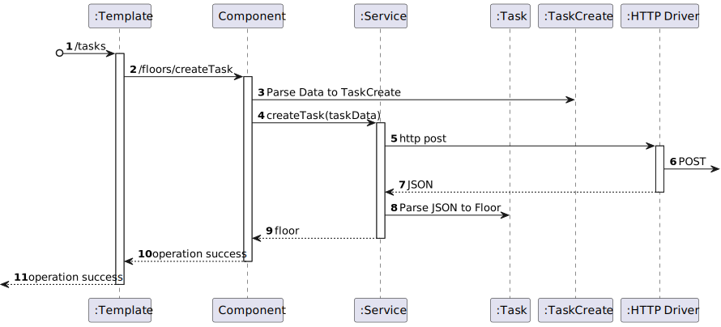

# US 460 - As the system user I intend to request a task, specify the parameters necessary for its execution, namely the starting point and term point and what is the intended task

## 1. Context

* First time that this user story is being implemented.
* This task is relative to system user.

## 2. Requirements

**US 460 -** As the system user I intend to request a task, specify the parameters necessary for its execution, namely the starting point and term point and what is the intended task

**Dependencies:**
 - none

### Client Questions
> **Q**: Em relação às tarefas existentes (vigilância de um piso e transporte de um objeto) existem algum requerimento especial? Para além da especificação do piso na vigilância e especificação do objeto e local de recolha e entrega no caso do transporte. <br>
> **A**: As tarefas de vigilância caracterizam-se por indicar qual o edificio e piso(s) que se pretende vigiar bem como o número de contacto em caso de incidente. tipicamente o segurança irá requisitar que um robot "dê uma volta pelos pisos X, Y e Z do edificio N". <br> As tarefas de "piclup & delivery" caracterizam-se por indicar qual a sala que se pretende de pickup e qual a sala de delivery, bem como um nome e um contacto para pickup e outro para delivery. deve também ser indicado um código de confirmação que a pessoa que receberá deverá introduzir no painel do robot. adicionalmente deve ser indicada uma descrição da entrega, ex., "Marcadores de cor vermelha (1x) e azul (2x)"

> **Q**: Gostaríamos de saber se pretende que fique registado qual foi o utente que requisitou a tarefa. <br>
> **A**: sim. o requerente é uma informação importante a manter. <br>

> **Q**: Na tarefa de Supervision deve ser indicado um contacto para o qual deve ser enviada uma mensagem em caso de necessidade. Este contacto pode/deve ser o do utente que faz a requisição da tarefa? Por exemplo, se um segurança pedir esta tarefa, e em caso de necessidade de contacto, o robot contacta o mesmo segurança que foi quem fez o pedido e é quem deve obter informações acerca da tarefa. A mesma questão aplica-se à tarefa de Pickup & Delivery onde o contacto de pickup pode/deve ser o do utilizador que faz a requisição da tarefa, passando apenas o contacto de delivery. <br>
> **A**: O utilizador pode introduzir um contacto que não o dele. exemplo, o docente ABC requista a recolha de uma caneta na secretaria do departamento indicando o contacto de XYZ para entrega na sala de aula XXX ao docente ASD. <br> 

> **Q**: O contacto indicado pelo utilizador deve ser o e-mail ou número de telemóvel? <br>
> **A**: na requisição de uma tarefa será necessário indicar um contacto de "pickup" e um contacto de "delivery" (nome e número de telefone <br>

> **Q**: Relativamente ao 'Código de Confirmação', mencionado em https://moodle.isep.ipp.pt/mod/forum/discuss.php?d=25045#p31683, gostava de perceber se este código segue algum formato específico. Além disso, o código será introduzido pelo utilizador que está a requisitar a tarefa, ou deverá ser gerado automaticamente pelo sistema? <br>
> **A**: o código de confirmação é introduzido pelo requisitante. é um número entre 4 e 6 digitos <br>

> **Q**: Gostávamos de saber se a descrição de entrega deve ter algum limite de caracteres? <br>
> **A**: para a descrição devem limitar a 1000 caracteres alfanumericos <br>

> **Q**: Foi-nos dito, no contexto de ALGAV (modulo de planeamento), que "Nas tarefas do tipo vigilância ou desinfeção os pontos iniciais e finais de cada tarefa estão sempre no mesmo corredor interno de um piso de um edifício". No entanto, numa resposta anterior "As tarefas de vigilância caracterizam-se por indicar qual o edifício e piso(s)" <br>
> **A**: Sim podem considerar as tarefas de vigilância apenas para um piso e o utilizador terá que criar uma requisição para cada piso. <br>

> **Q**: em relação ao processo da criação da tarefa, o cliente aceita que a tarefa tenha um estado "requisitado" ou entende que o processo se divide em duas etapas distintas: requisição da tarefa e depois a criação da tarefa propriamente dita? <br>
> **A**: o processo de negócio é o seguinte:
1.utente efetua requisição de tarefa,
2.gestor de tarefas aprova requisição,
3.gestor de tarefas inicia o planeamento das tarefas aprovadas <br>

> **Q**: Perante este caso de uso, o quê que identificaria uma Tarefa? Podem haver várias tarefas com os mesmos detalhes no sistema? <br>
> **A**: em relação à segunda pergunta, sim, é perfeitamente possivel um utente fazer duas requisições com as mesmas caracteristicas<br>


## 3. Analysis

**Analyzing this User Story we understand that:**
* Task is a request made by a user to the system to perform a certain action.
* The task can be of two types: Surveillance and Pickup & Delivery
* Surveillance task is a request made by a user to the system to perform a surveillance action in a certain building floor.
* The surveillance task information is based on: Task Type, Task Description, Task Building, Task Floor, Task Contact
* Pickup & Delivery task is a request made by a user to the system to perform a pickup & delivery action in a certain building floor.
* The pickup & delivery task information is based on: Task Type, Task Description, Task Pickup Contact, Task Delivery Contact, Task Pickup Code, Task Pickup Room, Task Delivery Room

* Task example:
```
{
    "taskType": "Surveillance",
    "taskDescription": "Vigilância do piso 1 do edificio B",
    "taskBuilding": "B",
    "taskFloor": "1",
    "taskContact": "912345678"
}
```
```
{
    "taskType": "Pickup & Delivery",
    "taskDescription": "Recolha de caneta na secretaria do departamento",
    "taskPickupContact": "912345678",
    "taskDeliveryContact": "912345678",
    "taskPickupCode": "1234",
    "taskPickupRoom": "Secretaria",
    "taskDeliveryRoom": "Sala de aula 1"
}
```

### 3.1. Domain Model Excerpt


## 4. Design

### 4.1. Realization

### Level1
###### LogicalView:


###### SceneryView:


###### ProcessView:


#### Level2
###### LogicalView:


###### ImplementationView:


###### PhysicalView:


###### ProcessView:


#### Level3
###### LogicalView:


###### ImplementationView:


###### ProcessView:


### 4.3. Applied Patterns


### 4.4. Tests


## 5. Implementation


## 6. Integration/Demonstration


## 7. Observations
