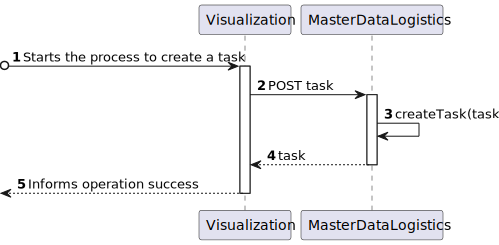

# US 460 - As the system user I intend to request a task, specify the parameters necessary for its execution, namely the starting point and term point and what is the intended task

## 1. Context

* First time that this user story is being implemented.
* This task is relative to system user.

## 2. Requirements

**US 460 -** As the system user I intend to request a task, specify the parameters necessary for its execution, namely the starting point and term point and what is the intended task

**Dependencies:**
 - none

### Client Questions
> **Q**: Em relação às tarefas existentes (vigilância de um piso e transporte de um objeto) existem algum requerimento especial? Para além da especificação do piso na vigilância e especificação do objeto e local de recolha e entrega no caso do transporte. <br>
> **A**: As tarefas de vigilância caracterizam-se por indicar qual o edificio e piso(s) que se pretende vigiar bem como o número de contacto em caso de incidente. tipicamente o segurança irá requisitar que um robot "dê uma volta pelos pisos X, Y e Z do edificio N". <br> As tarefas de "piclup & delivery" caracterizam-se por indicar qual a sala que se pretende de pickup e qual a sala de delivery, bem como um nome e um contacto para pickup e outro para delivery. deve também ser indicado um código de confirmação que a pessoa que receberá deverá introduzir no painel do robot. adicionalmente deve ser indicada uma descrição da entrega, ex., "Marcadores de cor vermelha (1x) e azul (2x)"

> **Q**: Gostaríamos de saber se pretende que fique registado qual foi o utente que requisitou a tarefa. <br>
> **A**: sim. o requerente é uma informação importante a manter. <br>

> **Q**: Na tarefa de Supervision deve ser indicado um contacto para o qual deve ser enviada uma mensagem em caso de necessidade. Este contacto pode/deve ser o do utente que faz a requisição da tarefa? Por exemplo, se um segurança pedir esta tarefa, e em caso de necessidade de contacto, o robot contacta o mesmo segurança que foi quem fez o pedido e é quem deve obter informações acerca da tarefa. A mesma questão aplica-se à tarefa de Pickup & Delivery onde o contacto de pickup pode/deve ser o do utilizador que faz a requisição da tarefa, passando apenas o contacto de delivery. <br>
> **A**: O utilizador pode introduzir um contacto que não o dele. exemplo, o docente ABC requista a recolha de uma caneta na secretaria do departamento indicando o contacto de XYZ para entrega na sala de aula XXX ao docente ASD. <br> 

> **Q**: O contacto indicado pelo utilizador deve ser o e-mail ou número de telemóvel? <br>
> **A**: na requisição de uma tarefa será necessário indicar um contacto de "pickup" e um contacto de "delivery" (nome e número de telefone <br>

> **Q**: Relativamente ao 'Código de Confirmação', mencionado em https://moodle.isep.ipp.pt/mod/forum/discuss.php?d=25045#p31683, gostava de perceber se este código segue algum formato específico. Além disso, o código será introduzido pelo utilizador que está a requisitar a tarefa, ou deverá ser gerado automaticamente pelo sistema? <br>
> **A**: o código de confirmação é introduzido pelo requisitante. é um número entre 4 e 6 digitos <br>

> **Q**: Gostávamos de saber se a descrição de entrega deve ter algum limite de caracteres? <br>
> **A**: para a descrição devem limitar a 1000 caracteres alfanumericos <br>

> **Q**: Foi-nos dito, no contexto de ALGAV (modulo de planeamento), que "Nas tarefas do tipo vigilância ou desinfeção os pontos iniciais e finais de cada tarefa estão sempre no mesmo corredor interno de um piso de um edifício". No entanto, numa resposta anterior "As tarefas de vigilância caracterizam-se por indicar qual o edifício e piso(s)" <br>
> **A**: Sim podem considerar as tarefas de vigilância apenas para um piso e o utilizador terá que criar uma requisição para cada piso. <br>

> **Q**: em relação ao processo da criação da tarefa, o cliente aceita que a tarefa tenha um estado "requisitado" ou entende que o processo se divide em duas etapas distintas: requisição da tarefa e depois a criação da tarefa propriamente dita? <br>
> **A**: o processo de negócio é o seguinte:
1.utente efetua requisição de tarefa,
2.gestor de tarefas aprova requisição,
3.gestor de tarefas inicia o planeamento das tarefas aprovadas <br>

> **Q**: Perante este caso de uso, o quê que identificaria uma Tarefa? Podem haver várias tarefas com os mesmos detalhes no sistema? <br>
> **A**: em relação à segunda pergunta, sim, é perfeitamente possivel um utente fazer duas requisições com as mesmas caracteristicas<br>


## 3. Analysis

**Analyzing this User Story we understand that:**
* Task is a request made by a user to the system to perform a certain action.
* The task can be of two types: Surveillance and Pickup & Delivery
* Surveillance task is a request made by a user to the system to perform a surveillance action in a certain building floor.
* The surveillance task information is based on: Task Type, Task Description, Task Building, Task Floor, Task Contact
* Pickup & Delivery task is a request made by a user to the system to perform a pickup & delivery action in a certain building floor.
* The pickup & delivery task information is based on: Task Type, Task Description, Task Pickup Contact, Task Delivery Contact, Task Pickup Code, Task Pickup Room, Task Delivery Room

* Task example:
```
{
    "taskType": "Surveillance",
    "taskDescription": "Vigilância do piso 1 do edificio B",
    "taskBuilding": "B",
    "taskFloor": "1",
    "taskContact": "912345678"
}
```
```
{
    "taskType": "Pickup & Delivery",
    "taskDescription": "Recolha de caneta na secretaria do departamento",
    "taskPickupContact": "912345678",
    "taskDeliveryContact": "912345678",
    "taskPickupCode": "1234",
    "taskPickupRoom": "Secretaria",
    "taskDeliveryRoom": "Sala de aula 1"
}
```

### 3.1. Domain Model Excerpt


## 4. Design

### 4.1. Realization

### Level1
###### LogicalView:


###### SceneryView:


###### ProcessView:


#### Level2
###### LogicalView:


###### ImplementationView:


###### PhysicalView:


###### ProcessView:


#### Level3
###### LogicalView:


###### ImplementationView:


###### ProcessView:


### 4.3. Applied Patterns
* Pipe
* Directive
* Service

### 4.4. Tests
**Test 1:** **Check Title**
```
it('has correct title', () => {
    cy.get('h1').should('contain', 'Create Task');
  });
```

**Test 2:** **Display Object Transport Form**
```
it('should display a form for creating a new Object Transport task', () => {
    cy.get('#taskType').select('Object transport');
    cy.get('form').should('be.visible');
  });
```

**Test 3:** **Display Task Description Input Field**
```
it('should display a text input field for entering the task description', () => {
    cy.get('#taskType').select('Object transport');
    cy.get('input[id=Description]').should('be.visible');
    cy.get('input[id=Description]').should('have.attr', 'type', 'text');
  });
```

**Test 4:** **Display Pickup Room Dropdown**
```
it('should display a dropdown for selecting the Pickup Room', () => {
    cy.get('#taskType').select('Object transport');
    cy.get('select[formControlName=PickupRoom]').should('be.visible');
  });
```

**Test 5:** **Display Delivery Room Dropdown**
```
it('should display a dropdown for selecting the Delivery Room', () => {
    cy.get('#taskType').select('Object transport');
    cy.get('select[formControlName=DeliveryRoom]').should('be.visible');
  });
```

**Test 6:** **Display Pickup Contact Input Field**
```
it('should display a text input field for entering the Pickup Contact', () => {
    cy.get('#taskType').select('Object transport');
    cy.get('input[id=PickupContact]').should('be.visible');
    cy.get('input[id=PickupContact]').should('have.attr', 'type', 'text');
  });
```

**Test 7:** **Display Delivery Contact Input Field**
```
it('should display a text input field for entering the Delivery Contact', () => {
    cy.get('#taskType').select('Object transport');
    cy.get('input[id=DeliveryContact]').should('be.visible');
    cy.get('input[id=DeliveryContact]').should('have.attr', 'type', 'text');
  });
```

**Test 8:** **Display Pickup Code Input Field**
```
it('should display a text input field for entering the Pickup Code', () => {
    cy.get('#taskType').select('Object transport');
    cy.get('input[id=PickupCode]').should('be.visible');
    cy.get('input[id=PickupCode]').should('have.attr', 'type', 'number');
  });
```

**Test 9:** **Display Create Button for Object Transport Task**
```
it('should display a button for creating the Object Transport task', () => {
    cy.get('#taskType').select('Object transport');
    cy.get('button:contains("Create")').should('be.visible');
  });
```

**Test 10:** **Create Object Transport Task**
```
it('should create an Object transport task', () => {
    cy.get('#taskType').select('Object transport');
    cy.get('#Description').type('Test Description');
    cy.get('select[formControlName=PickupRoom]').select('A201');
    cy.get('select[formControlName=DeliveryRoom]').select('B103');
    cy.get('#PickupContact').type('912913914');
    cy.get('#DeliveryContact').type('912913915');
    cy.get('#PickupCode').type('1234');
    cy.get('button:contains("Create")').click();
    cy.wait('@createTask')

    cy.get('#Description').should('have.value', '');
    cy.get('#PickupContact').should('have.value', '');
    cy.get('#DeliveryContact').should('have.value', '');
    cy.get('#PickupCode').should('have.value', '');
  });
```

**Test 11:** **Display Floor Surveillance Form**
```
it('should display a form for creating a new Floor surveillance task', () => {
    cy.get('#taskType').select('Floor surveillance');
    cy.get('form').should('be.visible');
  });
```
**Test 12:** **Display Task Description Input Field for Floor Surveillance**
```
it('should display a text input field for entering the task description', () => {
    cy.get('#taskType').select('Floor surveillance');
    cy.get('input[id=Description]').should('be.visible');
    cy.get('input[id=Description]').should('have.attr', 'type', 'text');
  });
```

**Test 13:** **Display Building Dropdown**
```
it('should display a dropdown for selecting the Building', () => {
    cy.get('#taskType').select('Floor surveillance');
    cy.get('select[formControlName=buildingCode]').should('be.visible');
  });
```

**Test 14:** **Display Floor Dropdown**
```
it('should display a dropdown for selecting the Floor', () => {
    cy.get('#taskType').select('Floor surveillance');
    cy.get('select[formControlName=floorId]').should('be.visible');
  });
```

**Test 15:** **Display Pickup Room Dropdown for Floor Surveillance**
```
it('should display a dropdown for selecting the Pickup Room', () => {
    cy.get('#taskType').select('Floor surveillance');
    cy.get('select[formControlName=PickupRoom]').should('be.visible');
  });
```

**Test 16:** **Display Delivery Room Dropdown for Floor Surveillance**
```
it('should display a dropdown for selecting the Delivery Room', () => {
    cy.get('#taskType').select('Floor surveillance');
    cy.get('select[formControlName=DeliveryRoom]').should('be.visible');
  });
```

**Test 17:** **Display Contact Input Field for Floor Surveillance**
```
it('should display a text input field for entering the Contact', () => {
    cy.get('#taskType').select('Floor surveillance');
    cy.get('input[id=Contact]').should('be.visible');
    cy.get('input[id=Contact]').should('have.attr', 'type', 'number');
  });
```

**Test 18:** **Display Create Button for Floor Surveillance Task**
```
it('should display a button for creating the Floor surveillance task', () => {
    cy.get('#taskType').select('Floor surveillance');
    cy.get('button:contains("Create")').should('be.visible');
  });
```

**Test 19:** **Create Floor Surveillance Task**
```
it('should create an Floor surveillance task', () => {
    cy.get('#taskType').select('Floor surveillance');
    cy.get('#Description').type('Test Description');
    cy.get('select[formControlName=buildingCode]').select('B');
    cy.get('select[formControlName=floorId]').select('1');
    cy.get('select[formControlName=PickupRoom]').select('B101');
    cy.get('select[formControlName=DeliveryRoom]').select('B103');
    cy.get('#Contact').type('912913914');
    cy.get('button:contains("Create")').click();
    cy.wait('@createTask')

    cy.get('#Description').should('have.value', '');
    cy.get('#Contact').should('have.value', '');   
  });
```

## 5. Implementation

#### HTML
```
<h1>Create Task</h1>

<label for="taskType"></label>
<select id="taskType" [(ngModel)]="taskType">
  <option value="Object transport">Object transport</option>
  <option value="Floor surveillance">Floor surveillance</option>
</select>

<form *ngIf="taskType === 'Object transport'" [formGroup]="objectTransportForm" (ngSubmit)="onSubmit()">
    <div class="form__group field">
        <input type="text" class="form__field" name="Description" id='Description' formControlName="Description" required/>
        <label for="Description" class="form__label">Description</label>
    </div>
    <div class="form__group field">
        <label for="PickupRoom" class="form__label">PickupRoom</label>
        <select formControlName="PickupRoom" id="view">
            <option value="">Select a Room</option>
            <option *ngFor="let room of rooms" [value]="room.roomName"> {{
                room.roomName }}
            </option>
        </select>
    </div>
    <div class="form__group field">
        <label for="DeliveryRoom" class="form__label">DeliveryRoom</label>
        <select formControlName="DeliveryRoom" id="view">
            <option value="">Select a Room</option>
            <option *ngFor="let room of rooms" [value]="room.roomName"> {{
                room.roomName }}
            </option>
        </select>
    </div>
    <div class="form__group field">
        <input type="text" class="form__field" name="PickupContact" id='PickupContact' formControlName="PickupContact" required/>
        <label for="PickupContact" class="form__label">PickupContact</label>
    </div>
    <div class="form__group field">
        <input type="text" class="form__field" name="DeliveryContact" id='DeliveryContact' formControlName="DeliveryContact" required/>
        <label for="DeliveryContact" class="form__label">DeliveryContact</label>
    </div>
    <div class="form__group field">
        <input type="number" class="form__field" name="PickupCode" id='PickupCode' formControlName="PickupCode" required/>
        <label for="PickupCode" class="form__label">PickupCode</label>
    </div>
   
    <div>
        <button>Create</button>
    </div>
</form>
  
  <!-- Floor Surveillance Form -->
<form *ngIf="taskType === 'Floor surveillance'" [formGroup]="floorSurveillanceForm" (ngSubmit)="onSubmit()">
    <div class="form__group field">
        <input type="text" class="form__field" name="Description" id='Description' formControlName="Description" required/>
        <label for="Description" class="form__label">Description</label>
    </div>
    <div class="form__group field">
        <label for="Building" class="form__label">Building</label>
        <select formControlName="buildingCode" (change)="listFloors()" id="view">
            <option value="">Select a building</option>
            <option *ngFor="let building of buildings" [value]="building.buildingCode"> {{
                building.buildingCode }}
            </option>
        </select>
    </div>
    <div class="form__group field">
        <label for="Floor" class="form__label">Floor</label>
        <select formControlName="floorId" (change)="listRoomsByFloor()  "id="view">
            <option value="">Select a Floor</option>
            <option *ngFor="let floor of floors" [value]="floor.floorId"> {{ floor.floorNumber }}
            </option>
        </select>
    </div>
    <div class="form__group field">
        <label for="PickupRoom" class="form__label">PickupRoom</label>
        <select formControlName="PickupRoom" id="view">
            <option value="">Select a Room</option>
            <option *ngFor="let room1 of floorsRoom" [value]="room1"> {{
                room1 }}
            </option>
        </select>
    </div>
    <div class="form__group field">
        <label for="DeliveryRoom" class="form__label">DeliveryRoom</label>
        <select formControlName="DeliveryRoom" id="view">
            <option value="">Select a Room</option>
            <option *ngFor="let room of floorsRoom" [value]="room"> {{
                room }}
            </option>
        </select>
    </div>
    <div class="form__group field">
        <input type="number" class="form__field" name="Contact" id='Contact' formControlName="Contact" required/>
        <label for="Contact" class="form__label">Contact</label>
    </div>   
    <div>
        <button>Create</button>
    </div>
  
</form>
```

#### COMPONENT
```
export class TasksUsersComponent {
  objectTransportForm: FormGroup;
  floorSurveillanceForm: FormGroup;

  constructor(
    private taskService: TaskService,
    private buildingService: BuildingService,
		private floorService: FloorService,
    private roomService: RoomService,
    private fb: FormBuilder, 
  ){
    this.objectTransportForm = this.fb.group({
      Description: new FormControl(''),
      PickupRoom: new FormControl(''),
      DeliveryRoom: new FormControl(''),
      PickupContact: new FormControl(''),
      DeliveryContact: new FormControl(''),
      PickupCode: new FormControl(''),
      
    });

    this.floorSurveillanceForm = this.fb.group({
      Description: new FormControl(''),
      PickupRoom: new FormControl(''),
      DeliveryRoom: new FormControl(''),
      buildingCode: new FormControl(''),
      floorId: new FormControl(''),
      Contact: new FormControl(''),
    });
  }

  buildings: Building[] = [];
	buildingCode: string = "";
	floors: Floor[] = []
	floorId: number = 0;

  floorsRoom: string[] = [];

  rooms: Room[] = [];

  taskType: string = '';

 

  ngOnInit(): void {
		this.listBuildings();
    this.listRooms();
	}

  onSubmit() {
    if (this.taskType === 'Object transport') {
      const taskCreate: ICreateTaskDTO = {
        taskType: this.taskType,
        taskDescription: this.objectTransportForm.value.Description,
        taskPickupRoom: this.objectTransportForm.value.PickupRoom,
        taskDeliveryRoom: this.objectTransportForm.value.DeliveryRoom,
        taskPickupContact: this.objectTransportForm.value.PickupContact,
        taskDeliveryContact: this.objectTransportForm.value.DeliveryContact,
        taskPickupCode: this.objectTransportForm.value.PickupCode,
      }
      this.taskService.createTask(taskCreate).subscribe(
        (task: ITaskDTO) => {
          window.alert("Task " + task.id + " created successfully");
          this.objectTransportForm.reset();
        },
        (error: ITaskDTO) => {
          console.error('Error:', error);
          this.objectTransportForm.reset();
        }
      );
      
    } else if (this.taskType === 'Floor surveillance') {
      const taskCreate: ICreateTaskDTO = {
        taskType: this.taskType,
        taskDescription: this.floorSurveillanceForm.value.Description,
        taskPickupRoom: this.floorSurveillanceForm.value.PickupRoom,
        taskDeliveryRoom: this.floorSurveillanceForm.value.DeliveryRoom,
        taskBuilding: this.floorSurveillanceForm.value.buildingCode,
        taskFloor: Number(this.floorSurveillanceForm.value.floorId),
        taskContact: this.floorSurveillanceForm.value.Contact.toString(),
      }
      this.taskService.createTask(taskCreate).subscribe(
        (task: ITaskDTO) => {
          window.alert("Task " + task.id + " created successfully");
          this.floorSurveillanceForm.reset();
        },
        (error: ITaskDTO) => {
          console.error('Error:', error);
          this.floorSurveillanceForm.reset();
        }
      );
      
    }
  }


  listBuildings() {
		this.buildingService.listAll().subscribe((buildings: Building[]) => {
			this.buildings = buildings
		})
	}

  listRooms() {
    this.roomService.listAllRooms().subscribe((rooms: Room[]) => {
      this.rooms = rooms;
    })
  }

	listFloors() {
		this.floorService.listAllFloors( this.floorSurveillanceForm.value.buildingCode).subscribe((floors: Floor[]) => {
			this.floors = floors;
		})
	}

  listRoomsByFloor(){
      const floor = this.floors.find(floor => floor.floorId === Number(this.floorSurveillanceForm.value.floorId));
      this.floorsRoom = floor?.floorMap.rooms || [];
  }

  
}

```

## 6. Integration/Demonstration


## 7. Observations
