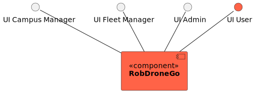
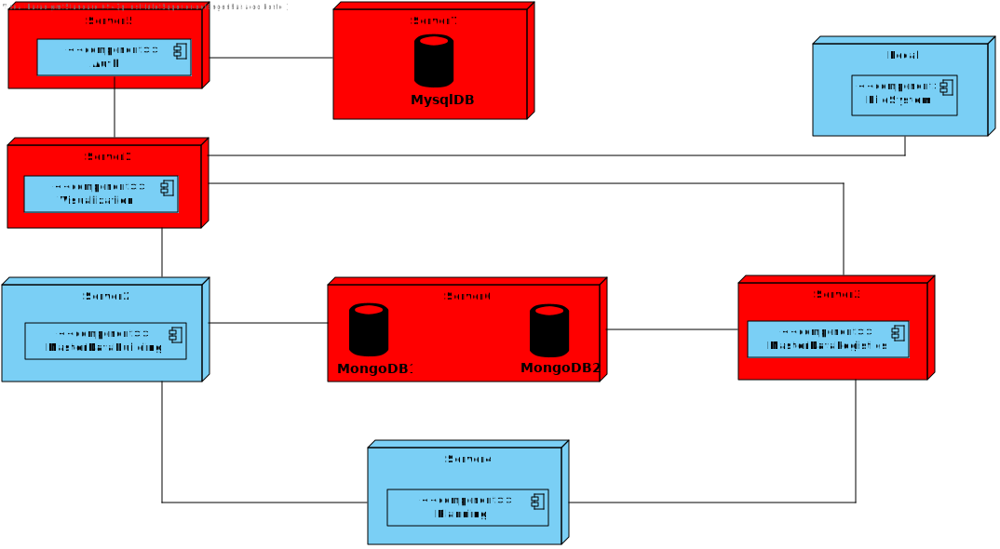

# US 480 - As a task manager, I want to search for all pending tasks.

## 1. Context

* First time that this user story is being implemented.
* This task is relative to the task manager.

## 2. Requirements

**US 480 -** As a task manager, I want to search for all pending tasks.

**Dependencies:**
- US 460 - As the system user I intend to request a task, specify the parameters necessary for its execution, namely the starting point and term point and what is the intended task

### Client Questions
> **Q**:  pretendido é consultar as requisições de tarefas que ainda não foram aprovadas, nem recusadas (ou seja, apresentar só as "pendentes"). Ou se seria pretendido consultar as tarefas "pendentes" + as tarefas recusadas. <br>
> **A**: pretende-se a listagem das requisições pendentes de decisão" <br>

> **Q**: As requisições recusadas também contam como ainda não aprovadas ou apenas as requisições pendentes de aprovação/recusacão.  <br>
> **A**:esta opção deve mostrar ao utilizador as requisções que ainda não tiveram qualquer tipo de decisão: aprovação/recusa. <br>

## 3. Analysis

**Analyzing this User Story we understand that:**
* The task manager is the user who is responsible for managing the tasks.
* The task manager can search for all pending tasks that have not yet been approved or rejected.

### 3.1. Domain Model Excerpt


## 4. Design

### 4.1. Realization

### Level1
###### LogicalView:


###### SceneryView:


###### ProcessView:


#### Level2

###### LogicalView:


###### ImplementationView:


###### PhysicalView:


###### ProcessView:


#### Level3
###### LogicalView:


###### ImplementationView:


###### ProcessView:


### 4.2. Applied Patterns

* Pipe
* Directive
* Service

### 4.3. Tests

**Test 1:** **Check Title**
```
it('has correct title', function () {
    cy.get('h1').should('contain', 'Pending Tasks')
  })
```

**Test 2:** **Checks the list is receiving correct items**
```
it('checks for listed pending tasks', function () {

    cy.get('table').then(($table) => {
      const initialTableText = $table.text()
      cy.wait('@listPendingTasks')

      cy.get('table tbody tr:first-child td.column1').contains('123');
      cy.get('table tbody tr:first-child td.column2').contains('Test Description');
      cy.get('table tbody tr:first-child td.column3').contains('utente@isep.ipp.pt');
      cy.get('table tbody tr:first-child td.column4').contains('Floor surveillance');

      cy.get('table tbody tr:nth-child(2) td.column1').contains('456');
      cy.get('table tbody tr:nth-child(2) td.column2').contains('Test Description 2');
      cy.get('table tbody tr:nth-child(2) td.column3').contains('utente@isep.ipp.pt');
      cy.get('table tbody tr:nth-child(2) td.column4').contains('Floor surveillance');

      cy.get('table').should(($tableAfter) => {
        expect($tableAfter.text()).not.to.eq(initialTableText)
      })

    })
  })
```

**Test 3:** **Handles Errors Correctly**
```
it('handles errors correctly', function () {
    cy.intercept('GET', '/api/tasks', { statusCode: 500, body: {} }).as('taskOrError')
    cy.visit('/tasks/listPendingTasks')
    cy.on('window:alert', (str) => {
      expect(str).to.include('`An error occurred:')
    })
  })
```

## 5. Implementation

#### HTML
```
<h1>Pending Tasks</h1>
<div>
  <table>
    <thead>
    <tr class="table100-head">
      <th class="column1">Id</th>
      <th class="column2">Description</th>
      <th class="column3">Requester</th>
      <th class="column4">Type</th>
    </tr>
    </thead>
    <tbody>
    <tr *ngFor="let task of tasks">
      <td class="column1">{{ task.id }}</td>
      <td class="column2">{{ task.taskDescription }}</td>
      <td class="column3">{{ task.taskRequester }}</td>
      <td class="column4">{{ task.taskType }}</td>
    </tr>
    </tbody>
  </table>
</div>
```

#### COMPONENT
```
export class TaskListNotApprovedComponent {

  tasks: ITaskDTO[] = [];

  constructor(
    private taskService: TaskService,
  ) { }

  ngOnInit() {
    this.taskService.listAllPending()
      .subscribe(
        (data: ITaskDTO[]) => {
          this.tasks = data;
        }
      )
  }

}

```

## 6. Integration/Demonstration

To show this functionality the user needs to authenticated in the system as a task manager. Then, the user needs to click on the "Pending Tasks" button in the menu. After logging in, the user needs to select the "Pending Tasks" option in the menu. The user will be presented with a list of all pending tasks automatically.

## 7. Observations

No observations.
