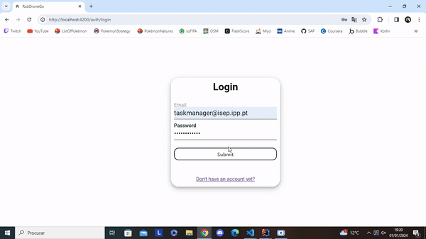

# US 490 - As a task manager, I want to search task requests by status, device type, or user.

## 1. Context

* First time that this user story is being implemented.
* User wants to search task requests by status, device type, or user.
* This task is relative to system user.

## 2. Requirements

**US 490 -** As a task manager, I want to search task requests by status, device type, or user.

**Dependencies:**
- US 460 - As the system user I intend to request a task, specify the parameters necessary for its execution, namely the starting point and term point and what is the intended task
- US 470 - As a task manager, I want to approve or reject a request

### Client Questions
> **Q**: Em relação a esta US, nós estamos com umas dúvidas em relação ao que o cliente considera um tipo de dispositivo, por exemplo, seria robots e drones ou tipos especificos de robots? <br>
> **A**: considerar "tipo de robot" <br>

> **Q**: Neste requisito é suposto o utilizador filtrar uma lista de requisições de tarefas ou apenas escolher o tipo de listagem (estado,tipo de dispositivo ou utente) que quer ver e mostrar lhe apenas isso.  <br>
> **A**: na listagem resultante deve ser possivel filtrar os dados pelos atributos indicados. Esta opção mostra todas as requisições do sistema, incluindo de datas passadas pelo que deverá também ser possivel filtrar por data de requisição. notem que o volume de dados pode ser muito grande pelo que devem avaliar tecnicamente como equilibrar este requisito funcional com a sua implementação tecnica. Por exemplo, ao fim de algum tempo o sistema poderá ter milhares (ou dezenas de milhares) de requisições. Embora seja aceitavel para efeitos de prototipo que existam limitações na vossa implementação, tais limitações devem ser devidamente e explcitamente documentadas bem como propostas de alternativas para contornar essas limitações. <br>

## 3. Analysis

**Analyzing this User Story we understand that:**
* Task is a request made by a user to the system to perform a certain action.
* The task can be of two types: Surveillance and Pickup & Delivery
* Surveillance task is a request made by a user to the system to perform a surveillance action in a certain building floor.
* The surveillance task information is based on: Task Type, Task Description, Task Building, Task Floor, Task Contact
* Pickup & Delivery task is a request made by a user to the system to perform a pickup & delivery action in a certain building floor.
* The pickup & delivery task information is based on: Task Type, Task Description, Task Pickup Contact, Task Delivery Contact, Task Pickup Code, Task Pickup Room, Task Delivery Room
* When i list the tasks i can filter by: Task Status, Task Device Type, Task User


### 3.1. Domain Model Excerpt


## 4. Design

### 4.1. Realization

### Level1
###### LogicalView:


###### SceneryView:


###### ProcessView:


#### Level2

###### LogicalView:


###### ImplementationView:


###### PhysicalView:


###### ProcessView:


#### Level3
###### LogicalView:


###### ImplementationView:


###### ProcessView:


### 4.3. Applied Patterns
* Pipe
* Directive
* Service

### 4.4. Tests
**Test 1:** **has correct title**
```
it('has correct title', () => {
    cy.get('h1').should('contain', 'Task list');
  });
```

**Test 2:** **should display task list form and tables**
```
it('should display task list form and tables', () => {
    cy.get('h1').should('contain.text', 'Task list');
    cy.get('form').should('exist');
    cy.get('table').should('exist');
  });
```

**Test 3:** **should submit the form with valid data and display filtered results NUll parameters**
```
it('should submit the form with valid data and display filtered results NUll parameters', () => {
    cy.get('button:contains("Search")').click()
    cy.get('table').then(($table) => {
      const initialTableText = $table.text()

      cy.get('button:contains("Search")').click()
      cy.on('window:alert', (str) => {
        expect(str).to.include('Tasks found:')
      })

    cy.get('table').should(($tableAfter) => {
      expect($tableAfter.text()).eq(initialTableText)
    })
  })
  });
```

**Test 4:** **should submit the form with valid data and display filtered results Status**
```
it('should submit the form with valid data and display filtered results Status', () => {
    cy.get('button:contains("Search")').click()
    cy.get('table').then(($table) => {
      const initialTableText = $table.text()
      cy.get('select').first().type('Approved');
      cy.get('button:contains("Search")').click()
      cy.on('window:alert', (str) => {
        expect(str).to.include('Tasks found:')
      })

    cy.get('table').should(($tableAfter) => {
      expect($tableAfter.text()).not.to.eq(initialTableText)
    })
  })
  });
```

**Test 5:** **should submit the form with valid data and display filtered results Date**
```
 it('should submit the form with valid data and display filtered results Date', () => {
    cy.get('button:contains("Search")').click()
    cy.get('table').then(($table) => {
      const initialTableText = $table.text()

      cy.get('input[type="date"]').first().type('2021-06-01')
      cy.get('input[type="date"]').last().type('2021-06-30')
      cy.get('button:contains("Search")').click()
      cy.on('window:alert', (str) => {
        expect(str).to.include('Tasks found:')
      })

    cy.get('table').should(($tableAfter) => {
      expect($tableAfter.text()).not.to.eq(initialTableText)
    })
  })
  });
```

**Test 6:** **should display surveillance tasks and pickup/delivery tasks tables**
```
it('should display surveillance tasks and pickup/delivery tasks tables', () => {
    cy.get('h3').should('contain.text', 'Survelliance Tasks');
    cy.get('h3').should('contain.text', 'Pickup And Delivery Tasks');
    cy.get('table').should('have.length', 2);
  });
```

## 5. Implementation

#### HTML
```
<h1>Task list</h1>

<form [formGroup]="form" (ngSubmit)="onSubmit()">
<div class="form__group field">
    <label for="start" class="form__label">Select a Task State:</label>
    <select class="form_select" (change)="onchange($event)">
        <option></option>
        <option>Pending</option>
        <option>Accepted</option>
        <option>Rejected</option>
        <option>Done</option>    
    </select>

    <label for="start" class="form__label" style="margin-left: 35%;">Select a robot type:</label>
    <select class="form_select" formControlName="robotTypeID" style="margin-left: 5%">
        <option></option>
        <option *ngFor="let type of robotTypes" [value]="type.robotTypeID">{{ type.robotTypeID }}</option>
    </select>

    <label for="start" class="form__label"  style="margin-left: 70%;">Select a User:</label>
    <select class="form_select" formControlName="user" style="margin-left: 5%">
        <option></option>
        <option *ngFor="let user of users" [value]="user.email">{{ user.email }}</option>
    </select>
</div>

<div class="form__group field">
    <label for="start" class="form__label">Start date:</label>
    <input type="date"  formControlName="initialDate" value="2024-01-01" min="2023-01-01" max="2024-12-31" />

    <label for="start" class="form__label" style="margin-left: 26%;">End date:</label>
    <input  style="margin-left: 5%;" type="date"  formControlName="finalDate" value="2024-01-01" min="2023-01-01" max="2024-12-31" />
</div>

<button>Search</button>
</form>

<div style="margin-top: 20px;">
    <h3>Survelliance Tasks</h3>
<table>
    <thead>
    <tr class="table100-head">
        <th class="column1">ID</th>
        <th class="column2">Description</th>
        <th class="column3">Type</th>
        <th class="column4">State</th>
        <th class="column5">Pickup room</th>
        <th class="column6">Delivery room</th>
        <th class="column7">Building</th>
        <th class="column8">Floor</th>
        <th class="column9">Contact</th>
        <th class="column10">Requester</th>
        <th class="column11">Request date</th>
        <th class="column12">Robot type</th>
        <th class="column13">Robot</th>
        <th class="column14">Path</th>
    </tr>
    </thead>
    <tbody>
    <tr *ngFor="let task of floorSurvellianceTasks">
        <td class="column1">{{task.id}}</td>
        <td class="column2">{{task.taskDescription}}</td>
        <td class="column3">{{task.taskType}}</td>
        <td class="column4">{{task.taskState}}</td>
        <td class="column5">{{task.taskPickupRoom}}</td>
        <td class="column6">{{task.taskDeliveryRoom}}</td>
        <td class="column7">{{task.taskBuilding}}</td>
        <td class="column8">{{task.taskFloor}}</td>
        <td class="column9">{{task.taskContact}}</td>
        <td class="column10">{{task.taskRequester}}</td>
        <td class="column11">{{task.taskRequestDate}}</td>
        <td class="column12">{{task.taskRobotType}}</td>
        <td class="column13">{{task.taskRobot}}</td>
        <td class="column14">{{task.taskPath}}</td>
    </tr>
    </tbody>
</table>
</div>

<div style="margin-top: 20px;">
    <h3>Pickup And Delivery Tasks</h3>
    <table>
        <thead>
        <tr class="table100-head">
            <th class="column1">ID</th>
            <th class="column2">Description</th>
            <th class="column3">Type</th>
            <th class="column4">State</th>
            <th class="column5">Pickup room</th>
            <th class="column6">Delivery room</th>
            <th class="column7">PickupContact</th>
            <th class="column8">DeliveryContact</th>
            <th class="column9">PickupCode</th>
            <th class="column10">Requester</th>
            <th class="column11">Request date</th>
            <th class="column12">Robot type</th>
            <th class="column13">Robot</th>
            <th class="column14">Path</th>
        </tr>
        </thead>
        <tbody>
        <tr *ngFor="let task of floorPickupDeliveryTasks">
            <td class="column1">{{task.id}}</td>
            <td class="column2">{{task.taskDescription}}</td>
            <td class="column3">{{task.taskType}}</td>
            <td class="column4">{{task.taskState}}</td>
            <td class="column5">{{task.taskPickupRoom}}</td>
            <td class="column6">{{task.taskDeliveryRoom}}</td>
            <td class="column7">{{task.taskPickupContact}}</td>
            <td class="column8">{{task.taskDeliveryContact}}</td>
            <td class="column9">{{task.taskPickupCode}}</td>
            <td class="column10">{{task.taskRequester}}</td>
            <td class="column11">{{task.taskRequestDate}}</td>
            <td class="column12">{{task.taskRobotType}}</td>
            <td class="column13">{{task.taskRobot}}</td>
            <td class="column14">{{task.taskPath}}</td>
        </tr>
        </tbody>
    </table>
    </div>
```

#### COMPONENT
```
export class TaskListRequestsComponent {
  form: FormGroup;

  floorSurvellianceTasks: ITaskDTO[] = [];
  floorPickupDeliveryTasks: ITaskDTO[] = [];
  robotTypes: RobotType[] = [];
  users: UserDto[] = [];

  constructor(
    private taskService: TaskService,
    private robotTypeService: RobotTypeService,
    private authService: AuthServiceService,
    private fb: FormBuilder, 
  ) { 
    this.form = this.fb.group({
      robotTypeID: [{value: '', disabled: true}, Validators.required],
      taskState: new FormControl(''),
      user: new FormControl(''),
      initialDate: new FormControl(''),
      finalDate: new FormControl(''),     
    });
  }


  ngOnInit(): void {
		this.listAllTasks();
    this.listAllRobotTypes();
    this.listAllUsers();
	}

  listAllTasks() {
		this.taskService.listAllTasks().subscribe((tasks: ITaskDTO[]) => {
			this.floorSurvellianceTasks = tasks.filter((task) => task.taskType === "Floor surveillance");
      this.floorPickupDeliveryTasks = tasks.filter((task) => task.taskType === "Object transport");
		})
	}

  listAllRobotTypes() {
    this.robotTypeService.listAll().subscribe(
      (data: any) => {
        this.robotTypes = data;
      },
      (error: any) => {
        console.error('Error:', error);
        this.robotTypes = [];
      }
    );
  }

  listAllUsers() {
    this.authService.listAllUtentes().subscribe(
      (data: any) => {
        this.users = data;
      },
      (error: any) => {
        console.error('Error:', error);
        this.users = [];
      }
    );
  }

  onSubmit() {
    if(this.form.value.robotTypeID === "" || this.form.value.robotTypeID === undefined) {
      this.form.value.robotTypeID = null;
    }
    if(this.form.value.taskState === "") {
      this.form.value.taskState = null;
    }
    if(this.form.value.user === "") {
      this.form.value.user = null;
    }
    if(this.form.value.initialDate === "") {
      this.form.value.initialDate = null;
    }
    if(this.form.value.finalDate === "") {
      this.form.value.finalDate = null;
    }
      
    const form: ITaskSearchDTO = {
      robotTypeID: this.form.value.robotTypeID!,
      taskState: this.form.value.taskState!,
      user: this.form.value.user!,
      initialDate: this.form.value.initialDate!,
      finalDate: this.form.value.finalDate!,
    }

    this.taskService.searchTask(form).subscribe(
      (tasks: ITaskDTO[]) => {
        this.floorSurvellianceTasks = tasks.filter((task) => task.taskType === "Floor surveillance");
        this.floorPickupDeliveryTasks = tasks.filter((task) => task.taskType === "Object transport");
        window.alert("Tasks found: " + tasks.length);
    },
      (error: any) => {
        console.error('Error:', error);
       window.alert("Error: " + error.error);
      }
    );
  }

  onchange(event: any) {
    const selectedOption = event.target.value;  
    this.form.get('taskState')?.setValue(event.target.value);
    if (selectedOption === 'Done') {
      this.form.get('robotTypeID')?.enable();
    } else {
      this.form.get('robotTypeID')?.setValue('');
      this.form.get('robotTypeID')?.disable();
    }
  }

}

```

## 6. Integration/Demonstration


## 7. Observations
