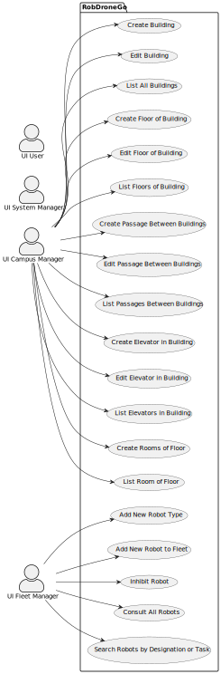

# Use Case Diagram

## System Description

RobDroneGo is a system prototype for managing a fleet of robots and drones that can perform tasks on the ISEP campus.

## Use Case Diagram

### Actors

- **Campus Manager:** User role that manages the data of the routes and maps.
- **Fleet Manager:** User role that manages the data of the robots and drones and the types of tasks.* 
- **System Manager:** User role that has overall control of the RobDroneGo system. They are responsible for the maintenance and configuration of the system, ensuring that it is operating correctly and efficiently. They can manage user accounts, system settings, and have access to all data in the system.*
- **User:** User role that requests tasks to be executed by the robots and drones.*

### Use Cases

- **Create Building:** This use case allows a campus manager to create a new building in the RobDroneGo system. The user provides details such as the building’s name and number of floors. This information is then stored in the system’s database.

- **Edit Building:** This use case allows a campus manager to edit the details of an existing building. This could include changing the building’s name or number of floors.

- **List All Buildings:** This use case allows any user to view a list of all buildings in the RobDroneGo system.

- **Create Floor of Building:** This use case allows a campus manager to add a new floor to an existing building. The user provides details such as the floor’s number and layout, which are then stored in the system’s database.

- **Edit Floor of Building:** This use case allows a campus manager to edit the details of an existing floor in a building. This could include changing the floor’s number or layout.

- **List Floors of Building:** This use case allows any user to view a list of all floors in a specific building. The list includes details such as each floor’s number and layout.

- **Create Passage Between Buildings:** This use case allows a campus manager to create a new passage between two buildings. The user provides details such as the passage’s start and end points, which are then stored in the system’s database.

- **Edit Passage Between Buildings:** This use case allows a campus manager to edit the details of an existing passage between buildings. This could include changing the passage’s start and end points.

- **List Passages Between Buildings:** This use case allows any user to view a list of all passages between buildings in the RobDroneGo system. The list includes details such as each passage’s start and end points.

- **Create Elevator in Building:** This use case allows a campus manager to add a new elevator to an existing building. The user provides details such as which floors it can access, which are then stored in the system’s database.

- **Edit Elevator in Building:** This use case allows a campus manager to edit the details of an existing elevator in a building. This could include which floors it can access.

- **List Elevators in Building:** This use case allows any user to view a list of all elevators in a specific building. The list includes details such as which floors it can access.

- **Create Rooms of Floor:** This use case allows a campus manager to add new rooms to an existing floor in a building. The user provides details such as each room’s number and purpose, which are then stored in the system’s database.

- **List Room of Floor:** This use case allows any user to view a list of all rooms on a specific floor in a building. The list includes details such as each room’s number and purpose.

- **Add New Robot Type:** This use case allows a fleet manager to add a new type of robot to the RobDroneGo system. The user provides details such as the robot type’s name, capabilities, and limitations, which are then stored in the system’s database.

- **Add New Robot to Fleet:** This use case allows a fleet manager to add a new robot of an existing type to their fleet. The user provides details such as the robot’s designation and current status, which are then stored in the system’s database.

- **Inhibit Robot:** This use case allows a fleet manager to temporarily disable or inhibit a robot from performing tasks. The robot’s status is updated in the system’s database.

- **Consult All Robots:** This use case allows any user to view a list of all robots in the RobDroneGo fleet. The list includes details such as each robot’s designation, type, and current status.

- **Search Robots by Designation or Task:** This use case allows any user to search for robots based on their designation or the tasks they can perform. The search results include all robots that match the search criteria.
